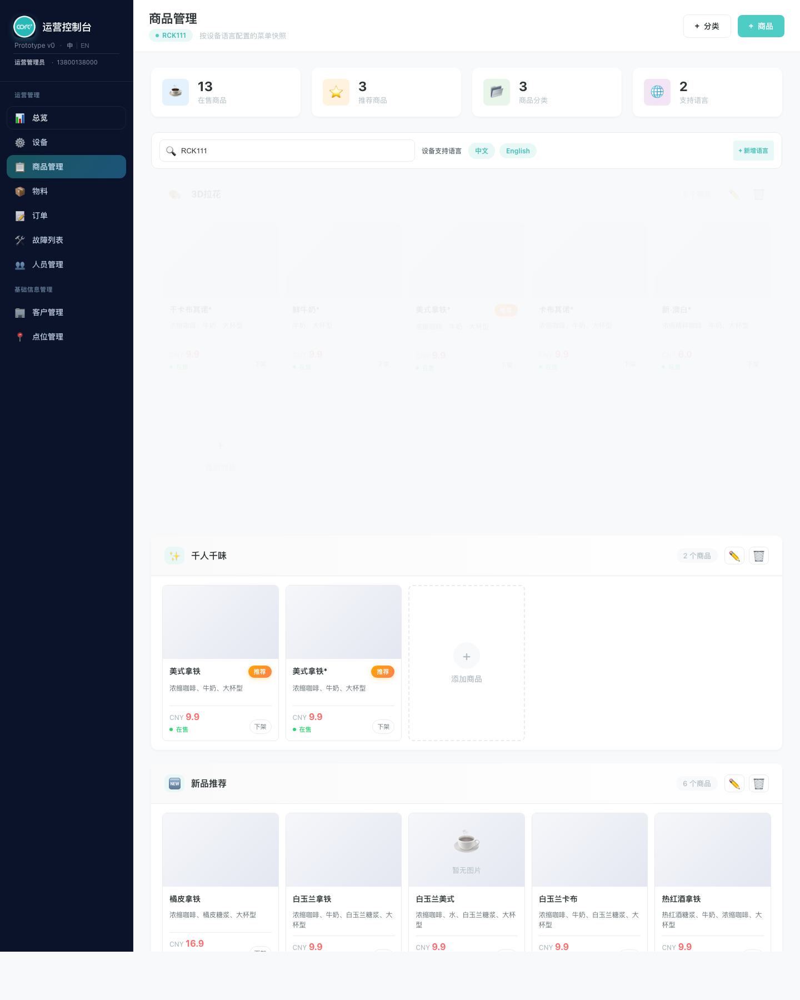
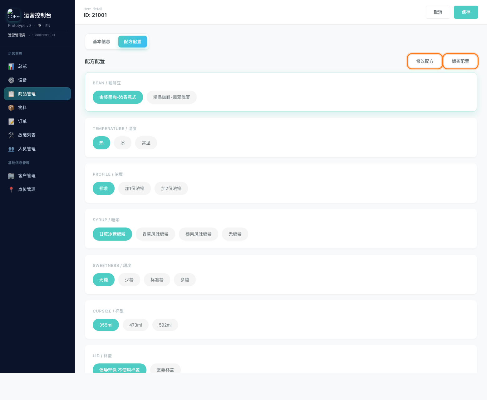
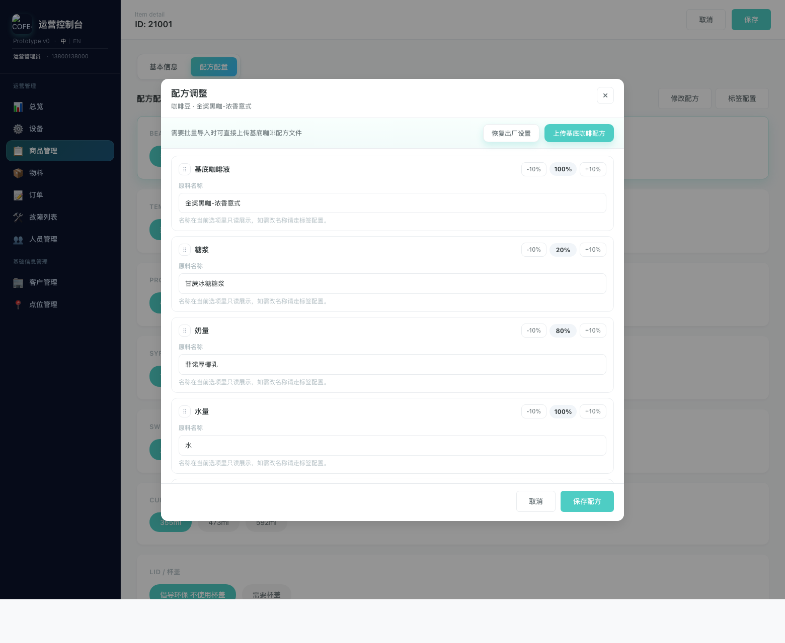
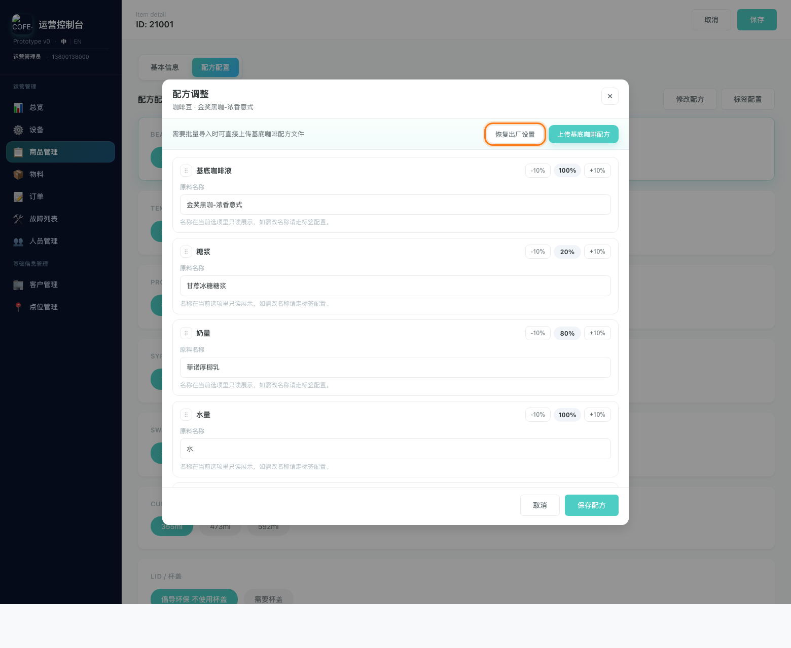
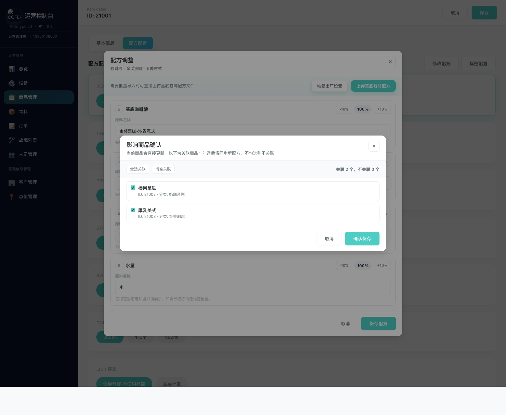

# 商品配方修改说明

适用页面：桌面端 `商品管理` -> `商品详情` -> `配方配置`

这份说明文档适合直接发给同事，用来快速介绍“如何从桌面端商品管理首页进入编辑，并修改一个商品的配方”。

## 一、先从桌面端商品管理首页进入编辑

1. 在左侧导航点击 `商品管理`。
2. 进入页面后，先不要停留在顶部统计卡、设备搜索和语言设置区域。
3. 继续往下找到 `商品区域 / 商品卡片区域`。
4. 当前页面没有单独的 `编辑` 按钮，直接点击目标商品卡片进入编辑。

重点提醒：

- 很多人进入 `商品管理` 后，只看到顶部基础设置区，就不知道下一步了。
- 真正进入商品编辑的入口，在页面下方的商品区域，不是在顶部统计区。
- 当前页面没有独立的 `编辑` 按钮，直接点击商品卡片本身即可进入编辑。

## 二、进入商品详情后切换到配方配置

1. 进入商品详情页后，点击上方 `配方配置` 页签。
2. 先在页面中选中你要调整的选项，例如咖啡豆、温度、糖浆、甜度或杯型。
3. 点击右上角的 `修改配方`。

## 三、修改配方

进入 `配方调整` 弹窗后，可以做下面几类操作：

1. 调整配方分组顺序
   通过左侧拖拽手柄调整前后顺序。
2. 调整配方比例
   点击每一行右侧的 `-10%` 或 `+10%` 调整比例。
3. 查看当前原料名称
   原料名称在这里是只读展示，用来确认当前配方内容。

注意：

- 如果你想改的是“前台展示名称”而不是制作配方，请不要在这里处理，应改用 `标签配置`。
- 修改完成后，点击右下角 `保存配方`。

## 四、可选操作

如果不是手动微调，而是需要快速恢复或批量导入，也可以直接在配方调整弹窗顶部处理：

1. `恢复出厂设置`
   把当前选项恢复到默认配方。
2. `上传基底咖啡配方`
   用文件批量导入“基底咖啡液”配方。

建议场景：

- 需要回退到标准配方时，使用 `恢复出厂设置`
- 需要按模板批量导入时，使用 `上传基底咖啡配方`

## 五、保存并确认影响范围

点击 `保存配方` 后，系统会弹出 `影响商品确认` 弹窗。

这里要重点说明给同事：

1. 当前商品一定会保存，不需要额外勾选。
2. 下面列出的商品，是和当前配方有关联的其他商品。
3. 默认是全选，表示这些商品也会一起更新为新配方。
4. 如果某些商品不想一起改，就取消勾选。
5. 最后点击 `确认保存`。

最常用的判断方法：

- 只想改当前商品：把关联商品全部取消勾选后再保存。
- 想让一批关联商品一起更新：保持勾选，直接确认保存。

## 六、给同事讲解时可以直接这样说

“先在左侧打开商品管理。进入页面后不要停在顶部基础设置区，要继续往下找到商品区域。这里没有单独的编辑按钮，直接点击目标商品卡片进入编辑。进到商品详情以后，切到配方配置，再点右上角的修改配方。进弹窗以后，可以拖动顺序，也可以用加减 10% 调整比例。改完点保存配方。最后系统会再问一次哪些关联商品要一起更新，如果你只想改当前商品，就把其他商品取消勾选后再确认保存。” 

## 七、注意事项

- 进入 `商品管理` 后，不要停在顶部统计和基础设置区，真正的编辑入口在下方商品区域。
- 当前页面没有单独的 `编辑` 按钮，直接点击商品卡片本身即可进入商品详情。
- 修改前先确认自己选中的到底是哪一个选项组和哪个标签值。
- `修改配方` 是改制作规则，不是改前台展示文案。
- 取消勾选的关联商品不会跟随本次新配方。
- 如果需要批量导入，优先使用 `上传基底咖啡配方`，不要逐项手调。
