# COFEPLUS 网站 PRD（左侧菜单逐页 Case 版）

## 1. 文档信息

| 项目 | 内容 |
|---|---|
| 文档名称 | COFEPLUS 网站 PRD（左侧菜单逐页 Case） |
| 版本 | V1.0 |
| 日期 | 2026-02-25 |
| 适用对象 | 前后端研发、测试、产品 |
| 产出目标 | 将左侧菜单页面与关联页面逐页拆解为可执行 case |

## 2. 产品概述

COFEPLUS 是面向咖啡设备运营管理的后台网站，覆盖经营总览、菜单管理、设备运维、物料补给、订单售后、客户与点位基础数据管理。  
本 PRD 以“页面级 case”为主，定义每个页面的目标、场景、流程、规则、异常与输入输出，用于研发实现与测试回归。

## 3. 范围说明

### 3.1 左侧菜单页面（主范围）

| 页面名称 | 页面截图 |
|---|---|
| 总览 | 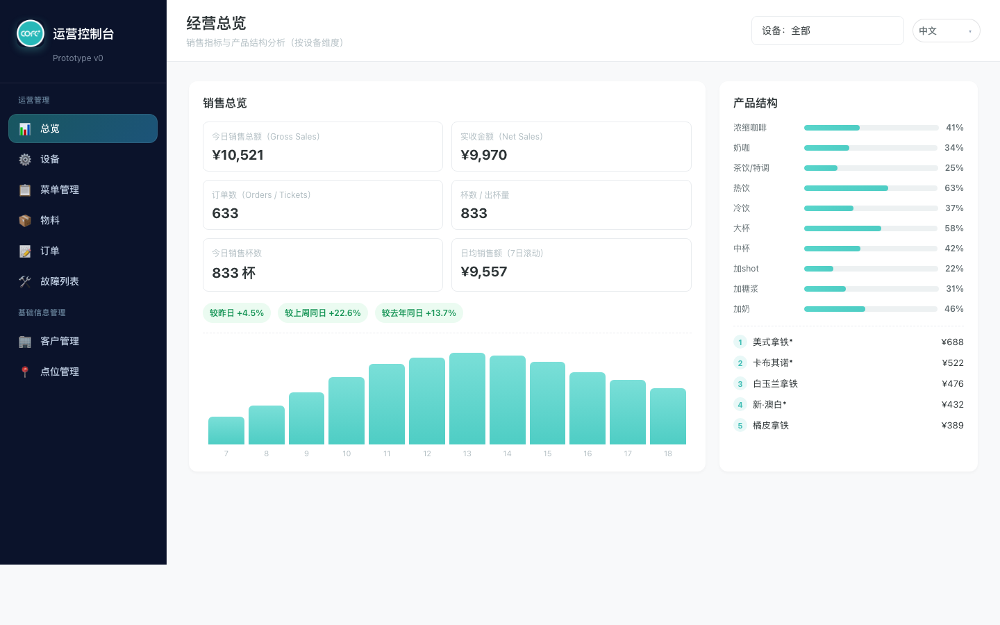 |
| 菜单管理 |  |
| 设备管理 | 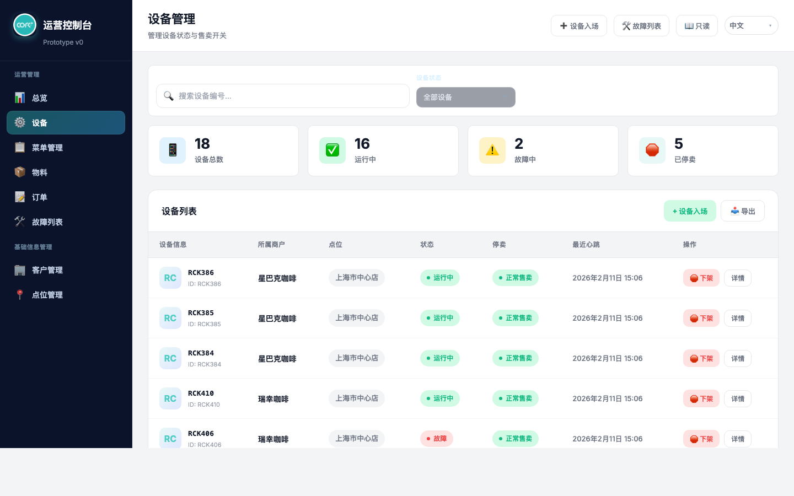 |
| 物料管理 | 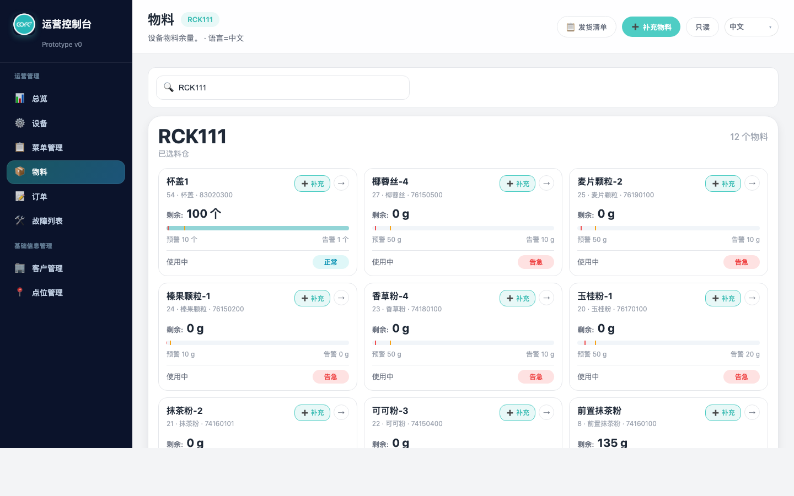 |
| 订单管理 | 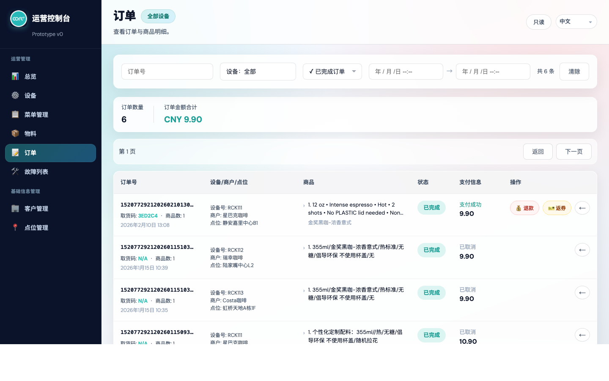 |
| 故障列表 | 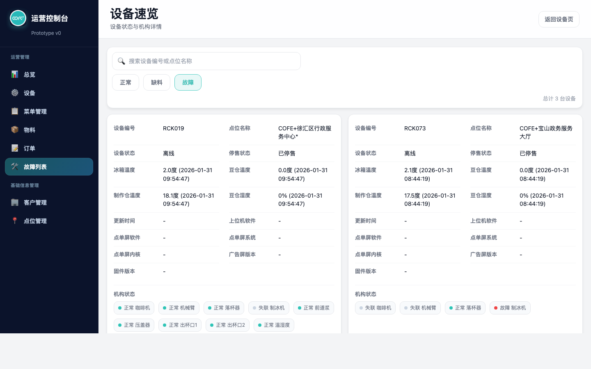 |
| 客户管理 | 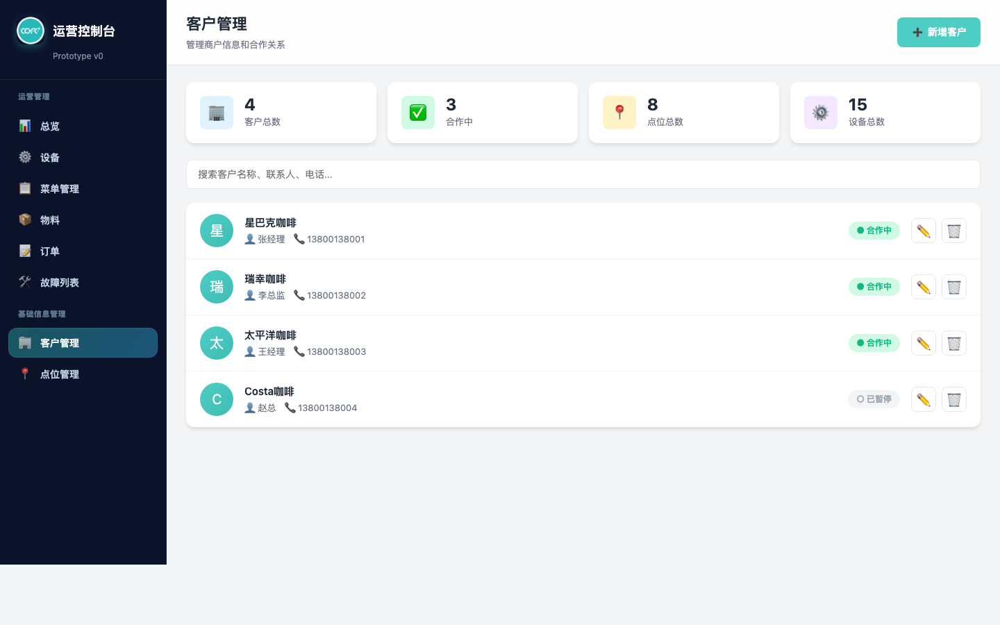 |
| 点位管理 | 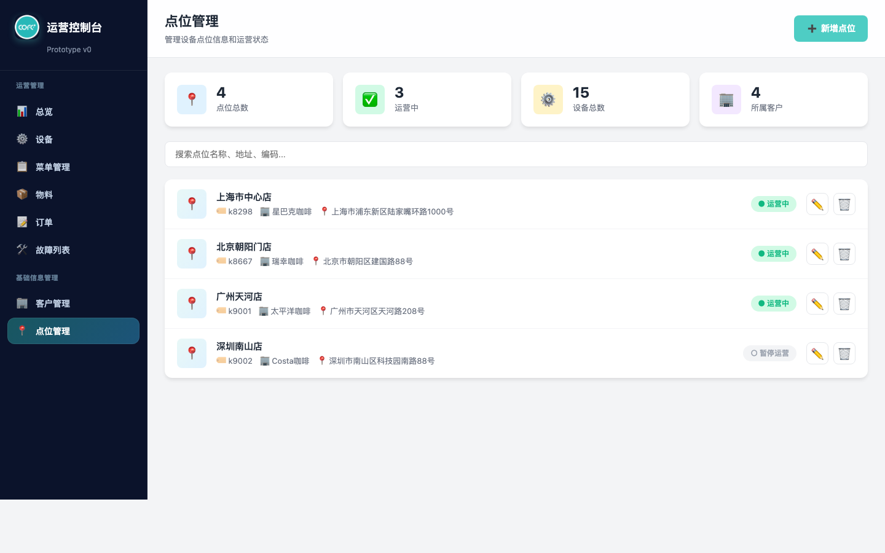 |

### 3.2 关联页面（扩展范围）

| 页面名称 | 页面截图 |
|---|---|
| 设备入场 | 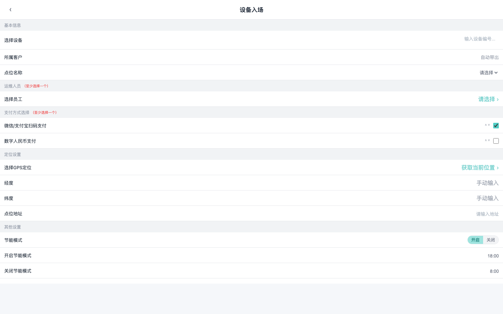 |
| 发货清单 |  |
| 补充物料 | 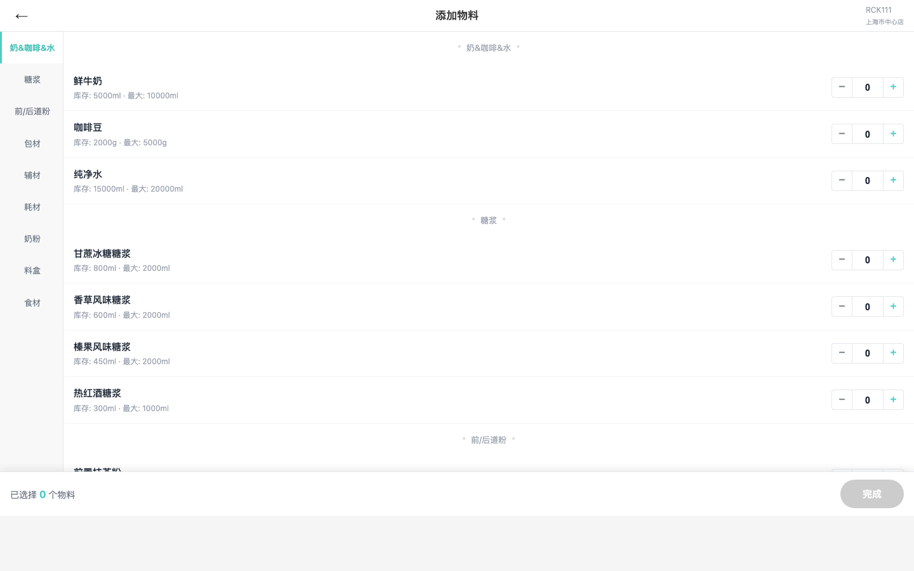 |
| 商品首页 | 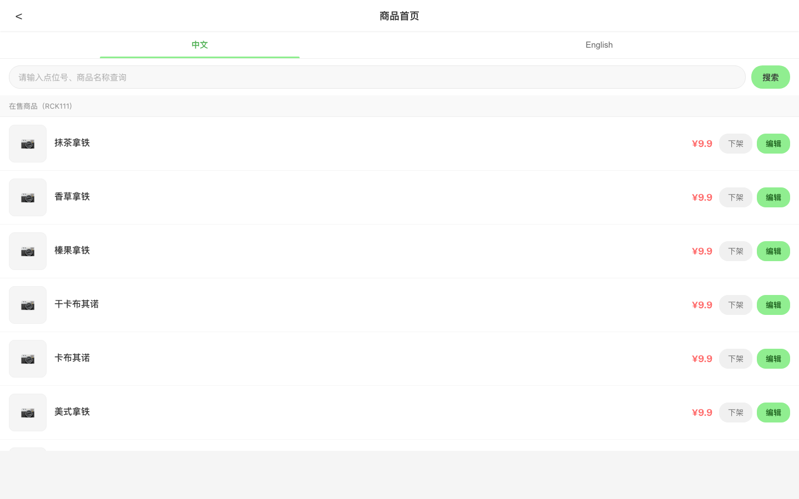 |
| 商品详情 | 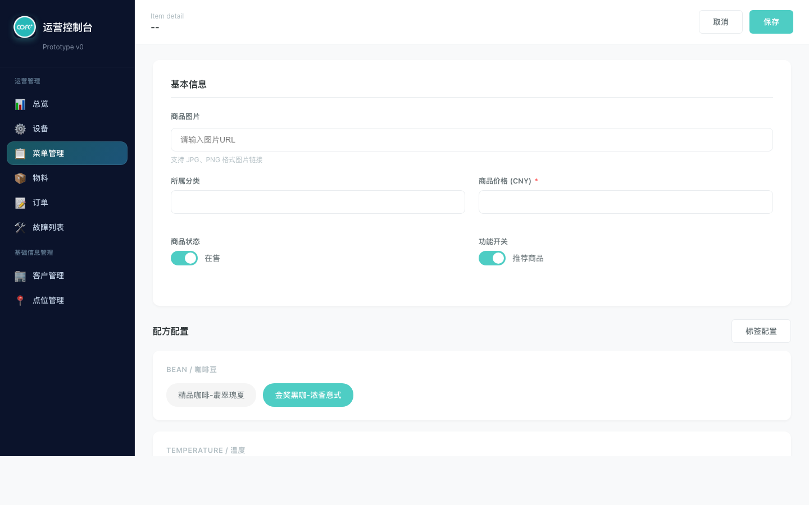 |

## 4. Case 清单

| Case ID | 页面 | 类型 | 说明 |
|---|---|---|---|
| C01 | 总览 | 主菜单 | 经营指标与产品结构查看 |
| C02 | 菜单管理 | 主菜单 | 分类、商品、多语言菜单配置 |
| C03 | 设备管理 | 主菜单 | 设备查询、状态筛选、售卖开关 |
| C04 | 物料管理 | 主菜单 | 设备物料余量看板与跳转补料 |
| C05 | 订单管理 | 主菜单 | 订单筛选、分页、售后动作 |
| C06 | 故障列表 | 主菜单 | 正常/缺料/故障分组与搜索 |
| C07 | 客户管理 | 主菜单 | 客户档案增删改查 |
| C08 | 点位管理 | 主菜单 | 点位档案增删改查 |
| C09 | 设备入场 | 关联页 | 新增设备基础信息 |
| C10 | 发货清单 | 关联页 | 补料相关订单/任务查看 |
| C11 | 补充物料 | 关联页 | 补料录入与库存更新 |
| C12 | 商品首页 | 关联页 | 商品列表入口与管理跳转 |
| C13 | 商品详情 | 关联页 | 商品字段编辑与保存 |

## 5. 页面级 Case 详细说明

### C01 总览（menu.html?tab=overview）

| 字段 | 说明 |
|---|---|
| 功能目标 | 展示经营结果，支持按设备维度查看整体销售表现 |
| 使用场景 | 运营经理日常巡检经营数据，识别异常波动 |
| 用户流程 | 进入总览页 -> 选择设备范围 -> 查看销售与结构数据 |
| 业务规则 | 默认显示全部设备数据；设备筛选后各指标联动更新 |
| 异常处理 | 无数据时显示空状态；筛选结果为空时提示“无匹配设备” |
| 输入 | 设备筛选条件、时间维度（页面内置） |
| 输出 | 销售额、订单数、杯量、产品结构、Top 列表等 |

### C02 菜单管理（menu.html?tab=menu）

| 字段 | 说明 |
|---|---|
| 功能目标 | 管理菜单分类与商品，维护设备支持语言配置 |
| 使用场景 | 运营人员上新、下架、调整价格和文案 |
| 用户流程 | 切换到菜单管理 -> 选择设备 -> 新增/编辑分类与商品 -> 保存 |
| 业务规则 | 商品必须归属分类；价格为有效数值；语言配置应作用于展示项 |
| 异常处理 | 必填项缺失阻断提交；非法价格提示；保存失败提示重试 |
| 输入 | 分类名、商品名、多语言文案、价格、状态 |
| 输出 | 更新后的分类树、商品列表、语言标签 |

### C03 设备管理（devices.html）

| 字段 | 说明 |
|---|---|
| 功能目标 | 统一管理设备状态与售卖开关 |
| 使用场景 | 运维定位故障设备并控制是否可售 |
| 用户流程 | 搜索设备 -> 按状态筛选 -> 查看详情 -> 执行停售/开售 |
| 业务规则 | 列表按筛选实时刷新；分页与统计卡片同步；售卖开关状态可持续 |
| 异常处理 | 搜索无结果显示空列表；目标设备不存在时提示 |
| 输入 | 设备编号关键字、状态筛选、分页动作 |
| 输出 | 设备列表、统计值（总数/运行中/故障中/停售） |

### C04 物料管理（materials.html）

| 字段 | 说明 |
|---|---|
| 功能目标 | 展示设备料仓余量并提供补料入口 |
| 使用场景 | 补料人员排查缺料风险并发起补料 |
| 用户流程 | 选择设备 -> 查看料仓状态 -> 点击补充/详情 -> 跳转关联页 |
| 业务规则 | 余量按阈值显示状态（健康/预警/危急）；设备切换后看板重渲染 |
| 异常处理 | 设备编号无效提示；物料缺失时显示默认状态 |
| 输入 | 设备编号、操作按钮（补充/发货清单） |
| 输出 | 物料卡片、状态标签、关联页面跳转结果 |

### C05 订单管理（orders.html）

| 字段 | 说明 |
|---|---|
| 功能目标 | 支持订单查询、统计、售后处理 |
| 使用场景 | 客服处理退款返券；运营核对订单表现 |
| 用户流程 | 设置筛选条件 -> 浏览列表 -> 执行退款/返券 -> 翻页查看 |
| 业务规则 | 筛选条件可组合；统计值随筛选结果变化；分页边界受控 |
| 异常处理 | 日期条件非法时提示；无结果显示空态；售后失败提示重试 |
| 输入 | 订单号、设备集合、状态、时间区间 |
| 输出 | 订单列表、总条数、金额统计、售后结果提示 |

### C06 故障列表（faults.html）

| 字段 | 说明 |
|---|---|
| 功能目标 | 以状态分组方式查看设备健康与故障详情 |
| 使用场景 | 值班人员快速定位需处理设备 |
| 用户流程 | 进入故障页 -> 选择分组 Tab -> 搜索设备 -> 查看卡片详情 |
| 业务规则 | Tab 分组互斥；搜索同时匹配设备编号与点位名称 |
| 异常处理 | 分组为空展示空态；搜索无命中显示“无结果” |
| 输入 | 分组选择、搜索关键字 |
| 输出 | 故障列表卡片、分组数量汇总 |

### C07 客户管理（customers.html）

| 字段 | 说明 |
|---|---|
| 功能目标 | 维护客户档案与联系信息 |
| 使用场景 | 运营录入新客户，更新联系人信息 |
| 用户流程 | 新增/编辑客户 -> 填写表单 -> 保存 -> 列表刷新 |
| 业务规则 | 客户名称为必填；编辑与新增走统一表单逻辑 |
| 异常处理 | 必填缺失时阻断保存；删除前弹确认 |
| 输入 | 客户名、联系人、电话、地址、备注 |
| 输出 | 客户列表、客户统计卡片 |

### C08 点位管理（locations.html）

| 字段 | 说明 |
|---|---|
| 功能目标 | 维护设备投放点位档案 |
| 使用场景 | 新增点位、调整点位属性、清理无效点位 |
| 用户流程 | 新增/编辑点位 -> 填写表单 -> 保存 -> 列表刷新 |
| 业务规则 | 点位基础信息必须完整；点位与客户关系可维护 |
| 异常处理 | 必填缺失时提示；删除前二次确认 |
| 输入 | 点位名、地址、客户关联信息、备注 |
| 输出 | 点位列表、点位统计信息 |

### C09 设备入场（device-entry.html）

| 字段 | 说明 |
|---|---|
| 功能目标 | 完成新设备录入并进入设备池 |
| 使用场景 | 新机器上线前录入设备信息 |
| 用户流程 | 打开设备入场页 -> 填写设备信息 -> 提交保存 |
| 业务规则 | 设备编号应唯一；必填字段完整后方可提交 |
| 异常处理 | 编号重复或字段缺失时阻断提交并提示 |
| 输入 | 设备编号、点位、客户、状态等字段 |
| 输出 | 新增设备记录、回跳设备列表可见 |

### C10 发货清单（materials-orders.html）

| 字段 | 说明 |
|---|---|
| 功能目标 | 展示补料相关订单/任务，辅助仓配执行 |
| 使用场景 | 按任务筛选待处理发货项 |
| 用户流程 | 进入发货清单 -> 设置筛选条件 -> 分页查看任务 |
| 业务规则 | 与订单页筛选模型一致；状态筛选生效 |
| 异常处理 | 无数据时展示空态；筛选条件冲突时提示 |
| 输入 | 订单号、状态、设备、时间等 |
| 输出 | 发货任务列表、分页信息 |

### C11 补充物料（materials-refill.html）

| 字段 | 说明 |
|---|---|
| 功能目标 | 记录补料动作并更新库存 |
| 使用场景 | 现场补料后回填系统 |
| 用户流程 | 选择物料 -> 输入补充数量 -> 提交 -> 返回物料页校验 |
| 业务规则 | 补充数量为正值；提交后库存值应变化 |
| 异常处理 | 数量非法阻断提交；物料不存在时提示 |
| 输入 | 设备、物料编码、补充数量、备注 |
| 输出 | 更新后的库存数据、操作反馈 |

### C12 商品首页（product-management.html）

| 字段 | 说明 |
|---|---|
| 功能目标 | 提供商品管理入口与列表视图 |
| 使用场景 | 运营快速浏览商品并进入编辑 |
| 用户流程 | 打开商品首页 -> 搜索/筛选商品 -> 点击进入详情 |
| 业务规则 | 商品列表应反映当前菜单配置 |
| 异常处理 | 列表空态提示；搜索无结果提示 |
| 输入 | 搜索词、筛选项 |
| 输出 | 商品列表、商品状态展示 |

### C13 商品详情（product-detail.html）

| 字段 | 说明 |
|---|---|
| 功能目标 | 维护单个商品完整属性 |
| 使用场景 | 调整价格、文案、图片、上下架状态 |
| 用户流程 | 进入详情 -> 修改字段 -> 保存 -> 返回上级页面 |
| 业务规则 | 价格字段有效；多语言内容按当前支持语言展示 |
| 异常处理 | 保存失败需提示；字段校验失败阻断提交 |
| 输入 | 商品名称、描述、价格、图片、状态、标签 |
| 输出 | 更新后的商品实体及提示信息 |

## 6. 非功能说明

按本次确认（4A），本版 PRD 不展开非功能需求（性能、安全、权限、兼容性）与对应验收指标。

## 7. 备注

- 本文档用于“现状功能基线”对齐，不新增产品范围。  
- 后续如进入迭代开发，建议基于本文件新增《迭代 PRD（增量）》与《测试用例集》。
