# COFEPLUS 网站 PRD（左侧菜单逐页 Case 版）

## 1. 文档信息

| 项目 | 内容 |
|---|---|
| 文档名称 | COFEPLUS 网站 PRD（左侧菜单逐页 Case） |
| 版本 | V1.1 |
| 日期 | 2026-04-28 |
| 适用对象 | 前后端研发、测试、产品 |
| 产出目标 | 将左侧菜单页面与关联页面逐页拆解为可执行 case |

## 2. 产品概述

COFEPLUS 是面向咖啡设备运营管理的后台网站，覆盖经营总览、菜单管理、设备运维、物料补给、订单售后、客户与点位基础数据管理。  
本 PRD 以“页面级 case”为主，定义每个页面的目标、场景、流程、规则、异常与输入输出，用于研发实现与测试回归。

## 3. 范围说明

### 3.1 左侧菜单页面（主范围）

| 页面名称 | 页面截图 |
|---|---|
| 总览 | 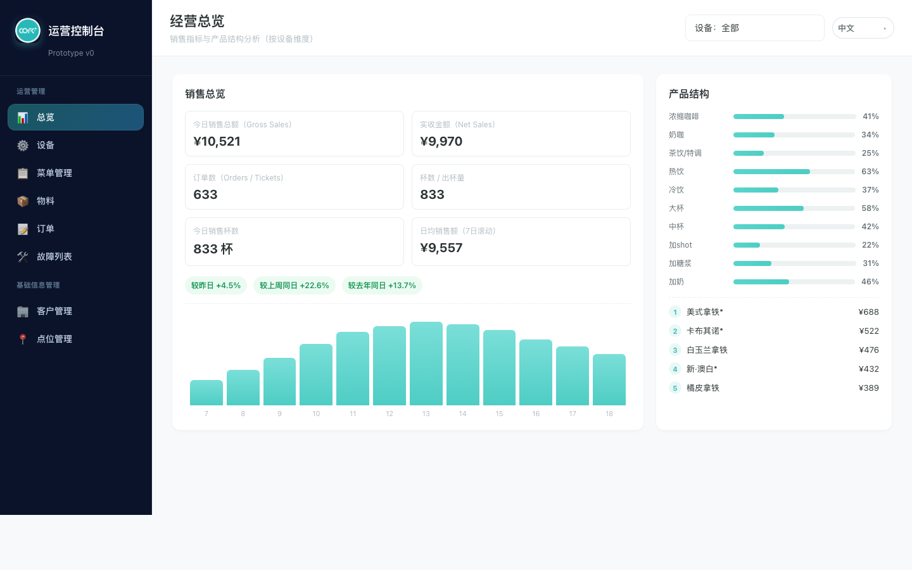 |
| 菜单管理 | 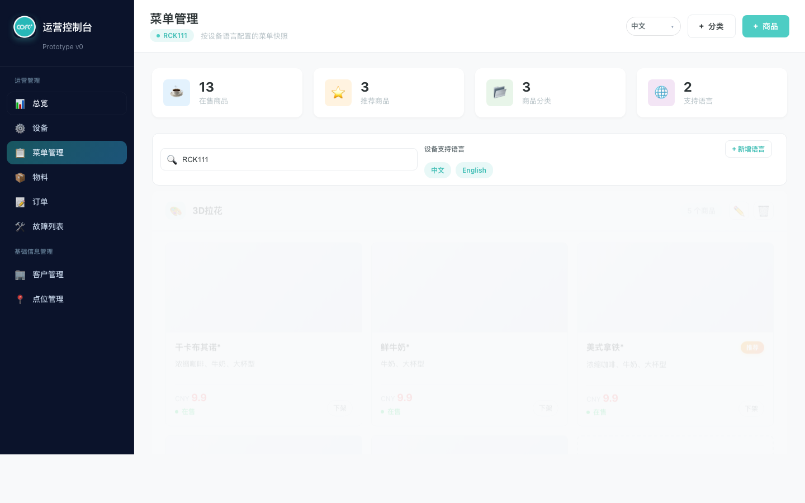 |
| 设备管理 | 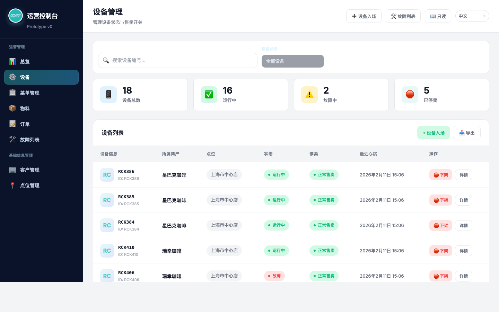 |
| 物料管理 | 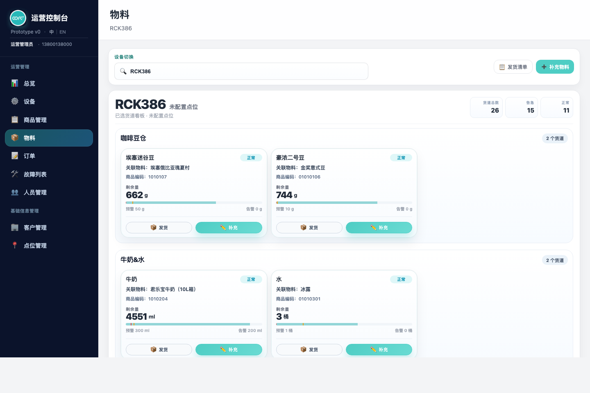 |
| 订单管理 | 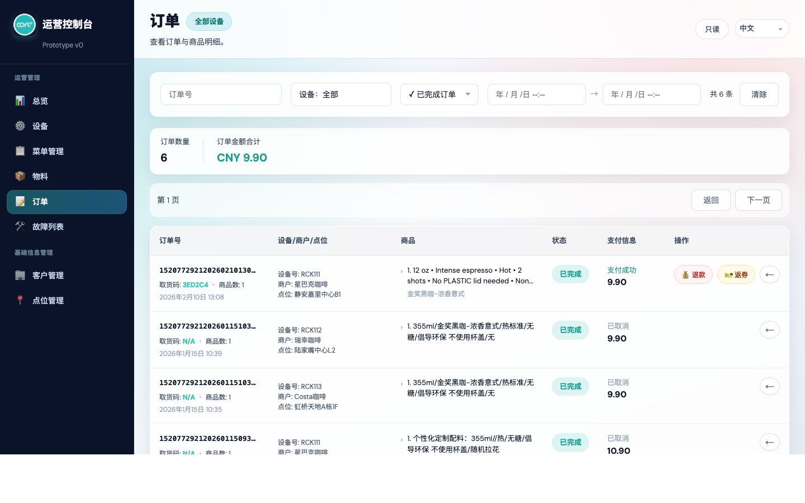 |
| 故障列表 | 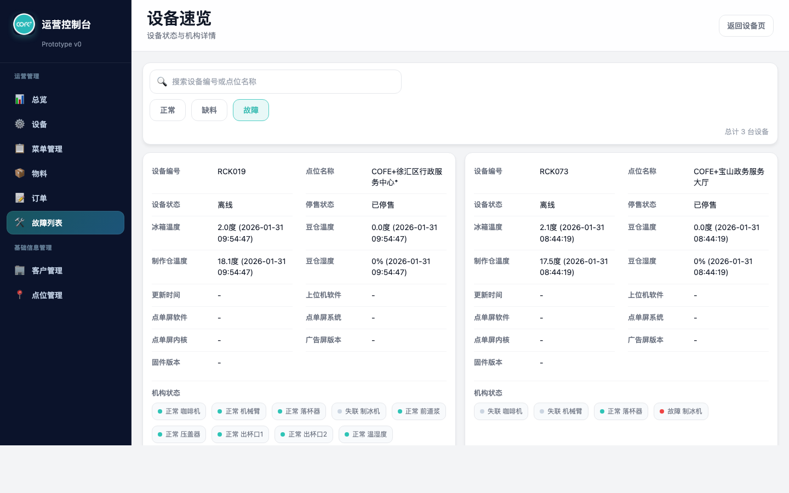 |
| 客户管理 | 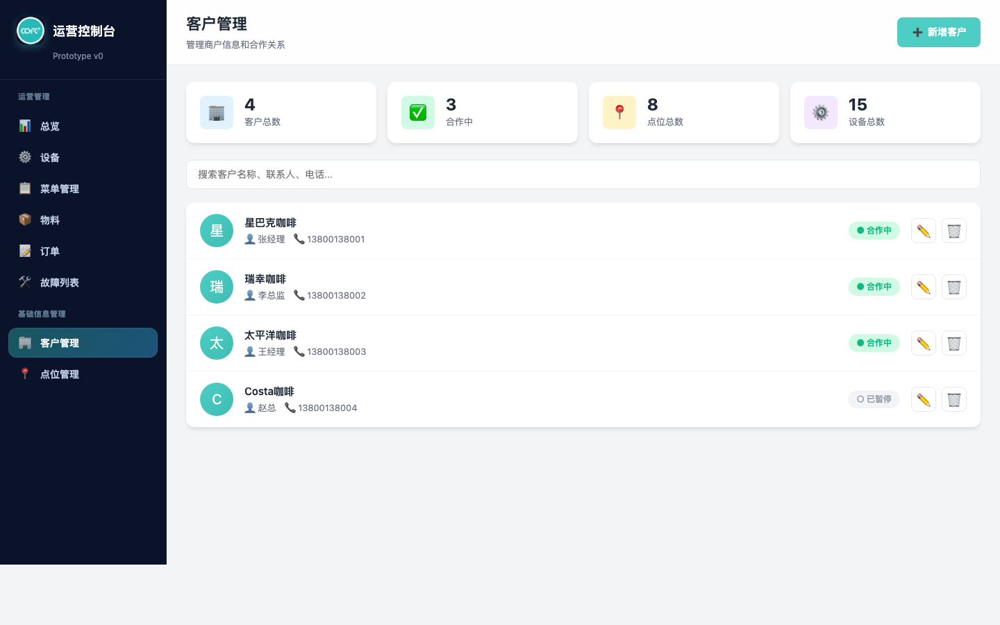 |
| 点位管理 | 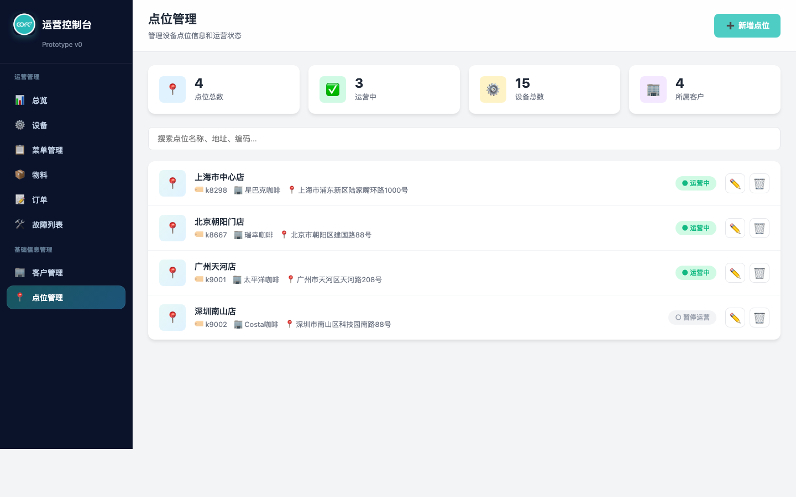 |

### 3.2 关联页面（扩展范围）

| 页面名称 | 页面截图 |
|---|---|
| 设备入场 | 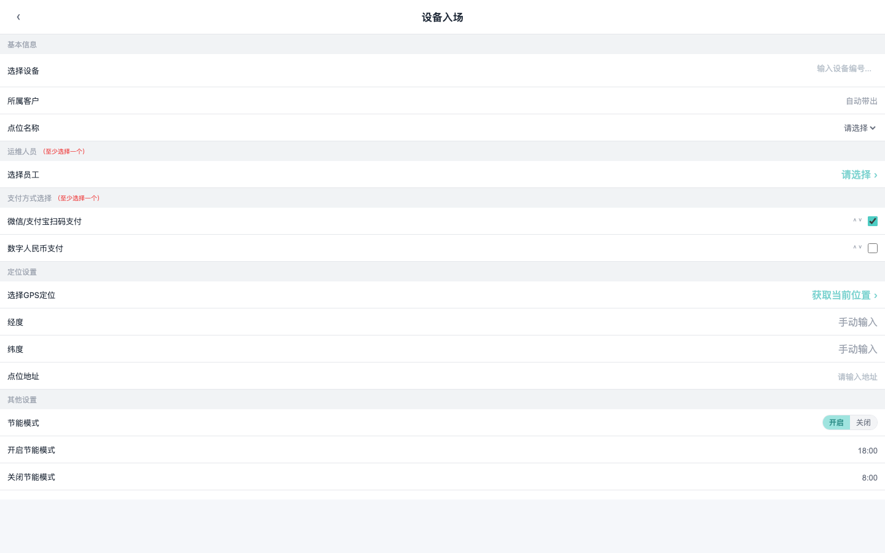 |
| 发货清单 | 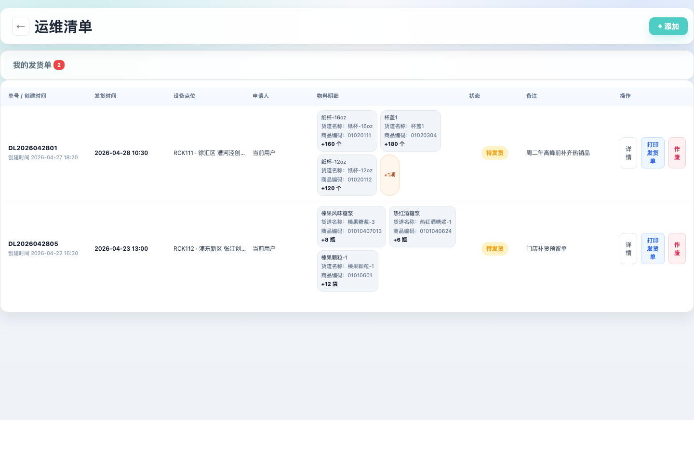 |
| 补充物料 | 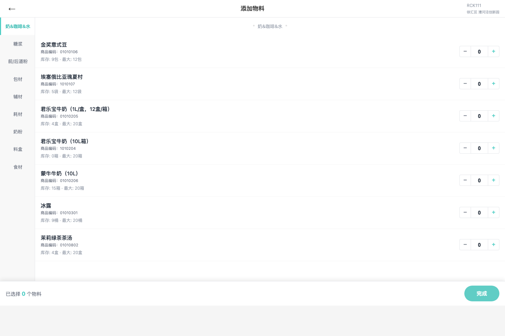 |
| 商品首页 | 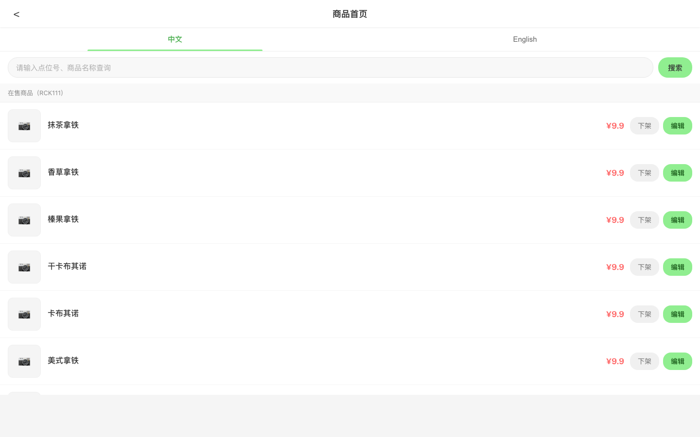 |
| 商品详情 | 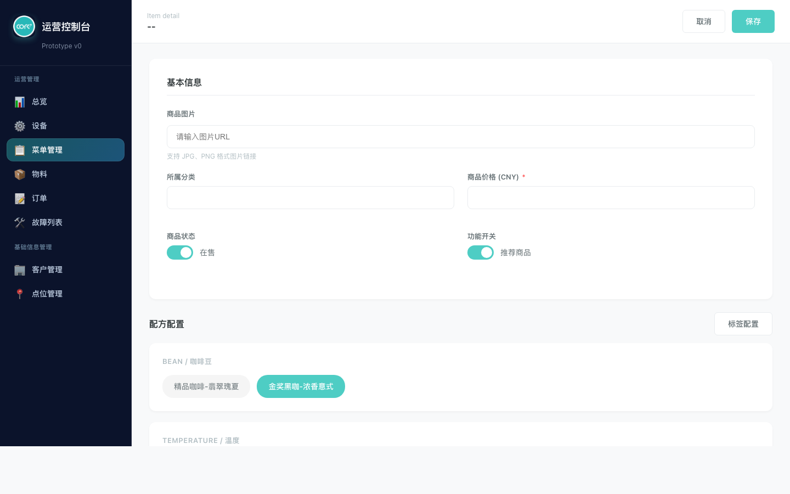 |

## 4. Case 清单

| Case ID | 页面 | 类型 | 说明 |
|---|---|---|---|
| C01 | 总览 | 主菜单 | 经营指标与产品结构查看 |
| C02 | 菜单管理 | 主菜单 | 分类、商品、多语言菜单配置 |
| C03 | 设备管理 | 主菜单 | 设备查询、状态筛选、售卖开关 |
| C04 | 物料管理 | 主菜单 | 设备货道看板、关联物料、发货与补充操作 |
| C05 | 订单管理 | 主菜单 | 订单筛选、分页、售后动作 |
| C06 | 故障列表 | 主菜单 | 正常/缺料/故障分组与搜索 |
| C07 | 客户管理 | 主菜单 | 客户档案增删改查 |
| C08 | 点位管理 | 主菜单 | 点位档案增删改查 |
| C09 | 设备入场 | 关联页 | 新增设备基础信息 |
| C10 | 运维清单 | 关联页 | 发货单查看、打印与作废 |
| C11 | 添加物料 | 关联页 | 按物料表选择补充物料并生成发货单 |
| C12 | 商品首页 | 关联页 | 商品列表入口与管理跳转 |
| C13 | 商品详情 | 关联页 | 商品字段编辑与保存 |

## 5. 页面级 Case 详细说明

### C01 总览（menu.html?tab=overview）

| 字段 | 说明 |
|---|---|
| 功能目标 | 展示经营结果，支持按设备维度查看整体销售表现 |
| 使用场景 | 运营经理日常巡检经营数据，识别异常波动 |
| 用户流程 | 进入总览页 -> 选择设备范围 -> 查看销售与结构数据 |
| 业务规则 | 默认显示全部设备数据；设备筛选后各指标联动更新 |
| 异常处理 | 无数据时显示空状态；筛选结果为空时提示“无匹配设备” |
| 输入 | 设备筛选条件、时间维度（页面内置） |
| 输出 | 销售额、订单数、杯量、产品结构、Top 列表等 |

### C02 菜单管理（menu.html?tab=menu）

| 字段 | 说明 |
|---|---|
| 功能目标 | 管理菜单分类与商品，维护设备支持语言配置 |
| 使用场景 | 运营人员上新、下架、调整价格和文案 |
| 用户流程 | 切换到菜单管理 -> 选择设备 -> 新增/编辑分类与商品 -> 保存 |
| 业务规则 | 商品必须归属分类；价格为有效数值；语言配置应作用于展示项 |
| 异常处理 | 必填项缺失阻断提交；非法价格提示；保存失败提示重试 |
| 输入 | 分类名、商品名、多语言文案、价格、状态 |
| 输出 | 更新后的分类树、商品列表、语言标签 |

### C03 设备管理（devices.html）

| 字段 | 说明 |
|---|---|
| 功能目标 | 统一管理设备状态与售卖开关 |
| 使用场景 | 运维定位故障设备并控制是否可售 |
| 用户流程 | 搜索设备 -> 按状态筛选 -> 查看详情 -> 执行停售/开售 |
| 业务规则 | 列表按筛选实时刷新；分页与统计卡片同步；售卖开关状态可持续 |
| 异常处理 | 搜索无结果显示空列表；目标设备不存在时提示 |
| 输入 | 设备编号关键字、状态筛选、分页动作 |
| 输出 | 设备列表、统计值（总数/运行中/故障中/停售） |

### C04 物料管理（materials.html）

| 字段 | 说明 |
|---|---|
| 功能目标 | 以设备为维度展示货道余量看板，支持查看货道名称、关联物料、商品编码、库存状态，并提供发货、补充、编辑货道名称、编辑关联物料入口 |
| 使用场景 | 运维/补料人员巡检指定设备货道状态，识别售罄、告急和正常货道，并对单个货道发起补充或发货 |
| 用户流程 | 选择设备 -> 查看 6 类货道分组 -> 查看货道卡片信息 -> 按权限执行发货、补充、编辑货道名称或编辑关联物料 |
| 业务规则 | 货道按“咖啡豆仓、牛奶&水、糖浆、前/后道粉、包材、制冰机”分组；每个货道一对一关联一个物料；货道卡片展示货道名称、关联物料、商品编码、剩余量、预警值、告警值；售罄和告急必须使用不同视觉状态；有数据分类优先展示，无数据分类后置 |
| 权限规则 | 查看物料由 `ops.materials` 控制；编辑货道名称由 `ops.materials.laneNameEdit` 控制；编辑关联物料由 `ops.materials.laneMaterialEdit` 控制；历史人员维护账号需兼容迁移新增货道编辑权限 |
| 异常处理 | 设备编号无效时提示；货道无关联物料时展示默认/空状态；编辑关联物料时仅允许选择当前商户物料表内且分类匹配的物料 |
| 输入 | 设备编号、货道操作、补充数量、预警值、告警值、货道名称、关联物料 |
| 输出 | 货道分组看板、货道卡片、库存状态、运维记录、发货/补充跳转上下文 |

#### C04-1 关键验收点

- 设备切换后，页面标题、设备摘要、点位信息和货道看板同步刷新。
- 货道卡片标题显示货道名称，不显示物料名称；物料名称只显示在“关联物料”字段。
- 卡片底部“补充”为主按钮，“发货”为次按钮，并适配桌面端和移动端。
- 补充弹窗遵循原流程：输入值表示“在当前库存上增加的数量”；“重置为 0”单独将当前量清零。
- 补充弹窗输入框聚焦后自动选中原数字，避免用户手动删除。
- 运维记录必须记录操作人员姓名和电话。

### C05 订单管理（orders.html）

| 字段 | 说明 |
|---|---|
| 功能目标 | 支持订单查询、统计、售后处理 |
| 使用场景 | 客服处理退款返券；运营核对订单表现 |
| 用户流程 | 设置筛选条件 -> 浏览列表 -> 执行退款/返券 -> 翻页查看 |
| 业务规则 | 筛选条件可组合；统计值随筛选结果变化；分页边界受控 |
| 异常处理 | 日期条件非法时提示；无结果显示空态；售后失败提示重试 |
| 输入 | 订单号、设备集合、状态、时间区间 |
| 输出 | 订单列表、总条数、金额统计、售后结果提示 |

### C06 故障列表（faults.html）

| 字段 | 说明 |
|---|---|
| 功能目标 | 以状态分组方式查看设备健康与故障详情 |
| 使用场景 | 值班人员快速定位需处理设备 |
| 用户流程 | 进入故障页 -> 选择分组 Tab -> 搜索设备 -> 查看卡片详情 |
| 业务规则 | Tab 分组互斥；搜索同时匹配设备编号与点位名称 |
| 异常处理 | 分组为空展示空态；搜索无命中显示“无结果” |
| 输入 | 分组选择、搜索关键字 |
| 输出 | 故障列表卡片、分组数量汇总 |

### C07 客户管理（customers.html）

| 字段 | 说明 |
|---|---|
| 功能目标 | 维护客户档案与联系信息 |
| 使用场景 | 运营录入新客户，更新联系人信息 |
| 用户流程 | 新增/编辑客户 -> 填写表单 -> 保存 -> 列表刷新 |
| 业务规则 | 客户名称为必填；编辑与新增走统一表单逻辑 |
| 异常处理 | 必填缺失时阻断保存；删除前弹确认 |
| 输入 | 客户名、联系人、电话、地址、备注 |
| 输出 | 客户列表、客户统计卡片 |

### C08 点位管理（locations.html）

| 字段 | 说明 |
|---|---|
| 功能目标 | 维护设备投放点位档案 |
| 使用场景 | 新增点位、调整点位属性、清理无效点位 |
| 用户流程 | 新增/编辑点位 -> 填写表单 -> 保存 -> 列表刷新 |
| 业务规则 | 点位基础信息必须完整；点位与客户关系可维护 |
| 异常处理 | 必填缺失时提示；删除前二次确认 |
| 输入 | 点位名、地址、客户关联信息、备注 |
| 输出 | 点位列表、点位统计信息 |

### C09 设备入场（device-entry.html）

| 字段 | 说明 |
|---|---|
| 功能目标 | 完成新设备录入并进入设备池 |
| 使用场景 | 新机器上线前录入设备信息 |
| 用户流程 | 打开设备入场页 -> 填写设备信息 -> 提交保存 |
| 业务规则 | 设备编号应唯一；必填字段完整后方可提交 |
| 异常处理 | 编号重复或字段缺失时阻断提交并提示 |
| 输入 | 设备编号、点位、客户、状态等字段 |
| 输出 | 新增设备记录、回跳设备列表可见 |

### C10 运维清单（materials-orders.html）

| 字段 | 说明 |
|---|---|
| 功能目标 | 展示物料运维相关发货单，支持查看明细、打印发货单、作废本人待发货单 |
| 使用场景 | 补料人员提交物料补充后，在运维清单查看发货任务；仓配或管理人员查看发货单明细与打印 |
| 用户流程 | 从物料页进入运维清单 -> 查看我的发货单 -> 打开详情/打印 -> 必要时作废本人待发货单 |
| 业务规则 | 默认展示“我的发货单”；“全部发货单”仅在具备查看全部权限时展示；不在本页面处理发货完成状态；作废仅允许当前用户作废自己创建且待发货的发货单；发货单明细必须展示商品编码，存在来源货道时展示货道名称 |
| 权限规则 | 我的发货单为基础可见范围；查看全部发货单需独立权限控制；作废能力按申请人与状态共同控制 |
| 异常处理 | 无数据时展示空态；无来源上下文时隐藏返回物料页入口；作废必须填写原因；非本人或非待发货单不允许作废 |
| 输入 | 发货单筛选、详情查看、打印、作废原因 |
| 输出 | 发货单列表、发货单详情、打印视图、作废状态与原因 |

#### C10-1 关键验收点

- 页面标题使用“运维清单”，避免继续使用旧“订单/历史清单”语义。
- 发货单物料明细统一展示商品编码，并使用现有物料表中的编号。
- 打印发货单应包含发货单号、设备、点位、申请人、申请人电话、物料名称、商品编码、数量和单位。
- 作废后详情和打印内容需要展示作废状态与作废原因。

### C11 添加物料（materials-refill.html）

| 字段 | 说明 |
|---|---|
| 功能目标 | 基于当前商户物料表添加补充物料，生成发货单并返回运维清单 |
| 使用场景 | 运维人员从货道卡片进入添加物料，或直接进入添加物料页批量选择需要补给的物料 |
| 用户流程 | 进入添加物料 -> 按分类浏览/搜索物料 -> 增减数量 -> 查看已选物料 -> 完成并生成发货单 -> 返回运维清单 |
| 业务规则 | 所有可选物料必须来自当前商户对应物料表；物料数据、商品编码、单位、库存、最大值与 Excel mock 对齐；列表默认只展开当前分类；来自货道卡片时应默认定位并预选对应物料；确认生成时写入申请人姓名和手机号 |
| 异常处理 | 数量为 0 时不可完成；超出最大值或非法数量时阻断；无来源上下文时按普通添加流程处理 |
| 输入 | 物料分类、搜索词、物料数量、配送日期选项 |
| 输出 | 已选物料清单、发货单、运维清单跳转上下文 |

#### C11-1 关键验收点

- 分类顺序与物料管理一致，移动端左侧分类和右侧物料列表均可用。
- 已选物料需要有独立颜色态，并随数量变化实时更新。
- 物料列表、已选清单、确认摘要都优先展示商品编码。
- 从货道卡片进入时，添加物料页需要展示来源货道名称，并生成带来源货道的发货单明细。

### C12 商品首页（product-management.html）

| 字段 | 说明 |
|---|---|
| 功能目标 | 提供商品管理入口与列表视图 |
| 使用场景 | 运营快速浏览商品并进入编辑 |
| 用户流程 | 打开商品首页 -> 搜索/筛选商品 -> 点击进入详情 |
| 业务规则 | 商品列表应反映当前菜单配置 |
| 异常处理 | 列表空态提示；搜索无结果提示 |
| 输入 | 搜索词、筛选项 |
| 输出 | 商品列表、商品状态展示 |

### C13 商品详情（product-detail.html）

| 字段 | 说明 |
|---|---|
| 功能目标 | 维护单个商品完整属性 |
| 使用场景 | 调整价格、文案、图片、上下架状态 |
| 用户流程 | 进入详情 -> 修改字段 -> 保存 -> 返回上级页面 |
| 业务规则 | 价格字段有效；多语言内容按当前支持语言展示 |
| 异常处理 | 保存失败需提示；字段校验失败阻断提交 |
| 输入 | 商品名称、描述、价格、图片、状态、标签 |
| 输出 | 更新后的商品实体及提示信息 |

## 6. 非功能说明

按本次确认（4A），本版 PRD 不展开非功能需求（性能、安全、权限、兼容性）与对应验收指标。

## 7. 备注

- 本文档用于“现状功能基线”对齐，不新增产品范围。  
- 后续如进入迭代开发，建议基于本文件新增《迭代 PRD（增量）》与《测试用例集》。
