# 产品需求文档：设备管理（按当前页面）

> 使用说明：`Markdown` 版本适合在仓库内查看；如需在浏览器或飞书文档中阅读，优先使用同目录的 [prd-device-management-user-flow.html](./prd-device-management-user-flow.html)。
>
> 口径说明：本文以当前设备管理页面能力为准，描述已上线页面结构、交互和已知限制，不扩展未来态需求。

## 1. 介绍 / 概述

设备管理是 COFE+ 后台当前用于查看设备概览、定位目标设备、维护入场信息、查看技术状态并发起基础设备操作的统一入口。

当前页面覆盖以下能力：

- 顶部统计卡、搜索、状态筛选、点位分类筛选
- 桌面端表格列表与移动端状态卡片列表
- 设备详情宽弹层、顶部设备摘要与概览 / 运行 / 记录 / 入场 / 广告屏标签页
- 入场信息查看 / 编辑、点位图片预览、点位变更记录
- 广告屏左右屏素材查看 / 编辑
- 温度报警设置
- 状态记录弹层、异常记录与运维记录查看
- 编辑设备状态、远程操作、跳转物料页面
- 按当前员工设备范围裁剪设备数据

默认用户角色：

- 运营人员：查看设备状态、搜索设备、维护入场信息、执行停卖 / 恢复。
- 运维人员：查看技术状态、调整温度报警参数、查看运维记录、执行远程操作。
- 区域管理员：查看设备整体运行情况、进入详情判断问题、进行状态维护。

## 2. 目标

- 让用户进入设备管理后先看到设备总量、运行中、故障、停用四项核心概览。
- 让用户通过设备编号、点位名称、状态和点位分类快速定位目标设备。
- 让桌面端与移动端都能在统一信息口径下完成浏览、查看详情和列表级动作。
- 让设备详情首屏通过顶部摘要和概览 / 状态双栏快速完成判断，并把运行、记录、入场和广告屏信息收纳到同一详情页的标签页。
- 让入场信息、广告屏与温度报警设置都能在当前设备上下文内直接维护。
- 让设备页面自动遵守当前员工的页面权限和设备范围，避免越权浏览。

## 3. 功能模块与截图

### F-001：设备总览

**功能说明：** 进入设备管理页后，用户先看到设备总数、运行中、故障、停用 4 张统计卡，以及顶部的主筛选栏。这一层承担“先看全局健康度，再决定是否继续筛选”的作用。

**当前页面表现：**
- 顶部统计卡按当前可见设备范围实时计算。
- 右上角提供 `+ 设备入场` 入口。
- 空状态下统计与列表会一起收口到权限 / 范围提示。

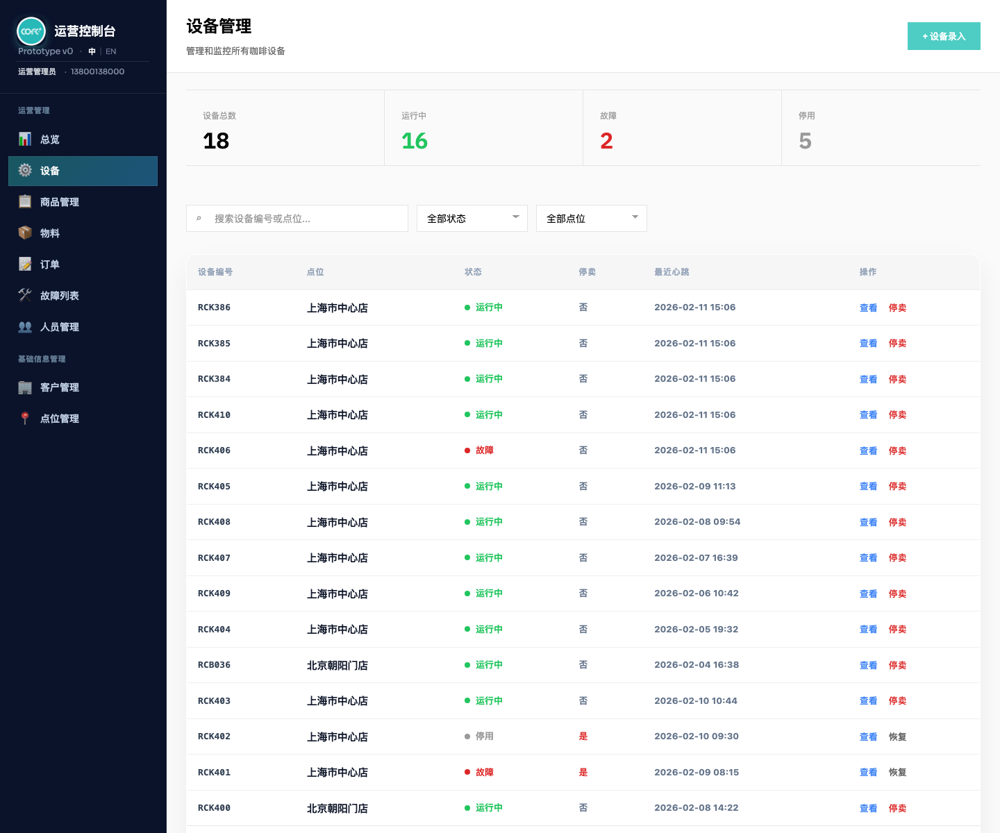

### F-002：搜索与筛选

**功能说明：** 用户可以通过搜索框、状态筛选和点位分类筛选快速定位目标设备；搜索同时覆盖设备编号、点位名称和点位编码。

**当前页面表现：**
- 支持 `全部状态 / 运行中 / 故障`。
- 虽然列表中会出现 `停用` 和 `未入场` 口径，但当前状态下拉不支持对这两类做单独筛选。
- 支持 `全部点位 / 展会点位 / 运营点位`。
- 条件变化后即时刷新列表，无需手动提交。

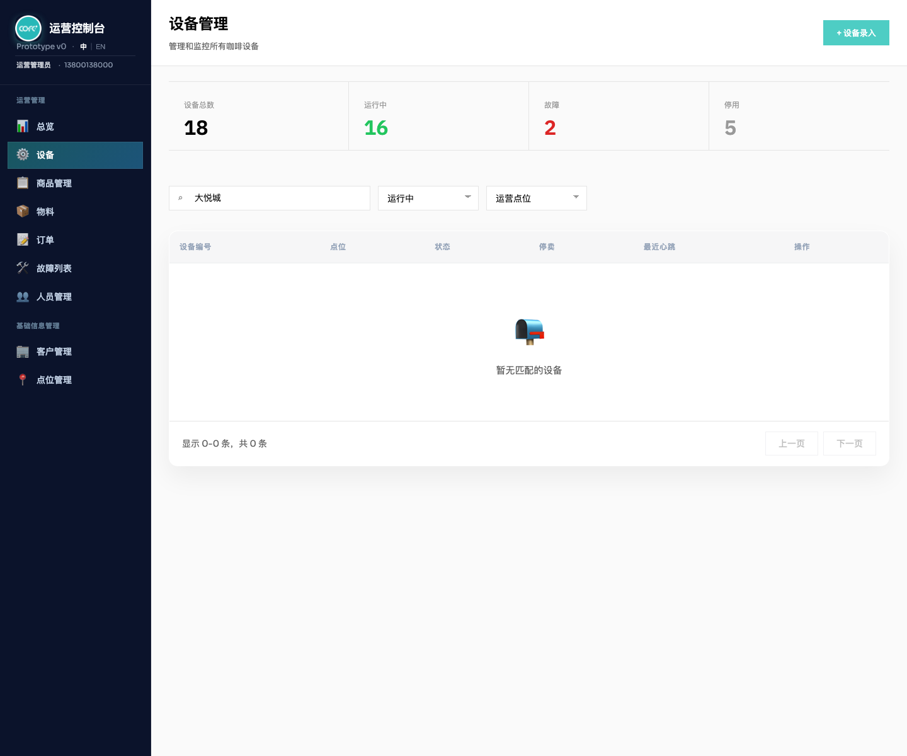

### F-003：设备列表

**功能说明：** 设备列表是页面的主工作区。桌面端使用表格承载高密度信息，移动端则使用状态卡片保证可读性和可操作性。

**当前页面表现：**
- 桌面端列表列出 `设备编号 / 商户 / 点位 / 状态 / 停卖 / 最近心跳 / 操作`。
- 移动端卡片展示 `商户 / 点位 / 停卖 / 状态 / 最近心跳`。
- 列表级动作固定为 `查看` 与 `停卖 / 恢复`。

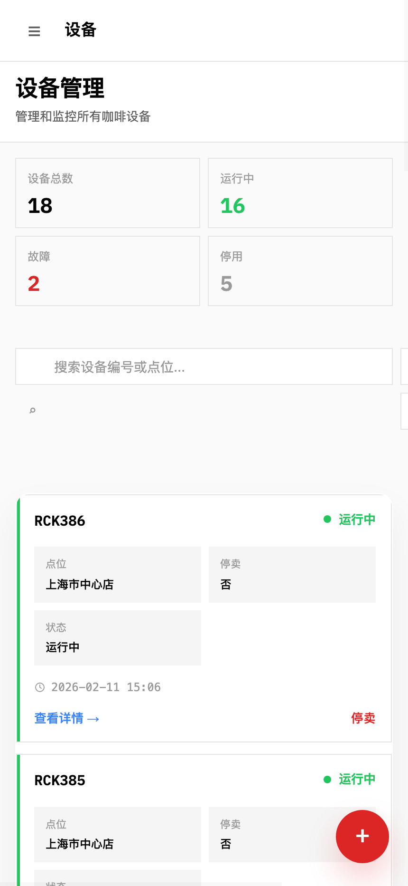

### F-004：添加设备（三步向导）

**功能说明：** 点击 `+ 设备入场` 后进入最新的三步设备入场向导，按 `基本信息`、`运维 · 支付`、`广告屏` 三步完成新设备入场配置。页面按当前登录商户自动限定设备、点位和员工范围，并在入场阶段一并完成支付方式、广告屏和点位照片配置。

**当前页面表现：**
- 设备、点位、员工都按当前登录商户范围过滤，不再在页面上单独选择所属客户。
- 基本信息区包含 `选择设备`、`点位名称`，并支持 `+ 新增点位` 快速创建并自动选中。
- 页面使用三步向导结构：第 1 步为 `基本信息`，第 2 步为 `运维 · 支付`，第 3 步为 `广告屏`；底部提供上一步、下一步和提交入场动作。
- 第 1 步承载设备、点位、坐标和点位照片；第 2 步承载运维人员、支付方式和运行设置；第 3 步承载左右广告屏素材上传。
- 提交后会保存入场信息，并同步更新设备商户、点位、入场状态、停卖状态和心跳初始状态。

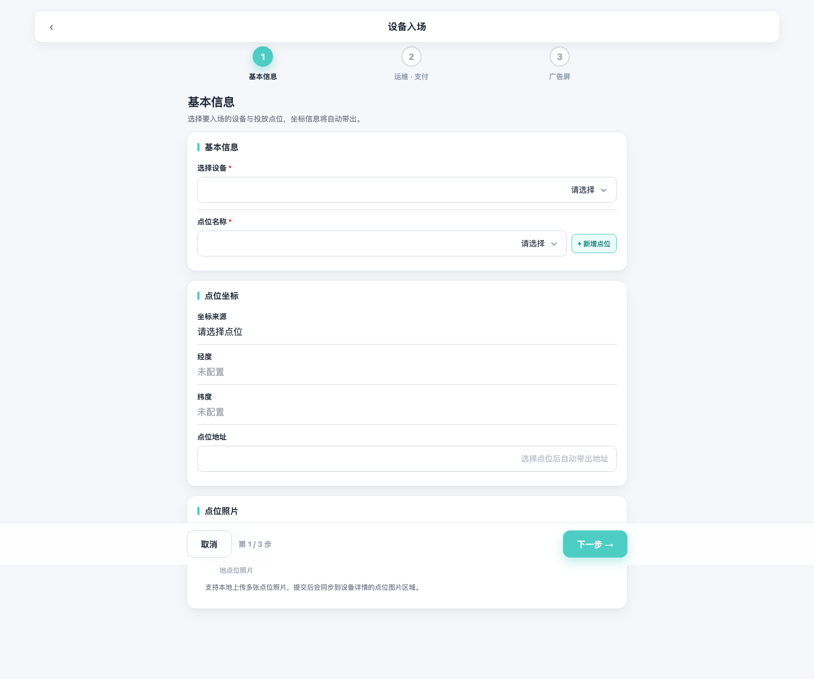

### F-005：设备详情概览

**功能说明：** 设备详情弹层是设备管理的核心查看面。最新版本采用“顶部摘要 + 标签页”的信息层级，让用户先判断这台设备是谁、在哪里、是否正常，再在同一详情页继续查看运行、记录、入场和广告屏信息。

**当前页面表现：**
- 顶部摘要展示返回、设备编号、运行状态、入场状态、点位，以及 `重启`、`远程操作`、`更多` 操作。
- 详情页固定提供 `概览 / 运行 / 记录 / 入场 / 广告屏` 五个标签页，默认打开 `概览`。
- `概览` 使用双栏信息卡展示 `设备概览` 与 `设备状态`；设备概览展示 `设备编号 / 点位 / 设备类别`，设备状态展示 `设备状态 / 停卖状态 / 最近心跳 / 入场状态 / 当前异常摘要`。
- `运行` 标签页承载温度、湿度、软件 / 固件版本、运营参数、机构状态和温度报警设置。
- `记录`、`入场`、`广告屏` 标签页分别承载异常 / 运维记录、入场信息、左右物理屏素材信息。
- 详情底部固定提供 `编辑入场信息` 与 `关闭`，编辑保存后刷新当前设备详情。

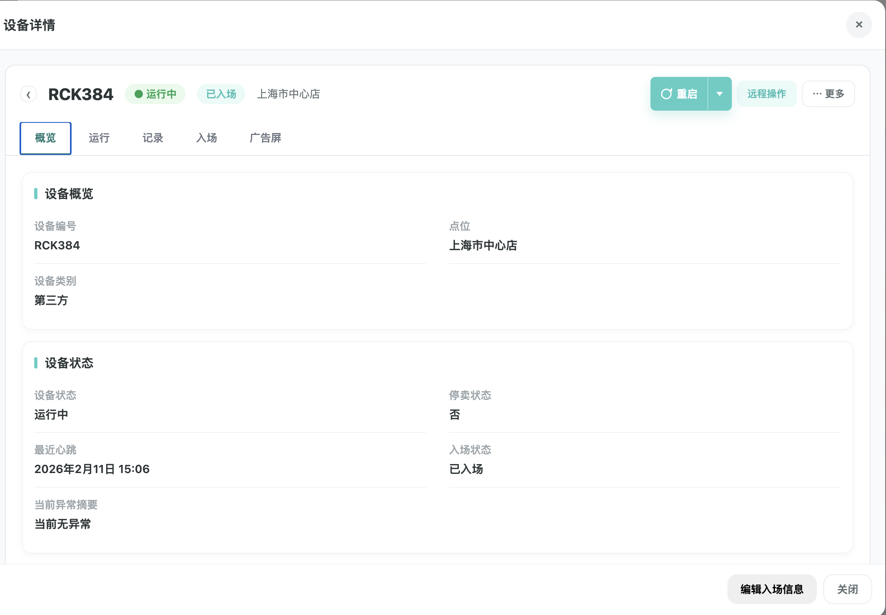

#### F-005-A：技术状态

**功能说明：** 技术状态用于承载当前设备的实时技术指标、软件版本和关键机构运行状态，帮助运维在不离开当前设备上下文的情况下快速判断“机器是不是正常、异常更像硬件还是软件问题、是否需要继续往下处理”。

**当前页面表现：**
- 用户切换到 `运行` 标签页查看技术状态。
- 技术状态在当前详情页中以独立信息区展示，并默认显示。
- 展开后按双列信息区展示 `冰箱温度`、`制作仓温度`、`豆仓温度`、`豆仓湿度`、`更新时间`、`上位机软件`、`点单屏软件`、`点单屏系统`、`点单屏内核`、`广告屏版本`、`固件版本` 等只读字段。
- 底部单独展示 `机构状态` 标签组，当前口径会展示咖啡机、机械臂、落杯器、制冰机、前道浆、压盖器、出杯口和混水水路等机构状态。
- 当前只支持查看，不支持在技术状态区域内直接修改任何参数。

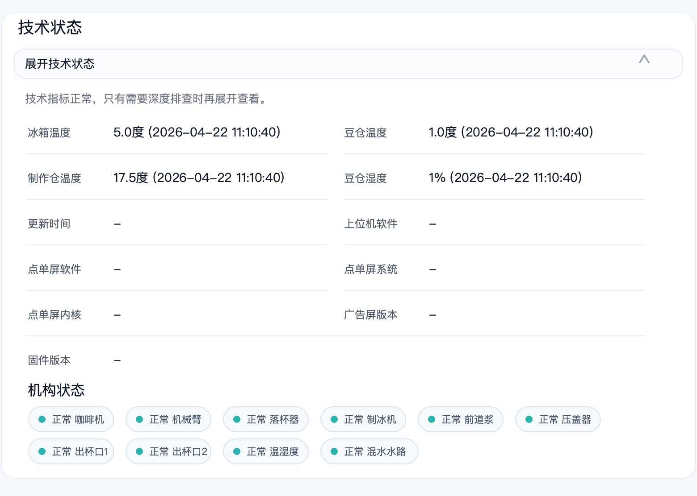

### F-006：入场信息

**功能说明：** 入场信息承载设备落位和基础配置，是详情里最重要的业务信息块之一。用户可以查看基础字段、补充字段与点位图片，并通过底部按钮进入编辑。

**当前页面表现：**
- 用户切换到 `入场` 标签页查看入场信息。
- 信息在当前详情页中以单一详情区块展示，并默认展开。
- 支持查看点位图片并点击预览。
- 支持查看点位变更记录；变更记录默认以折叠摘要卡片展示，每条记录摘要显示时间、操作人、变更项数量、变更字段和主要变化，点击后再查看完整变更前 / 变更后。
- 支持编辑后直接刷新到当前设备详情。

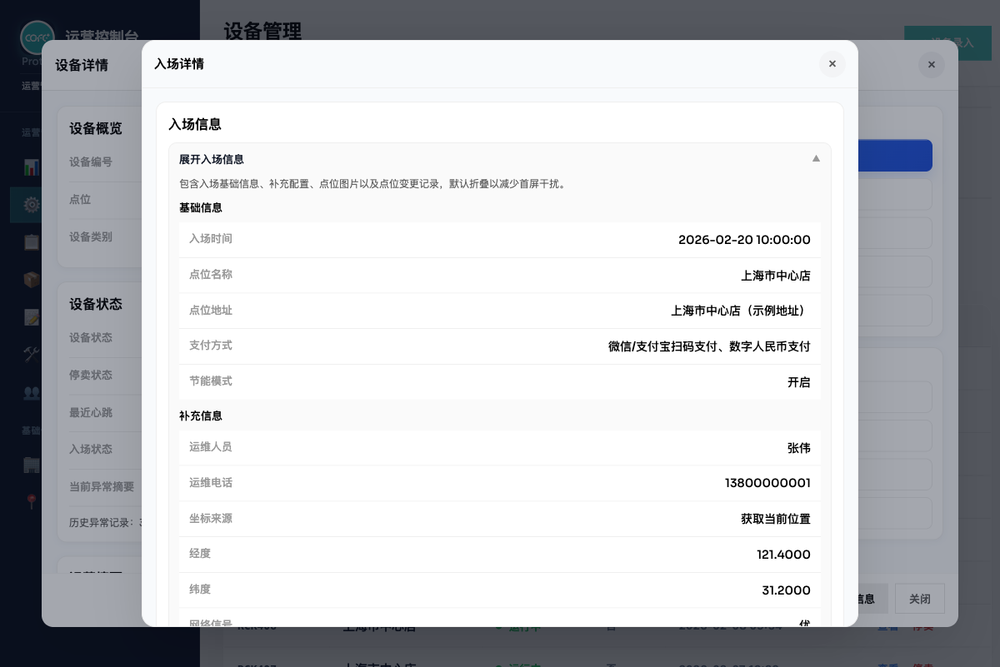

### F-007：广告屏信息

**功能说明：** 广告屏信息按左右物理屏拆开管理，避免素材传错位置。左侧菜单与右侧排队号背景分别展示、分别维护。

**当前页面表现：**
- 用户切换到 `广告屏` 标签页查看广告屏信息。
- 左侧支持图片和 H.264 视频。
- 右侧仅支持图片。
- 详情中按左右拼接方式预览。

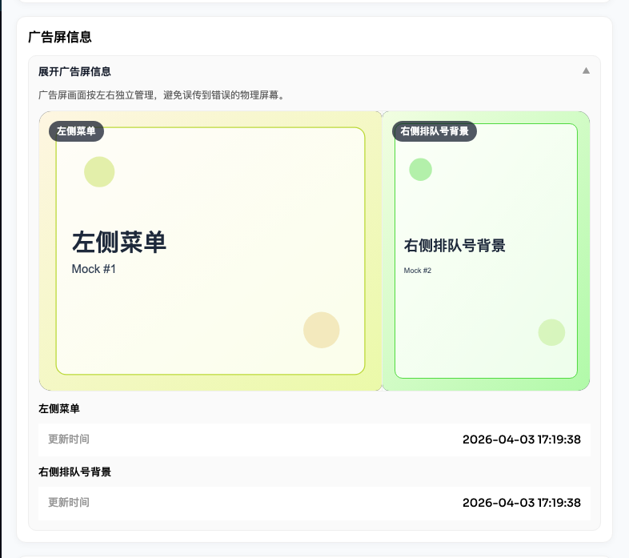

### F-008：温度报警设置

**功能说明：** 温度报警设置通过独立弹层打开，按温区展示参数卡片，并允许逐区修改阈值。

**当前页面表现：**
- 当前固定展示冰箱、豆仓、制作仓、净水区最低点、废水区最低点 5 个温区。
- 每个温区都可点击 `修改`。
- 保存后刷新当前弹层内容。

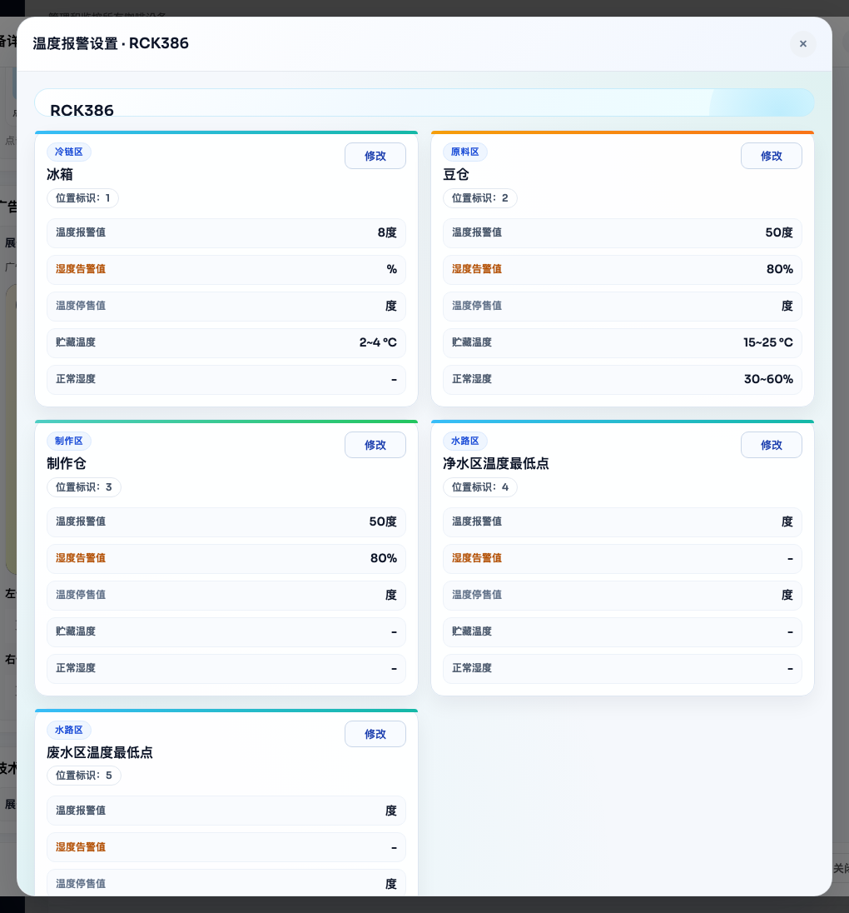

### F-009：状态记录

**功能说明：** 状态记录用于追溯设备最近的异常和运维处理，不承担远程操作总日志的展示职责。

**当前页面表现：**
- 用户切换到 `记录` 标签页直接查看异常 / 运维记录。
- 状态记录弹层固定为 `异常记录` 与 `运维记录` 双标签，打开时默认停留在 `异常记录`。
- 异常记录较少时，预览环境应保持列表展示稳定。
- 运维记录会自动带出运维人员和联系电话。

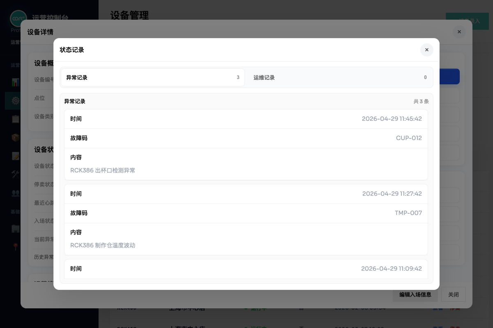

### F-010：编辑状态

**功能说明：** 用户可以从详情页顶部的 `更多` 菜单修改设备状态，快速把系统状态同步到线下真实状态。

**当前页面表现：**
- 当前支持 `正常 / 故障 / 缺料`。
- 保存后刷新列表、统计和设备详情。
- 改为故障时会同步生成异常记录。

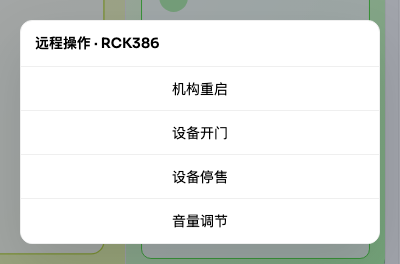

### F-011：远程操作

**功能说明：** 远程操作通过弹层发起，当前一级菜单固定包含 `机构重启`、`设备开门`、`设备停售`、`音量调节` 4 个动作。其中只有 `机构重启` 需要进入二级确认流，其余动作都属于一级直达动作。

**当前页面表现：**
- 一级入口以动作清单形式展示。
- `机构重启` 进入二级子菜单，再进入确认页。
- `设备开门`、`设备停售`、`音量调节` 当前点击后直接执行，并形成操作记录。

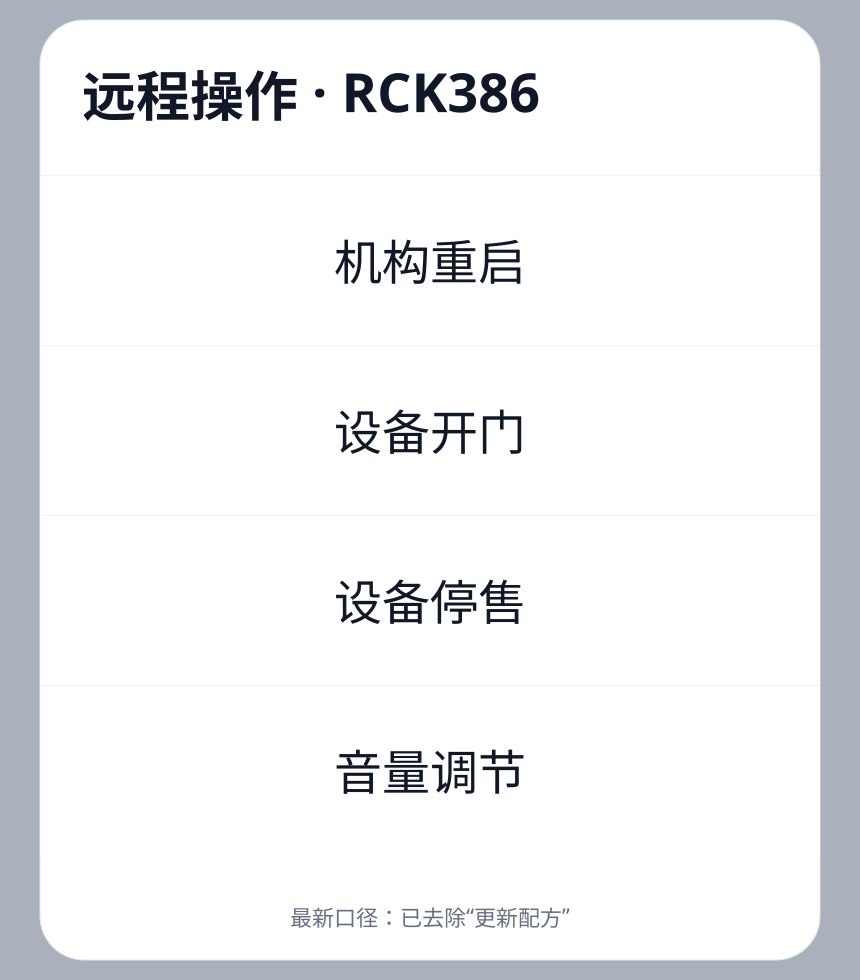

#### F-011-A：机构重启

**功能说明：** 用于对设备系统、左右点单屏和六轴机械臂发起重启，是当前远程操作里唯一需要二次确认的高风险动作。

**当前页面表现：**
- 点击 `机构重启` 后进入二级子菜单。
- 当前二级动作固定包含 `重启系统`、`重启点单屏（左）`、`重启点单屏（右）`、`重启六轴机械臂（注意安全，谨慎使用）`。
- 选择具体动作后进入确认页，点击 `确认执行` 才真正下发指令。

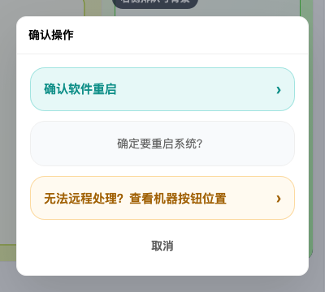

#### F-011-B：设备开门

**功能说明：** 用于直接向设备下发开门指令，便于现场补料、巡检或运维处理。

**当前页面表现：**
- 当前作为一级直达动作，入口位于远程操作菜单中。
- 点击后直接关闭弹层，并提示 `已向设备 {设备编号} 下发指令：设备开门`。
- 当前没有单独的二级确认页或参数配置页。

#### F-011-C：设备停售

**功能说明：** 用于向设备下发停售指令，作为远程操作的一类设备控制动作。

**当前页面表现：**
- 当前作为一级直达动作，无二级参数页。
- 点击后记录远程动作并提示成功。
- 当前页面不会因为这个动作立即改写列表里的 `停卖` 展示，列表停卖状态仍由设备数据本身决定。

#### F-011-D：音量调节

**功能说明：** 用于向设备下发音量调整类指令，是当前远程操作菜单中的直达入口之一。

**当前页面表现：**
- 当前作为一级直达动作展示在远程操作菜单中。
- 点击后直接下发指令并关闭弹层。
- 当前页面尚未实现 `设备音量 / 点单屏音量` 的二级拆分配置。

## 4. 用户流程 / 用户故事

### UF-001：进入设备管理并查看设备总览

**描述：** 作为运营人员，我希望进入设备管理页后先看到当前可见设备的整体状态，这样我能快速判断当前设备池是否稳定。

**主流程：**
1. 用户进入 `设备管理` 页面。
2. 页面加载当前可见设备数据。
3. 顶部展示统计卡、筛选栏和设备列表。
4. 用户继续搜索、筛选或进入详情。

**验收标准：**
- [ ] 页面标题为 `设备管理`，副标题为 `管理和监控所有咖啡设备`。
- [ ] 顶部统计卡固定展示 `设备总数`、`运行中`、`故障`、`停用` 4 项。
- [ ] 页面右上角提供 `+ 设备入场` 按钮，桌面端与移动端悬浮按钮都跳转到设备入场页面。
- [ ] 统计卡按当前可见设备范围计算，而不是按全量设备无差别统计。
- [ ] 列表采用分页，当前每页固定 `15` 条，并提供 `上一页 / 下一页`。
- [ ] 当当前账号无设备页权限、无分配设备或筛选后无结果时，页面展示明确空状态文案。

**参考截图：**

### UF-002：添加设备并提交入场信息

**描述：** 作为运营人员，我希望从设备管理页进入最新设备入场页，并在当前商户范围内完成设备、点位、员工、支付方式、广告屏和点位照片配置，这样新设备才能按最新流程正式纳入设备管理范围。

**主流程：**
1. 用户在设备管理页点击 `+ 设备入场`。
2. 系统跳转到 `设备入场` 页面。
3. 系统按当前登录商户范围加载可入场设备、可选点位和可选员工，并展示三步向导进度。
4. 用户在 `基本信息` 步骤选择设备、点位并补充坐标、点位地址和点位照片；如无合适点位，可先 `+ 新增点位` 并自动选中。
5. 用户在 `运维 · 支付` 步骤选择运维人员、至少一种支付方式，并补充节能模式、设备日期、网络信号、维护时段和备注。
6. 用户在 `广告屏` 步骤按需上传左侧菜单和右侧排队号背景素材。
7. 用户点击 `提交入场` 完成设备入场并返回设备管理。

**验收标准：**
- [ ] 设备入场入口从设备管理页顶部按钮和移动端悬浮按钮都可以进入。
- [ ] 三步设备入场向导按当前登录商户范围过滤 `设备`、`点位` 和 `员工`，不再单独提供“所属客户”选择框。
- [ ] 基本信息区至少支持 `选择设备`、`点位名称`，并支持 `+ 新增点位`。
- [ ] 快速新增点位时，系统自动绑定当前商户，并支持填写 `点位名称`、`点位编码`、`点位分类`、`点位状态`、`负责人`、`联系电话`、`详细地址`、`备注`。
- [ ] 运维人员区当前至少选择 1 名员工，员工列表按当前商户过滤。
- [ ] 定位设置至少支持 `获取当前位置`、经纬度展示 / 自动带出和 `点位地址` 填写。
- [ ] 其他设置至少支持 `节能模式`、节能起止时间、`设备开始日期`、`设备结束日期`、`第五代终端`、`订单并行制作`、`网络信号`、`维护时段`、`备注`。
- [ ] 支付方式区至少支持 `微信/支付宝扫码支付` 与 `数字人民币支付`，且至少选择一种。
- [ ] 广告屏设置区至少支持 `左侧菜单` 和 `右侧排队号背景` 两个固定槽位。
- [ ] 点位照片区支持本地上传多张图片，并在提交后同步到设备详情的点位图片区域。
- [ ] 页面底部按步骤提供 `上一步`、`下一步`，最后一步提供 `提交入场` 动作。
- [ ] 提交成功后，系统保存入场信息，同时更新设备所属商户、点位和入场状态；若设备原本未启用销售或无心跳，会同步补全默认展示状态。

**参考截图：**

### UF-003：通过搜索与筛选快速定位设备

**描述：** 作为运营或运维人员，我希望通过设备编号、点位和状态快速缩小范围，这样我能尽快找到目标设备。

**主流程：**
1. 用户在搜索框中输入设备编号或点位关键词。
2. 用户选择状态筛选。
3. 用户选择点位分类筛选。
4. 列表即时刷新并返回结果。

**验收标准：**
- [ ] 搜索框占位文案为 `搜索设备编号或点位...`。
- [ ] 搜索需同时匹配 `设备编号`、`点位名称` 和原始点位编码。
- [ ] 状态筛选当前仅包含 `全部状态`、`运行中`、`故障`。
- [ ] 当前不提供 `停用` 或 `未入场` 的单独筛选项；这两种口径只能在列表展示中查看，不能通过状态筛选直接过滤。
- [ ] 点位筛选当前仅包含 `全部点位`、`展会点位`、`运营点位`。
- [ ] 筛选项变化后即时生效，不需要额外点击“应用筛选”。
- [ ] 当筛选结果为空但当前账号仍有设备可见范围时，空状态文案显示为 `暂无匹配的设备`。

**参考截图：**

### UF-004：在桌面表格和移动卡片中浏览设备

**描述：** 作为后台使用者，我希望在桌面端和移动端都能快速浏览设备，并直接进行列表级操作，这样我不用每次都先进入详情。

**主流程：**
1. 用户在桌面端查看设备表格。
2. 用户在移动端查看设备状态卡片。
3. 用户在列表中点击 `查看` / `查看详情` 或 `停卖 / 恢复`。

**验收标准：**
- [ ] 桌面端表格列顺序固定为 `设备编号`、`商户`、`点位`、`状态`、`停卖`、`最近心跳`、`操作`。
- [ ] 移动端卡片展示 `商户`、`点位`、`停卖`、`状态`、`最近心跳` 关键信息，并带状态色条。
- [ ] 桌面端列表级动作固定为 `查看` 与 `停卖 / 恢复` 两个按钮。
- [ ] 移动端卡片动作固定为 `查看详情 →` 与 `停卖 / 恢复` 两个按钮。
- [ ] 当设备 `status = faulted` 时，列表状态显示为 `故障`。
- [ ] 当设备未故障但 `sales = disabled` 时，列表状态显示为 `停用`。
- [ ] 当设备未入场或缺少点位时，点位文案显示为 `未入场`。
- [ ] 点击 `停卖 / 恢复` 时，确认弹窗会带出设备编号和商户名称。

**参考截图：**

### UF-005：打开设备详情并查看概览

**描述：** 作为运维人员，我希望打开设备详情后先看到顶部设备身份、当前状态和点位信息，再通过标签页查看运行、记录、入场和广告屏详情。

**主流程：**
1. 用户点击列表中的 `查看` 或 `查看详情`。
2. 系统打开设备详情弹层。
3. 用户在 `概览` 标签页浏览设备概览和设备状态。
4. 用户通过 `运行 / 记录 / 入场 / 广告屏` 标签页查看对应详情。
5. 用户从顶部操作区发起重启、远程操作或更多菜单中的动作。

**验收标准：**
- [ ] 详情使用独立弹层，桌面端为超宽布局，移动端回退为单列卡片布局。
- [ ] 详情顶部必须展示设备编号、运行状态、入场状态、点位和主要操作。
- [ ] 详情必须提供 `概览 / 运行 / 记录 / 入场 / 广告屏` 五个标签页，默认打开 `概览`。
- [ ] `设备概览` 至少展示 `设备编号`、`点位`、`设备类别`；当前不再展示 `部署类型`。
- [ ] `设备状态` 至少展示 `设备状态`、`停卖状态`、`最近心跳`、`入场状态`、`当前异常摘要`。
- [ ] `运行` 标签页至少展示温度、湿度、软件 / 固件版本、运营参数、机构状态和温度报警设置。
- [ ] `记录`、`入场`、`广告屏` 标签页分别展示异常 / 运维记录、入场信息和左右广告屏信息。
- [ ] 详情底部固定提供 `编辑入场信息` 与 `关闭`。

**参考截图：**

#### UF-005-A：展开并查看技术状态

**描述：** 作为运维人员，我希望在设备详情里展开技术状态，查看温度、湿度、版本和机构状态，这样我可以先判断故障更偏向现场硬件问题还是软件 / 配置问题。

**主流程：**
1. 用户打开某台设备的详情弹层。
2. 用户切换到 `运行` 标签页。
3. 系统在当前详情页展示技术状态内容。
4. 系统展示当前设备的温度、湿度、软件版本和机构状态标签。
5. 用户根据读到的技术信息，决定继续查看记录、修改状态或发起远程操作。

**验收标准：**
- [ ] `技术状态` 必须在 `运行` 标签页展示。
- [ ] 展开后至少展示 `冰箱温度`、`制作仓温度`、`豆仓温度`、`豆仓湿度`、`更新时间`、`上位机软件`、`点单屏软件`、`点单屏系统`、`点单屏内核`、`广告屏版本`、`固件版本`。
- [ ] 技术状态底部必须提供 `机构状态` 标签区，并展示多个机构的当前状态标签。
- [ ] 当前技术状态区为只读展示，不提供参数编辑和保存动作。
- [ ] 当部分版本字段暂无数据时，页面允许显示为 `-`，但结构不能消失。

**参考截图：**

### UF-006：查看并编辑入场信息

**描述：** 作为运营人员，我希望在设备详情里查看并编辑入场信息、补充字段和点位图片，这样我可以确认设备的线下落位和基础配置。

**主流程：**
1. 用户切换到 `入场` 标签页。
2. 系统在当前详情页展示基础信息、补充信息、点位图片和点位变更记录。
3. 用户点击详情底部 `编辑入场信息`。
4. 用户在编辑弹层中修改字段、上传图片并保存。

**验收标准：**
- [ ] 入场信息以单一折叠区块展示，不再拆成“核心信息 / 全部信息”两个入口。
- [ ] 入场信息通过 `入场` 标签页打开。
- [ ] 基础信息至少展示 `入场时间`、`点位名称`、`点位地址`、`支付方式`、`节能模式`。
- [ ] 补充信息至少覆盖 `运维人员`、`运维电话`、`GPS定位`、`经纬度`、`网络信号`、`设备开始日期`、`设备结束日期`、`第五代终端`、`订单并行制作`、`维护时段`、`备注`。
- [ ] 当节能模式为 `开启` 时，详情和编辑弹层都展示节能开始 / 结束时间。
- [ ] 点位图片支持点击预览，并支持左右切换。
- [ ] 点位变更记录默认使用折叠摘要卡片展示，摘要至少包含时间、操作人、变更项数量、变更字段和主要变化。
- [ ] 展开某条点位变更记录后，必须能看到对应字段的 `变更前` 和 `变更后`。
- [ ] 编辑入场信息保存后更新当前设备详情，并即时刷新展示。
- [ ] 当设备缺少入场信息时，预览环境应提供稳定的空态或示例内容，避免详情完全空白。

**参考截图：**

### UF-007：查看并维护广告屏信息

**描述：** 作为运营人员，我希望按照设备的左右物理屏分别查看和维护广告屏素材，这样我能避免把素材传错位置。

**主流程：**
1. 用户切换到 `广告屏` 标签页。
2. 页面按左右固定区域展示广告屏预览。
3. 用户在入场信息编辑弹层中上传或替换广告屏素材。
4. 用户保存后返回详情查看左右屏最新状态。

**验收标准：**
- [ ] 广告屏信息通过 `广告屏` 标签页打开，并以 `左侧菜单` 和 `右侧排队号背景` 两组固定区域展示。
- [ ] 左侧菜单支持 `jpg/png` 图片和 `mp4(H.264)` 视频。
- [ ] 右侧排队号背景当前只支持 `jpg/png` 图片。
- [ ] 左侧素材推荐分辨率为 `1320×1080`，视频时长超过 `4 分钟` 时只给出警告，不强制阻止。
- [ ] 右侧素材推荐分辨率为 `800×1080`，上传视频时必须阻止保存。
- [ ] 当前版本对右侧背景图只给出“避免白底”提醒，不做强制识别拦截。
- [ ] 详情页广告屏区按左右拼接方式展示，贴近真实设备物理屏。
- [ ] 系统兼容历史广告素材数据，旧设备也能正常展示左侧菜单素材。

**参考截图：**

### UF-008：查看并修改温度报警设置

**描述：** 作为运维人员，我希望在当前设备上下文中查看各温区参数，并逐项修改报警阈值，这样我能按设备现场情况进行维护。

**主流程：**
1. 用户在详情页顶部 `更多` 菜单点击 `温度报警设置`。
2. 系统打开独立弹层，并显示当前设备编号和点位名称。
3. 用户查看各温区卡片。
4. 用户点击某个温区的 `修改`。
5. 用户在编辑弹层中填写参数并保存。

**验收标准：**
- [ ] 温度报警设置为独立弹层，不在详情正文内以卡片长期展开。
- [ ] 弹层标题显示为 `温度报警设置 · {设备编号}`。
- [ ] 当前固定展示 5 个温区：`冰箱`、`豆仓`、`制作仓`、`净水区温度最低点`、`废水区温度最低点`。
- [ ] 每个温区卡片至少展示 `位置标识`、`温度报警值`、`湿度告警值`、`温度停售值`，并保留贮藏温度、正常湿度等只读信息。
- [ ] 编辑弹层至少允许维护 `位置编号`、`温度报警值`、`湿度报警值`、`温度停售值`。
- [ ] 保存后更新当前设备的温度报警配置，并立即刷新弹层内容。
- [ ] 保存成功后给出 `{温区名} 参数已更新` 的提示。

**参考截图：**

### UF-009：查看异常记录与运维记录

**描述：** 作为运维人员，我希望在设备详情里追溯异常和运维处理信息，这样我能理解这台设备最近发生过什么问题和处理动作。

**主流程：**
1. 用户切换到 `记录` 标签页，查看异常记录和运维记录。
2. 系统展示完整记录内容，默认先展示 `异常记录`。
3. 用户切换到 `运维记录` 标签查看补料 / 清洁等记录。

**验收标准：**
- [ ] `记录` 标签页展示异常记录和运维记录。
- [ ] 记录区域固定为 `异常记录` 与 `运维记录` 双标签结构。
- [ ] 异常记录为空或不足 3 条时，预览环境应保证列表展示稳定。
- [ ] 运维记录应覆盖清洁、补料等常见类型，并兼容历史记录格式。
- [ ] 运维记录卡片必须展示 `时间`、`类型(清洁/补料)`、`内容`、`设备编号`、`设备地址`、`运维人员`、`运维人员电话`。
- [ ] 当运维记录缺少联系人时，系统会按当前设备或同设备历史记录自动补全联系人。
- [ ] 当前版本状态记录弹层只展示 `异常记录` 和 `运维记录`，不会单独展示远程操作日志。

**参考截图：**

### UF-010：编辑设备状态

**描述：** 作为运维人员，我希望直接在设备详情中更新设备状态，这样我可以让系统状态尽快反映线下实际情况。

**主流程：**
1. 用户在详情页顶部 `更多` 菜单点击 `编辑状态`。
2. 系统打开底部操作弹层。
3. 用户选择 `正常`、`故障` 或 `缺料`。
4. 系统保存后刷新设备详情和列表。

**验收标准：**
- [ ] 编辑状态入口位于详情右侧 `设备操作` 区。
- [ ] 当前状态编辑弹层固定提供 `正常`、`故障`、`缺料` 3 个选项。
- [ ] 保存后会刷新设备详情、顶部统计和列表展示。
- [ ] 当状态改为 `故障` 时，系统同步新增一条异常记录。
- [ ] 保存成功后给出 `设备 {设备编号} 状态已更新` 的提示。
- [ ] 当前版本中，`缺料` 主要影响详情状态口径，列表主状态仍按运行 / 停用规则展示。

**参考截图：**

### UF-011：发起远程操作

**描述：** 作为运维人员，我希望在设备详情中发起远程操作，并在必要时进行二次确认，这样我可以避免误触高风险动作。

**主流程：**
1. 用户在详情页顶部点击 `远程操作`。
2. 系统打开远程操作弹层。
3. 用户选择某个动作。
4. 如果选择 `机构重启`，进入重启子菜单并选择具体对象。
5. 系统执行动作并反馈结果。

**验收标准：**
- [ ] 远程操作一级菜单当前固定包含 `机构重启`、`设备开门`、`设备停售`、`音量调节`。
- [ ] `机构重启` 进入二级菜单后，当前固定包含 `重启系统`、`重启点单屏（左）`、`重启点单屏（右）`、`重启六轴机械臂（注意安全，谨慎使用）`。
- [ ] 点击机构重启二级动作后，系统先展示确认页，文案为 `确定要{动作名}？`，并提供 `确认执行` / `取消`。
- [ ] `设备开门`、`设备停售`、`音量调节` 当前为一级直达动作，点击后直接执行并关闭弹层。
- [ ] 执行成功后给出 `已向设备 {设备编号} 下发指令：{动作}` 提示。
- [ ] 当前版本会保留远程操作记录，但不会在状态记录弹层中单独展示。
- [ ] 当前页面尚未实现“机器按钮位置指引”或“设备音量 / 点单屏音量二级配置”流程。

**参考截图：**

## 5. 功能需求

- FR-1：设备管理页必须展示 4 张统计卡：`设备总数`、`运行中`、`故障`、`停用`。
- FR-2：设备管理页必须提供 `+ 设备入场` 入口，并统一跳转至设备入场页面。
- FR-3：页面必须支持按 `设备编号`、`点位名称`、原始点位编码搜索设备。
- FR-4：页面必须支持按 `全部状态 / 运行中 / 故障` 筛选，当前不支持 `停用 / 未入场` 的单独筛选。
- FR-5：页面必须支持按 `全部点位 / 展会点位 / 运营点位` 筛选。
- FR-6：搜索与筛选必须即时生效，不依赖手动提交。
- FR-7：桌面端设备列表必须展示 `商户` 字段。
- FR-8：移动端卡片必须展示 `商户`、`点位`、`停卖`、`状态`、`最近心跳`。
- FR-9：列表分页当前固定为每页 `15` 条。
- FR-10：列表级动作必须支持 `查看` 与 `停卖 / 恢复`。
- FR-11：设备详情必须采用“顶部设备摘要 + 五个标签页”布局，标签页固定为 `概览 / 运行 / 记录 / 入场 / 广告屏`。
- FR-12：设备概览必须展示 `设备编号`、`点位`、`设备类别`，当前不再展示 `部署类型`。
- FR-13：设备状态卡必须展示 `设备状态`、`停卖状态`、`最近心跳`、`入场状态`、`当前异常摘要`。
- FR-14：详情默认打开 `概览` 标签页，并以双栏信息卡展示 `设备概览` 和 `设备状态`。
- FR-15：顶部操作区必须包含 `重启`、`远程操作`、`更多`，底部必须包含 `编辑入场信息`、`关闭`。
- FR-16：`运行`、`记录`、`入场`、`广告屏` 标签页必须分别承载对应的运行、记录、入场和广告屏信息。
- FR-17：运行信息必须展示温度、湿度、软件 / 固件版本、运营参数、机构状态和温度报警设置。
- FR-18：入场信息必须在 `入场` 标签页展示，并支持点位图片预览和点位变更记录查看。
- FR-19：点位变更记录必须默认使用折叠摘要卡片，展开后展示变更前 / 变更后。
- FR-20：入场编辑保存后必须更新当前设备详情。
- FR-21：广告屏信息必须按 `左侧菜单` 与 `右侧排队号背景` 两个固定槽位展示。
- FR-22：左侧菜单必须支持 `jpg/png/mp4(H.264)`；右侧排队号背景必须只支持 `jpg/png`。
- FR-23：广告屏编辑必须兼容历史广告素材数据。
- FR-24：温度报警设置必须是独立弹层，并支持 5 个固定温区逐项编辑。
- FR-25：状态记录弹层必须提供 `异常记录` 与 `运维记录` 双标签。
- FR-26：`记录` 标签页默认展示 `异常记录`，并支持切换到 `运维记录`。
- FR-27：异常记录不足时，预览环境必须保持展示稳定。
- FR-28：运维记录必须支持联系人自动补全。
- FR-29：状态编辑必须支持 `正常`、`故障`、`缺料` 三个选项。
- FR-30：当状态改为 `故障` 时，系统必须同步新增异常记录。
- FR-31：远程操作一级菜单当前必须包含 `机构重启`、`设备开门`、`设备停售`、`音量调节`。
- FR-32：`机构重启` 必须先进入二级菜单，再进入确认执行页。
- FR-33：远程操作执行后必须保留操作记录并展示成功提示。
- FR-34：页面必须支持按当前员工设备范围裁剪统计、列表与空状态。
- FR-35：当当前账号无设备页权限或无分配设备时，页面必须返回明确空状态提示。

## 6. 关键规则矩阵

| 场景 | 当前规则 | 系统结果 |
| --- | --- | --- |
| 列表状态展示 | 设备状态为故障 | 列表状态显示 `故障` |
| 列表状态展示 | 设备未故障但销售状态为停用 | 列表状态显示 `停用` |
| 点位展示 | 未入场或无点位 | 列表显示 `未入场`，详情概览显示 `未分配点位` |
| 员工设备范围 | 当前账号无设备页权限 | 空状态显示 `当前账号暂未开通设备页面权限` |
| 员工设备范围 | 有页面权限但未分配设备 | 空状态显示 `你已拥有设备页面权限，但当前未分配可查看的设备，请联系管理员调整页面设备范围` |
| 广告屏上传 | 右侧上传视频 | 阻止保存，并提示右侧仅支持 `jpg/png` |
| 广告屏上传 | 左侧上传非 `H.264` 的 mp4 | 阻止保存，并提示编码不支持 |
| 广告屏上传 | 素材分辨率与推荐值不符 | 给出警告，但不强制拦截 |
| 温度报警保存 | 编辑单个温区并保存 | 只更新当前设备的温度报警配置，并刷新当前弹层 |
| 设备详情首屏 | 打开设备详情 | 顶部展示设备摘要，默认打开 `概览` 标签页并以双栏卡片展示概览和状态 |
| 详情标签页 | 点击 `运行 / 记录 / 入场 / 广告屏` | 在同一详情页切换对应信息区 |
| 点位变更记录 | 多条历史点位变更 | 默认显示折叠摘要卡片，点击单条后展示完整变更前 / 变更后 |
| 记录标签切换 | 点击 `记录` 标签 | 展示异常记录和运维记录，默认停留在 `异常记录` |
| 状态编辑 | 改为 `故障` | 刷新设备摘要，并追加异常记录 |
| 状态编辑 | 改为 `缺料` | 详情状态口径变为 `缺料`，列表主状态仍按运行 / 停用规则展示 |
| 远程操作 | 一级直达动作 | 点击后直接执行、关闭弹层并提示成功 |
| 远程操作 | `机构重启` 二级动作 | 先进入确认页，再执行 |
| 远程操作记录 | 已产生远程操作记录 | 当前不会在状态记录弹层中单独展示 |
| 入场信息 | 原始数据缺失 | 展示稳定空态或示例内容，保证详情样式稳定 |

## 7. 当前版本限制

- 当前状态筛选只支持 `全部状态 / 运行中 / 故障`，不支持单独筛选 `停用` 或 `未入场`。
- 当前远程操作虽然会保留操作记录，但状态记录弹层只展示 `异常记录` 和 `运维记录`，没有单独的远程操作标签。
- 设备详情通过顶部摘要和标签页组织信息；运行、记录、入场和广告屏内容在同一详情页切换查看。
- `设备开门`、`设备停售`、`音量调节` 当前都是统一的直达动作，没有进一步参数配置流程。
- 当前页面未实现“机器按钮位置指引”与“设备音量 / 点单屏音量分开调节”的二级交互。
- 页面会按员工设备范围裁剪数据，但不会在有数据时额外展示范围 banner，只在空状态时展示权限 / 范围提示。

## 8. 成功标准

- 用户能在进入页面后 3 步内完成“看概览 -> 定位设备 -> 进入详情”。
- 设备详情首屏能在一屏内完成“设备是谁、在哪里、是否正常、下一步做什么”的判断。
- 设备详情中的入场信息、广告屏、技术状态、状态记录、温度报警和状态编辑都能在当前设备上下文内完成闭环。
- 远程操作 4 个动作都在文档中有对应截图和当前行为描述，不再只保留一个总入口说明。
- 列表、统计、筛选和空状态都遵守员工设备范围，不出现越权浏览。
- 当前页面的已实现动作与当前限制都被清晰记录，便于后续继续迭代而不混淆未来态与现状。
