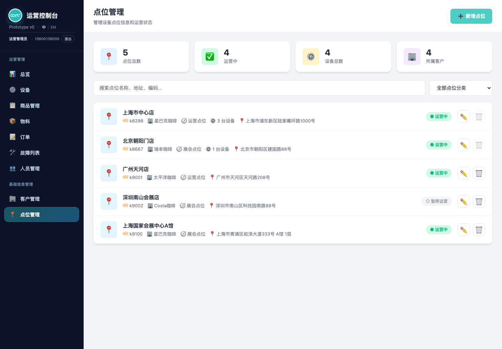
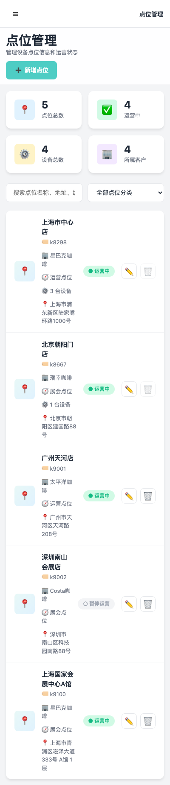
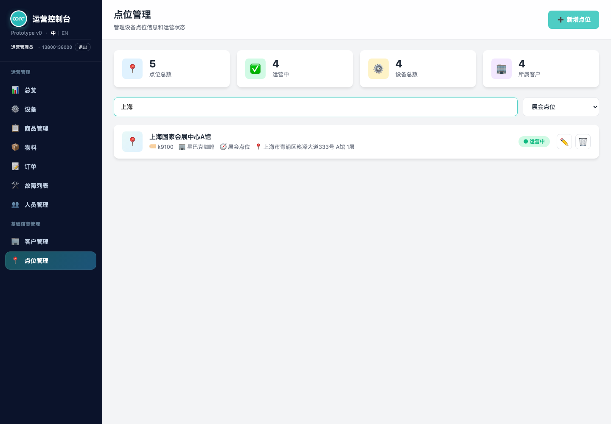
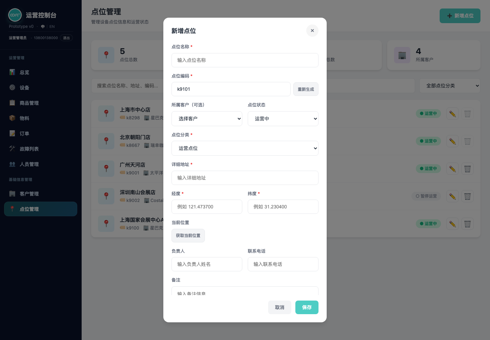
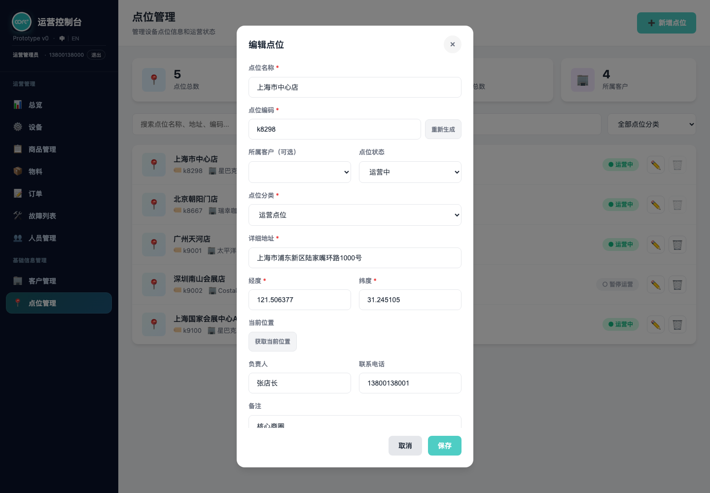

# 产品需求文档：点位管理（v1.1 点位档案与设备落位基础）

> 使用说明：本文件是点位管理页的唯一需求来源，每条规则只在一处正式定义，其余章节以引用方式指向定义点。`Markdown` 版本适合在仓库内查看；如需在浏览器中阅读，请使用同目录的 [prd-location-management-user-flow.html](./prd-location-management-user-flow.html)。
>
> 术语约定：本文所称「点位」即设备落地的物理位置（门店 / 展位 / 楼宇等）；「客户」「商户」在本页语境下同义，UI 沿用「所属客户」措辞。

## 0. 版本记录

| 版本 | 日期 | 主要变化 |
| --- | --- | --- |
| v1.2 | 2026-07-23 | 经纬度由选填改为必填（点位页与设备入场快速建点一致）；新增「绑定设备的点位不可删除」保护规则，列表条目显示绑定设备数；默认演示点位补齐经纬度 |
| v1.1 | 2026-07-20 | 表达规范化：正文移除代码变量名，统一改用中性产品语言 |
| v1.0 | 2026-07-20 | 首次沉淀点位管理需求：点位列表 + 概览统计、新增 / 编辑（含点位编码自动生成、GIS 经纬度与定位、点位分类）、搜索与分类筛选、删除；补充跨页联动（设备入场快速建点、设备搜索按点位名称匹配）；记录租户隔离为「已设计、待落地」 |

## 1. 概述与目标

点位管理是后台维护「设备装在哪儿」的基础信息入口，是设备、订单、物料、故障等业务页据以定位与聚合的空间锚点。页面覆盖点位概览统计、点位列表、点位新增 / 编辑、按分类与关键词检索、点位删除。

页面需同时服务桌面端（左侧固定侧边栏 + 高密度列表）与移动端（抽屉式侧边栏、单列表单、卡片圆角化）。

**目标：**

- 进入页面即可看到点位总数、运营中数量、设备总数、所属客户数四项概览。
- 新增点位时点位编码默认自动生成、可一键重生成、可手动改写，降低人工编码负担并避免撞码。
- 支持在表单内录入经纬度或「获取当前位置」一键定位，为设备地图化与就近调度打基础。
- 通过「点位分类」（展会点位 / 运营点位）区分临时展会档期与常态运营，并可在列表按分类筛选。
- 与设备入场流程打通：装机时若目标点位不存在，可在设备入场页内快速建点，无需跳转本页。
- 与全站设备搜索打通：设备搜索框可用点位名称检索，命中后以「点位名称 · 设备编号」展示。

**非目标：**

- 不在本期提供点位的批量导入 / 导出。
- 不在本期提供地图选点组件（经纬度为手填或浏览器定位回填的文本）。
- 不在本期提供点位与设备的双向解绑管理界面（设备归属仍在设备页维护）。
- 租户（商户）隔离本期**不作为已交付能力**（详见第 6 节现状说明）。

## 2. 数据模型与字段定义

本章是点位信息字段的唯一定义点。点位数据保存在浏览器本地存储中（原型阶段约定），跨页面共享同一份数据。

### 2.1 点位信息字段

| 字段 | 必填 | 说明 |
| --- | --- | --- |
| 点位 ID | 系统生成 | 形如 `L001`，三位零填充；新增时取现有最大序号 +1（见 2.3） |
| 点位名称 | 是 | 展示主标题，参与搜索 |
| 点位编码 | 是 | 形如 `k8298`，全局唯一；默认自动生成、可重生成、可手改（见 2.2）；参与搜索 |
| 所属客户 | 否 | 关联客户资料中「启用」状态的客户；未选时列表显示「未关联商户」 |
| 点位状态 | 是 | 运营中 / 暂停运营，默认「运营中」 |
| 点位分类 | 是 | 展会点位 / 运营点位（见 2.4） |
| 详细地址 | 是 | 参与搜索 |
| 经度 | 是 | 手填或定位回填，保留 6 位小数；与纬度成对，缺一不可保存 |
| 纬度 | 是 | 手填或定位回填，保留 6 位小数；与经度成对，缺一不可保存 |
| GPS 来源标记 | 系统生成 | 填写了经纬度时记录「来自点位管理」，便于追溯坐标录入渠道 |
| 负责人 | 否 | 点位负责人姓名 |
| 联系电话 | 否 | 负责人联系电话 |
| 备注 | 否 | 自由文本 |
| 创建时间 | 系统生成 | 新增时写入当天日期（年-月-日） |

### 2.2 点位编码规则（唯一定义点）

- 编码格式为小写 `k` + 数字，例如 `k8298`。
- **自动生成**：扫描现有全部点位编码，取可解析的最大数字（基线不低于 999）+1，并跳过已占用值，保证唯一；新增弹窗打开时即预填一个候选编码。
- **重新生成**：编码输入框右侧「重新生成」按钮重新计算下一个可用编码。
- **手动修改**：允许人工改写；本页保存时不做格式强校验，但业务上应保持唯一（设备入场页的快速建点会做编码撞码拦截，见 5.1）。

### 2.3 点位 ID 生成

- 格式 `L` + 三位零填充序号。
- 生成策略：解析现有全部点位 ID 的数字部分，取最大值 +1；系统自动补齐演示数据时同样走此策略以避免撞号。

### 2.4 点位分类（唯一定义点）

- 两个内建分类：**展会点位**、**运营点位**，在页面内集中定义、单点维护。
- 分类同时驱动：新增 / 编辑表单的「点位分类」下拉、列表上方的「点位分类筛选」下拉、列表条目上的分类标签。
- **归一化**：读取任意点位时对分类值做归一化，非法 / 缺失值自动回退到合法分类，避免脏数据导致渲染异常。
- **演示数据覆盖保证**：初始化时保证展会点位至少 2 条；不足时自动补齐演示点位，便于演示筛选效果。分类数量或补齐阈值调整只需修改集中定义处。

### 2.5 概览统计口径

页面顶部四张统计卡的取值口径：

| 卡片 | 口径 |
| --- | --- |
| 点位总数 | 全部点位条数 |
| 运营中 | 状态为「运营中」的点位数 |
| 设备总数 | 设备数据总条数，无数据时回退展示 15 |
| 所属客户 | 点位记录中去重后的非空所属客户数；无则回退为客户资料总数或 4 |

### 2.6 删除保护规则（唯一定义点）

点位与设备通过点位编码关联，一个点位下可落位多台设备。为避免删除后设备的点位归属悬空：

- **绑定了设备的点位不可删除**：删除前系统统计该点位编码下的在册设备数，只要大于 0，就拦截删除并提示「该点位已绑定 N 台设备，需先迁移或解绑设备后再删除」，不弹出确认框、不改动数据。
- **列表条目显示绑定设备数**：某点位有绑定设备时，条目上展示「N 台设备」，删除按钮呈禁用视觉（置灰 + 悬停提示），让运营在操作前即知晓。
- **无绑定的点位**照常删除（二次确认 → 移除 → 刷新统计）。
- 迁移 / 解绑设备在设备侧完成；本页不提供设备解绑入口。

## 3. 用户流程

每个流程只列该流程特有的验收点；字段与规则见第 2 章（验收时一并回归）。

### UF-001：进入点位管理并查看概览

**描述：** 作为运营人员，我希望进入页面后先看到点位规模与运营状态概览，再浏览点位列表。

**主流程：**
1. 打开点位管理页，侧边栏「基础信息管理 › 点位管理」高亮。
2. 首次进入（本地无点位数据）时自动写入默认演示点位，并做分类归一化与演示数据覆盖补齐。
3. 顶部渲染四张统计卡（口径见 2.5）。
4. 列表按当前搜索与分类筛选条件渲染全部点位。

**验收：**
- 侧边栏当前项为激活态；顶部标题为「点位管理」、副标题「管理设备点位信息和运营状态」。
- 四张统计卡数值与列表数据一致；无本地数据时展示默认演示点位且展会点位不少于 2 条。

### UF-002：搜索与按分类筛选点位

**描述：** 作为运营人员，我希望用关键词或分类快速定位目标点位。

**主流程：**
1. 在搜索框输入关键词，边输入边实时过滤。
2. 关键词对点位名称、点位编码、详细地址做不区分大小写的子串匹配。
3. 分类下拉选择「全部点位分类 / 展会点位 / 运营点位」，与关键词条件叠加生效。
4. 无命中时列表区展示空状态（📍 图标 + 「暂无点位数据」）。

**验收：**
- 关键词与分类条件同时作用于同一结果集，互不覆盖。
- 分类筛选按归一化后的分类值比较，脏数据不漏筛。
- 无结果时显示空状态而非空白。

### UF-003：新增点位

**描述：** 作为运营人员，我希望登记一个新点位，系统尽量减少我的手工输入。

**主流程：**
1. 点击右上角「➕ 新增点位」打开弹窗，标题为「新增点位」。
2. 弹窗打开即：预填自动生成的点位编码、加载可选客户下拉、状态默认「运营中」、分类给出默认值、其余字段清空。
3. 填写点位名称、详细地址（必填），按需选择所属客户、录入经纬度或点击「获取当前位置」、填写负责人 / 电话 / 备注。
4. 点击「保存」：校验必填后生成点位 ID 写入点位数据，落库、刷新列表与统计、关闭弹窗，弹出「点位添加成功」。

**验收：**
- 必填校验要求点位名称、点位编码、详细地址、经度、纬度；**所属客户为可选**，缺失时列表显示「未关联商户」。
- 经纬度缺任一即拦截保存并提示「请填写经纬度，可点击『获取当前位置』自动获取」。
- 「重新生成」按钮可换取下一个可用编码。
- 填写了经纬度时记录 GPS 来源标记为「来自点位管理」。
- 点击弹窗遮罩空白区域可关闭弹窗。

### UF-004：获取当前位置回填经纬度

**描述：** 作为在现场登记点位的人员，我希望一键用设备定位填入经纬度。

**主流程：**
1. 在新增 / 编辑弹窗点击「获取当前位置」，按钮进入「定位中...」禁用态。
2. 调起浏览器定位能力（高精度模式、10 秒超时）。
3. 成功：经、纬度各保留 6 位小数回填；若地址为空则回填占位地址文案；提示「已获取当前位置」。
4. 失败：按失败原因给出可读文案（权限拒绝 / 无法获取 / 超时 / 通用失败）。
5. 无论成功失败，按钮恢复为「获取当前位置」可点击态。

**验收：**
- 浏览器不支持定位时提示「当前浏览器不支持定位功能」，不抛异常。
- 定位过程中按钮禁用，避免重复触发。
- 权限被拒绝时提示「定位权限被拒绝，请允许定位权限后重试」。

### UF-005：编辑点位

**描述：** 作为运营人员，我希望修改既有点位的信息。

**主流程：**
1. 在列表条目点击「✏️ 编辑」，弹窗标题变为「编辑点位」并回填该点位全部字段（分类经归一化）。
2. 修改后点击「保存」，就地更新对应记录并同步客户名称（依据当前所选客户）。
3. 落库、刷新列表与统计、关闭弹窗，弹出「点位信息已更新」。

**验收：**
- 回填字段与记录一致，经纬度、负责人、电话、备注等可选字段缺失时显示为空。
- 切换所属客户后，保存的客户名称与所选客户一致；清空客户后列表显示「未关联商户」。

### UF-006：删除点位

**描述：** 作为运营人员，我希望移除不再使用的点位。

**主流程：**
1. 在列表条目点击「🗑️ 删除」。
2. 若该点位已绑定设备：直接拦截并提示需先迁移 / 解绑设备（见 2.6），不进入确认流程。
3. 若无绑定设备：弹出二次确认「确定要删除该点位吗？」，确认后从点位数据中移除该记录，落库、刷新列表与统计，弹出「点位已删除」。

**验收：**
- 绑定设备的点位删除被拦截，数据不变，提示明确设备数量（见 2.6）。
- 取消确认时不发生任何变更。
- 删除后统计卡数值随之更新。

## 4. 交互与展示规则

- **列表条目**展示：📍 图标、点位名称、编码（🏷️）、所属客户（🏢，未关联显示「未关联商户」）、分类（🧭）、绑定设备数（⚙️，有绑定时才显示）、地址（📍），右侧为状态徽标与「编辑 / 删除」操作；已绑定设备的点位删除按钮置灰禁用（见 2.6）。
- **状态徽标**：运营中为绿色实心圆 + 「运营中」；暂停运营为灰色空心圆 + 「暂停运营」。
- **客户下拉**只列出客户资料中「启用」状态的客户。
- **后台菜单语言**：侧边栏支持中 / 英切换，仅切换导航与页面框架文案，不翻译点位业务内容。
- **登录信息与登出**：侧边栏展示当前登录名 / 手机号并提供「退出」（清理登录态后跳转登录页）。
- **响应式**：窄屏（约 768px 及以下）时侧边栏转为抽屉、统计卡两列、表单单列、卡片圆角与阴影增强。

## 5. 跨页联动

### 5.1 设备入场页快速新增点位

- 设备入场登记时，点位选择区提供「+ 新增点位」入口，打开轻量快速建点弹窗。
- 快速建点表单复用点位分类（展会 / 运营）、编码自动生成 + 重新生成、GIS 经纬度与「获取当前位置」；经纬度同样为必填。
- **不含**所属客户选择器：默认写入当前登录商户，GPS 来源标记记录「新增点位时录入」。
- 保存前校验编码唯一，撞码提示「点位编码已存在」。
- 新增成功后刷新点位下拉并自动选中新点位、触发点位变更联动，装机流程无需跳转本页。

### 5.2 全站设备搜索支持点位名称

覆盖页面：总览 / 商品管理 / 菜单 / 物料 / 设备入场 / 人员管理。

- 设备搜索框在设备编号之外支持按点位名称检索，检索索引由设备数据关联点位数据在运行时构建。
- 命中后输入框展示为「点位名称 · 设备编号」；底层业务状态仍存纯设备 ID，保持向后兼容。

## 6. 租户（商户）隔离现状

> 本节记录设计与现状的差异，供后续排期，不代表本期已交付。

- 设计文档 `docs/superpowers/specs/2026-05-12-merchant-tenant-isolation-design.md` 规划了点位管理页的商户隔离：普通商户运营只应看到、操作本商户的点位；新增 / 编辑时「所属客户」应改为只读显示当前商户；编辑 / 删除应做归属二次校验；超级管理员旁路隔离看全局。
- **当前实现（v1.x）尚未落地该隔离**：点位管理页加载并渲染**全部**点位，新增 / 编辑仍以下拉方式在所有客户中选择，未接入商户可见范围判定。对应回归测试 `tests/locations.merchant-scope.test.js` 当前为红。
- 落地时应对齐设计文档并使上述测试转绿；共享的员工访问控制层已具备角色判定与商户范围判定基础设施，商户改名后的冗余名称同步也有集中入口。

## 7. 测试映射

| 能力 | 测试文件 | 现状 |
| --- | --- | --- |
| 点位分类、编码自动生成、GIS 经纬度、客户可选、演示数据覆盖 | `tests/locations.point-category.test.js` | 全绿 |
| 删除保护（绑定设备拦截）、经纬度必填、绑定设备计数 | `tests/locations.delete-guard.test.js` | 全绿 |
| 设备入场快速建点（编码唯一、默认商户、定位、经纬度必填、下拉刷新选中） | `tests/device-entry.location-quick-create.test.js` | 全绿 |
| 设备搜索按点位名称匹配 | `tests/device-search.location-name.test.js` | 全绿 |
| 点位管理商户隔离 | `tests/locations.merchant-scope.test.js` | **红（未落地，见第 6 节）** |

## 8. 关联文件边界

| 项 | 说明 |
| --- | --- |
| 页面 | `locations.html` |
| 数据存储 | 浏览器本地存储：点位数据（本页主数据）、客户资料（客户下拉）、设备数据（设备总数统计）、后台菜单语言、登录信息 |
| 关联页面 | `device-entry.html`（快速建点）、设备搜索相关页（点位名称检索） |
| 关联设计 / 计划 | `docs/superpowers/specs/2026-05-12-merchant-tenant-isolation-design.md`、`docs/plans/2026-03-11-device-search-location-name.md` |
