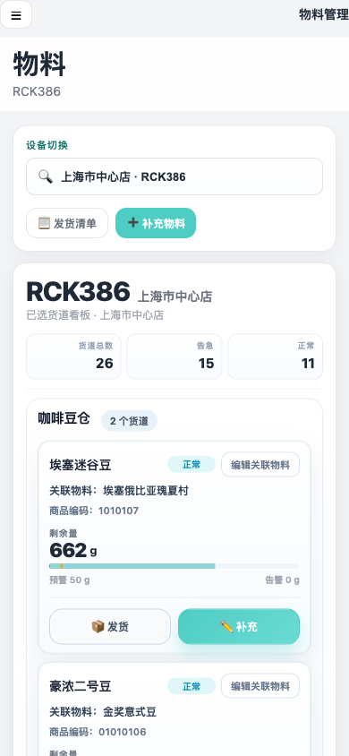

# 产品需求文档：物料管理（按用户流程）

> 使用说明：`Markdown` 版本适合在仓库内查看；如需在浏览器或飞书文档中阅读，优先使用同目录的 [prd-materials-management-user-flow.html](./prd-materials-management-user-flow.html)。

## 1. 介绍 / 概述

物料管理不是单纯的“库存列表”页面，而是后台运维人员围绕设备货道、关联物料、发货单和补料动作完成物料运营的统一入口。

该模块由三个页面组成：

- **物料管理**：以设备为维度展示货道看板，每张卡片代表一个货道，货道一对一关联一个物料。
- **添加物料**：基于当前商户物料表选择补充物料，生成发货单。
- **运维清单**：查看发货单、打印发货单、作废本人待发货单。

默认用户角色：

- 运维人员：查看设备货道余量、补充库存、发起发货、查看自己的发货单。
- 补料人员：按商户物料表选择补充物料并生成发货单。
- 商户管理员：维护货道名称、维护货道关联物料、按权限查看全部发货单。

## 2. 目标

- 让用户进入物料页后，能先按设备查看货道余量和风险状态。
- 让货道名称、关联物料、商品编码、剩余量、预警值、告警值形成稳定信息结构。
- 让“补充”和“发货”形成两条清晰路径：补充用于调整当前货道库存，发货用于进入添加物料生成发货单。
- 让货道名称编辑和货道关联物料编辑都有独立权限控制。
- 让添加物料严格来自当前商户物料表，并与业务确认的物料清单在商品编码、名称、单位、库存口径上保持一致。
- 让运维清单只承担发货单查看、打印和作废，不再处理发货完成状态。
- 让桌面端保持高密度运营看板，移动端保持完整可操作且不横向滚动。

## 3. 用户流程 / 用户故事

### UF-001：进入物料管理并切换设备

**描述：** 作为运维人员，我希望进入物料管理页面后，可以按设备编号或点位名称切换设备，这样我能查看目标设备的货道状态。

**主流程：**
1. 用户进入物料管理页面。
2. 页面展示当前设备名称、设备编号和点位信息。
3. 用户在设备切换输入框中输入设备编号或点位名称。
4. 系统匹配设备并刷新货道看板。

**验收标准：**
- [ ] 页面标题为“物料”，页头副标题显示当前设备名称，不再显示语言文案。
- [ ] 设备切换支持设备编号和点位名称搜索。
- [ ] 设备来源不在默认列表时，应自动加入可选设备。
- [ ] 从其他页面携带设备进入时，物料管理页面应自动选中对应设备。
- [ ] 切换设备后，设备摘要、点位信息和货道看板同步刷新。

**参考截图：**

### UF-002：按 6 类货道查看设备货道看板

**描述：** 作为补料人员，我希望按货道大类查看设备内所有货道，这样我能快速判断哪些区域需要处理。

**主流程：**
1. 用户选择设备。
2. 系统按货道大类展示货道分组。
3. 用户浏览每个分组下的货道卡片。
4. 若某分类没有货道数据，页面展示空分组提示。

**验收标准：**
- [ ] 货道固定按 6 类展示：咖啡豆仓、牛奶&水、糖浆、前/后道粉、包材、制冰机。
- [ ] 有数据的分类排在无数据分类前面，但各分类内部保持原顺序。
- [ ] 页面渲染为分组区块，不允许再将所有物料卡片单一混排。
- [ ] 移动端也必须完整展示全部货道分组，不使用锚点或折叠替代完整内容。
- [ ] 无数据分类展示明确空状态，例如“当前设备暂无此类物料”。

**参考截图：**

### UF-003：查看货道卡片信息和库存状态

**描述：** 作为运维人员，我希望每张货道卡片展示货道名称、关联物料和库存状态，这样我可以准确理解当前设备的真实货道情况。

**主流程：**
1. 用户查看货道卡片。
2. 卡片标题展示货道名称。
3. 卡片主体展示关联物料、商品编码、剩余量、预警值和告警值。
4. 系统根据当前剩余量展示正常、告急或售罄状态。

**验收标准：**
- [ ] 卡片标题必须显示货道名称，不得显示物料名称。
- [ ] 关联物料名称只显示在“关联物料”字段。
- [ ] 商品编码展示业务物料表中的商品编码，不展示页面内部标识。
- [ ] 剩余量、预警值、告警值必须带单位。
- [ ] 售罄和告急使用不同状态文案与视觉样式，不能只用同一种红色弱提示。
- [ ] 桌面端卡片需支持五列高密度布局，并在较窄桌面宽度降级为四列或三列。
- [ ] 移动端卡片必须单列展示且按钮可见。

**参考截图：**

### UF-004：在货道卡片中执行补充库存

**描述：** 作为补料人员，我希望从货道卡片直接打开补充设置，并按原流程在当前库存上增加输入值，这样现场补料后能快速回填。

**主流程：**
1. 用户点击货道卡片中的“补充”。
2. 系统打开补充设置弹窗。
3. 弹窗展示物料编码和当前库存。
4. 用户输入补充数量，必要时调整预警值和告警值。
5. 用户保存后，系统将当前量更新为“原当前库存 + 补充数量”。

**验收标准：**
- [ ] “补充”是货道卡片主按钮，“发货”是次按钮。
- [ ] 弹窗标题显示“补充设置 - 货道名称”。
- [ ] 补充数量输入框聚焦后自动选中原数字，避免用户手动删除。
- [ ] 补充数量只允许整数。
- [ ] 保存后当前量 = 当前库存 + 补充数量。
- [ ] 系统提供“重置为 0”按钮，用于直接清空当前量。
- [ ] 三个底部按钮顺序需符合当前页面设计：重置为 0、取消、确认保存。
- [ ] 保存后写入设备运维记录。

**参考截图：**

### UF-005：从货道卡片进入添加物料并保留来源上下文

**描述：** 作为补料人员，我希望从某个货道点击发货或补充物料时，添加物料页能知道来源货道，这样生成的发货单可以带出货道名称。

**主流程：**
1. 用户在货道卡片点击“发货”或从工具栏点击“补充物料”。
2. 系统写入来源上下文，包括设备编号、设备点位、货道名称、关联物料编码。
3. 页面跳转到添加物料页面。
4. 添加物料页读取来源上下文并展示来源货道。

**验收标准：**
- [ ] 从货道卡片进入添加物料页时，页面应记住来源设备、点位、货道名称和关联物料。
- [ ] 添加物料页应展示来源货道名称，便于用户确认当前发货来源。
- [ ] 添加物料页返回时优先返回来源设备的物料管理页，而不是固定返回默认设备。
- [ ] 无来源上下文时，添加物料页按普通添加流程运行。

**参考截图：**

### UF-006：编辑货道名称

**描述：** 作为商户管理员，我希望能单独编辑当前设备上的货道名称，但不改变货道关联物料和阈值，这样可以修正设备货道命名。

**主流程：**
1. 具备权限的用户在货道卡片点击“编辑货道名称”。
2. 系统打开编辑货道名称弹窗。
3. 用户输入新的货道名称。
4. 用户确认保存。
5. 当前设备的该货道名称刷新展示。

**验收标准：**
- [ ] 只有具备“编辑货道名称”权限的用户才能看到并使用该入口。
- [ ] 无权限用户不显示入口。
- [ ] 弹窗标题只显示“编辑货道名称”，不拼接物料名称。
- [ ] 保存只更新当前设备上的货道名称，不改动物料关联、余量、预警值或告警值。
- [ ] 货道名称不能为空。
- [ ] 修改后的货道名称只影响当前设备，不影响其他设备同名货道。

**参考截图：**

### UF-007：编辑货道关联物料

**描述：** 作为商户管理员，我希望能把货道关联到当前商户物料表中的其他物料，并且只能选择与当前货道大类匹配的物料，这样货道和物料关系不会混乱。

**主流程：**
1. 具备权限的用户点击“编辑关联物料”。
2. 系统打开关联物料选择弹窗。
3. 弹窗展示当前商户物料表中的候选物料。
4. 用户按分类或搜索筛选物料。
5. 用户选择一个物料并保存。
6. 货道卡片展示新的关联物料和商品编码。

**验收标准：**
- [ ] 只有具备“编辑货道关联物料”权限的用户才能看到并使用该入口。
- [ ] 无权限用户不显示入口。
- [ ] 关联物料必须来自当前商户物料表，不允许自由输入。
- [ ] 候选物料分类必须与当前货道大类匹配。
- [ ] 咖啡豆仓、牛奶&水只能选择“奶&咖啡&水”分类。
- [ ] 糖浆只能选择“糖浆”分类。
- [ ] 前/后道粉只能选择“前/后道粉”分类。
- [ ] 包材只能选择“包材”分类。
- [ ] 制冰机只能选择“食材”分类。
- [ ] 选择器样式需与添加物料页保持一致，使用分类 + 搜索 + 卡片选择，不使用原生下拉长列表。

**参考截图：**

### UF-008：在添加物料页按商户物料表选择物料

**描述：** 作为补料人员，我希望添加物料页只展示当前商户可用物料，并且数据与业务物料清单对齐，这样发货单明细不会出现旧编码或错误物料。

**主流程：**
1. 用户进入添加物料页面。
2. 页面按物料分类展示物料池。
3. 用户切换分类或搜索物料。
4. 用户通过加减控件调整物料数量。
5. 已选物料区域实时展示选择结果。

**验收标准：**
- [ ] 物料池数据必须与业务确认的物料清单一致。
- [ ] 每个物料展示商品编码、物料名称、库存、最大值、单位。
- [ ] 列表、已选清单、确认摘要都优先展示商品编码。
- [ ] 分类默认只展开当前分类，其他分类不同时展开。
- [ ] 已添加物料有独立颜色态，并随数量变化实时更新。
- [ ] 来自货道卡片时，应默认定位并聚焦到对应物料行。
- [ ] 物料数据需按当前商户隔离，不同商户对应不同物料表。

**参考截图：**

### UF-009：选择配送日期并生成发货单

**描述：** 作为补料人员，我希望选择固定配送日期选项后生成发货单，这样发货计划明确且可在运维清单中追踪。

**主流程：**
1. 用户在添加物料页选择一个或多个物料。
2. 用户选择配送日期选项。
3. 用户点击“完成”或“生成发货单”。
4. 系统生成发货单并写入本地发货单数据。
5. 系统跳转到运维清单。

**验收标准：**
- [ ] 配送日期使用固定天数选项：1、3、5、8、10、12 天。
- [ ] 确认生成时根据选项构造配送日期和发货时间。
- [ ] 数量为 0 时不可完成。
- [ ] 生成发货单时写入当前申请人姓名和手机号。
- [ ] 发货单物料明细必须包含物料名称、商品编码、数量、单位。
- [ ] 来自货道上下文的明细必须带出货道名称。
- [ ] 生成成功后跳转到运维清单页面，并能在“我的发货单”中看到新发货单。

**参考截图：**

### UF-010：查看我的发货单和全部发货单

**描述：** 作为运维人员，我希望在运维清单中默认查看自己的发货单；具备权限时，可以查看权限范围内全部发货单。

**主流程：**
1. 用户进入运维清单页面。
2. 页面默认展示“我的发货单”。
3. 若用户具备查看全部权限，页面展示“全部发货单”标签。
4. 用户查看发货单列表和明细摘要。

**验收标准：**
- [ ] 页面标题为“运维清单”。
- [ ] 默认展示“我的发货单”。
- [ ] 无权限时隐藏“全部发货单”。
- [ ] 不再展示“其他发货单”、“历史清单”或旧订单页语义。
- [ ] 发货单列表展示单号、发货时间、设备、点位、申请人、状态、物料摘要。
- [ ] 明细摘要必须展示商品编码，存在来源货道时展示货道名称。
- [ ] 历史演示数据或旧发货单数据展示时，也应补齐当前物料清单中的商品编码。

**参考截图：**

### UF-011：查看发货单详情和打印发货单

**描述：** 作为仓配或运维人员，我希望能查看发货单详情并打印发货单，这样线下拣货和配送有明确依据。

**主流程：**
1. 用户在运维清单中点击“详情”。
2. 系统展示发货单详情。
3. 用户点击“打印发货单”。
4. 系统打开或触发打印视图。

**验收标准：**
- [ ] 发货单详情展示发货单号、状态、设备编号、点位、申请人、申请人电话、发货时间。
- [ ] 发货单详情展示物料名称、商品编码、数量、单位。
- [ ] 有来源货道时，详情中展示货道名称。
- [ ] 打印发货单包含与详情一致的关键字段。
- [ ] 作废单打印时需展示作废状态和作废原因。

**参考截图：**

### UF-012：作废本人待发货单

**描述：** 作为发货单创建人，我希望能作废自己创建且仍待发货的发货单，并记录作废原因，这样错误申请可以被追踪处理。

**主流程：**
1. 用户在自己的待发货单上点击“作废”。
2. 系统要求填写作废原因。
3. 用户确认作废。
4. 系统更新发货单状态并展示作废原因。

**验收标准：**
- [ ] 运维清单页面不提供“完成”或“标记完成”功能。
- [ ] 作废只允许当前用户处理自己的待发货单。
- [ ] 作废必须填写原因。
- [ ] 作废成功后列表和详情状态同步更新。
- [ ] 作废原因在详情和打印内容中展示。
- [ ] 非本人或非待发货单不允许作废。

**参考截图：**

### UF-013：移动端完成物料管理核心流程

**描述：** 作为移动端运维人员，我希望在手机上也能完成设备切换、货道查看、补充、添加物料和查看运维清单，而不需要横向滚动。

**主流程：**
1. 用户在移动端打开物料页。
2. 用户切换设备并查看货道卡片。
3. 用户打开补充弹窗或添加物料页。
4. 用户生成发货单并进入运维清单。
5. 用户查看自己的发货单。

**验收标准：**
- [ ] 物料页移动端保留后台导航入口。
- [ ] 货道分组和卡片在移动端单列展示，不横向滚动。
- [ ] 卡片动作按钮在移动端始终可见且可点击。
- [ ] 补充弹窗在移动端底部或适配视口展示，不溢出屏幕。
- [ ] 添加物料页移动端左侧分类和右侧物料列表均可用。
- [ ] 运维清单移动端使用卡片列表展示，不强制使用桌面表格。

**参考截图：**

## 4. 功能需求

- FR-1：系统必须提供以设备为维度的物料管理页面。
- FR-2：物料管理页面必须支持按设备编号和点位名称搜索设备。
- FR-3：系统必须支持从其他页面进入时恢复对应设备。
- FR-4：物料管理页面必须按固定 6 类货道分组展示。
- FR-5：有数据货道分类必须排在无数据分类前面。
- FR-6：每张货道卡片必须代表一个货道，而不是一个物料池项。
- FR-7：货道与物料关系必须是一对一。
- FR-8：货道卡片必须展示货道名称、关联物料、商品编码、剩余量、预警值、告警值和状态。
- FR-9：售罄、告急、正常必须有不同文案和样式。
- FR-10：补充按钮必须作为货道卡片主操作。
- FR-11：发货按钮必须作为货道卡片次操作。
- FR-12：补充弹窗必须支持在当前库存上增加输入数量。
- FR-13：补充弹窗必须支持将当前量重置为 0。
- FR-14：补充弹窗输入框聚焦时必须自动选中当前数字。
- FR-15：补充保存后必须写入设备运维记录。
- FR-16：运维记录必须记录操作人员姓名和电话。
- FR-17：编辑货道名称必须由独立的“编辑货道名称”权限控制。
- FR-18：编辑关联物料必须由独立的“编辑货道关联物料”权限控制。
- FR-19：编辑关联物料必须限制在当前商户物料表内。
- FR-20：编辑关联物料必须限制候选物料分类与货道大类匹配。
- FR-21：添加物料页必须使用当前商户物料表数据。
- FR-22：添加物料页物料数据必须与业务确认的物料清单对齐。
- FR-23：添加物料页必须优先展示商品编码。
- FR-24：添加物料页必须支持分类浏览、搜索、数量增减和已选物料摘要。
- FR-25：添加物料页必须支持来源货道上下文。
- FR-26：生成发货单时必须写入申请人姓名和手机号。
- FR-27：生成发货单后必须跳转到运维清单。
- FR-28：运维清单必须默认展示我的发货单。
- FR-29：全部发货单必须由独立权限控制，无权限时隐藏。
- FR-30：运维清单不得处理发货完成状态。
- FR-31：运维清单必须支持打印发货单。
- FR-32：运维清单必须支持当前用户作废自己的待发货单。
- FR-33：作废必须填写原因，并在详情和打印中展示。
- FR-34：发货单明细必须展示商品编码。
- FR-35：发货单明细在有来源货道时必须展示货道名称。
- FR-36：历史演示发货单和旧发货单数据必须展示为当前带商品编码的物料。
- FR-37：桌面端物料看板必须支持高密度多列布局。
- FR-38：移动端物料、添加物料、运维清单都不得依赖横向滚动完成核心操作。

## 5. 权限与数据规则

- 查看物料：允许用户进入物料管理页面。
- 编辑货道名称：允许用户修改当前设备上的货道名称。
- 编辑货道关联物料：允许用户修改当前设备货道关联的物料。
- 查看全部发货单：控制运维清单中“全部发货单”标签是否展示。
- 历史管理员账号升级后应自动具备新增的货道编辑能力，避免原管理员看不到编辑按钮。
- 货道名称修改按设备隔离。
- 货道关联物料修改按商户和设备隔离。
- 不同商户对应不同物料表，物料选择不得跨商户。

## 6. 非功能需求

- NFR-1：桌面端需优先保证运营后台信息密度。
- NFR-2：移动端需保证无横向滚动、按钮可点击、弹窗不溢出。
- NFR-3：补充、发货、作废等关键动作需给出明确反馈。
- NFR-4：本地或接口数据异常时需安全降级为空数据或默认演示数据。
- NFR-5：页面切换设备、返回来源页面时需保持上下文一致。

## 7. 当前版本限制

- 当前为静态原型，物料、货道、发货单和权限数据使用演示数据。
- 发货完成状态暂不在运维清单处理。
- 打印发货单为前端打印视图，未接入真实后端单据模板。
- 物料表按当前演示商户数据维护，真实商户物料主数据接口待后续接入。
