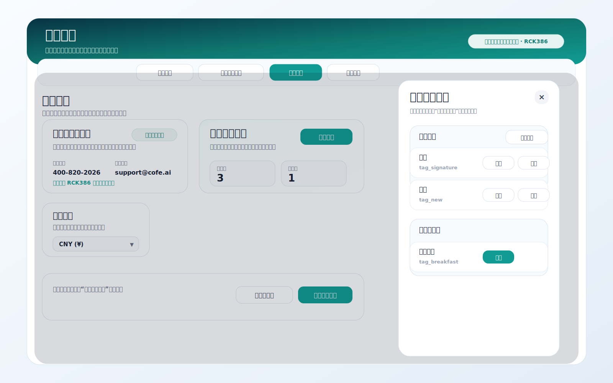
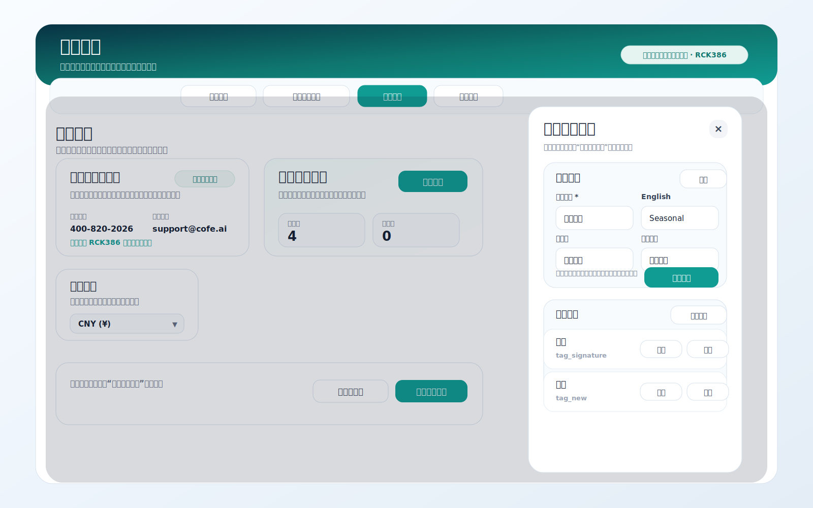
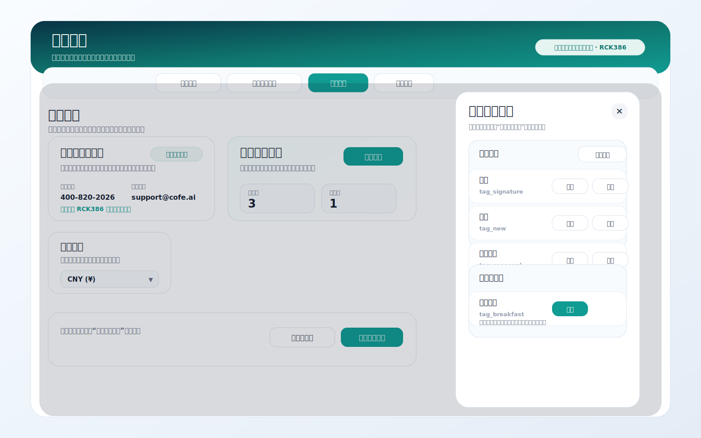
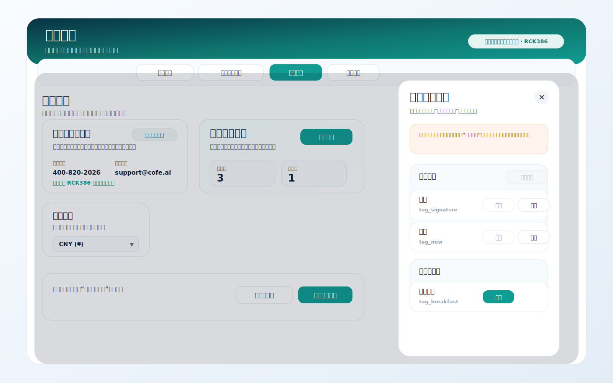

# 产品需求文档：商品管理业务标签管理（按用户流程）

> 使用说明：`Markdown` 版本适合在仓库内查看；如需在浏览器或飞书文档中阅读，优先使用同目录的 [prd-menu-management-business-tag-management.html](./prd-menu-management-business-tag-management.html)。如需查看拆分索引或印花图片相关需求，可回到 [prd-menu-management-tag-imprint-settings.md](./prd-menu-management-tag-imprint-settings.md)。

## 1. 介绍 / 概述

商品管理当前已经覆盖分类、商品、基础设置和批量改价等核心能力，但在实际试用和日常运营过程中，业务标签仍存在明显缺口：

- 缺少统一的后台标签库管理能力。
- 多语言名称维护与当前设备语言配置之间缺少明确约束。
- 标签下线时只能靠绕行处理，缺少安全的隐藏恢复机制。

`业务标签管理` 的职责是维护标签库本身，决定哪些标签可被商品使用、各语言下显示什么文案、哪些标签当前处于隐藏状态。

本次需求以“用户流程”为主线，覆盖商品管理中的业务标签管理能力，并明确其边界、规则与验收标准。

默认用户角色：

- 运营人员：维护标签、多语言名称、隐藏恢复标签。

## 2. 目标

- 让运营人员可以在后台统一维护业务标签库，而不是分散在多个入口或依赖人工处理。
- 让业务标签支持多语言维护，并与当前设备已启用语言保持一致。
- 让标签下线时采用“隐藏”而不是“删除”，降低误操作风险，并保证已绑定关系可恢复。
- 让商品管理中的标签配置形成更完整的后台维护闭环，同时保持主页面表达轻量。

## 3. 用户流程 / 用户故事

### UF-001：进入商品管理并查看业务标签管理概览

**描述：** 作为运营人员，我希望在商品管理的基本设置中快速看到业务标签管理概况，并进入统一的标签维护入口，这样我能集中管理标签库。

**主流程：**
1. 用户进入 `商品管理 > 基本设置`。
2. 页面展示业务标签管理摘要卡片。
3. 用户点击进入标签管理抽屉。
4. 抽屉中展示启用标签与已隐藏标签两个分组。

**验收标准：**
- [ ] 业务标签管理入口位于 `商品管理 > 基本设置`。
- [ ] 基本设置中只展示轻量摘要，不在主页面堆叠完整编辑表单。
- [ ] 标签管理详情通过独立抽屉或弹层承载。
- [ ] 抽屉中至少展示 `启用标签` 与 `已隐藏标签` 两个分组。

**参考截图：**

### UF-002：新建或编辑业务标签并维护多语言名称

**描述：** 作为运营人员，我希望在统一表单里完成业务标签的新建或编辑，并按设备已启用语言维护标签名称，这样我可以一次性完成标签配置。

**主流程：**
1. 用户在业务标签管理中点击 `新建标签`，或在已有标签上点击 `编辑`。
2. 系统打开统一的标签表单。
3. 系统根据当前设备已启用语言展示多语言输入项。
4. 用户填写主语言名称，并按需补充其他语言名称。
5. 用户保存草稿并回到标签列表。

**验收标准：**
- [ ] 新建与编辑共用同一套标签表单。
- [ ] 标签名称输入项按当前设备已启用语言动态展示。
- [ ] 当前设备主语言为必填项。
- [ ] 其他已启用语言为选填项。
- [ ] 保存后，标签库立即更新，标签列表实时刷新。

**参考截图：**

### UF-003：隐藏或恢复业务标签

**描述：** 作为运营人员，我希望在不删除标签的前提下，将某个标签暂时下线，并在需要时恢复，这样我可以安全控制前台展示范围。

**主流程：**
1. 用户在启用标签列表中点击 `隐藏`。
2. 系统将标签状态更新为已隐藏。
3. 标签从启用列表移入已隐藏列表。
4. 当需要恢复时，用户在已隐藏标签中点击 `恢复`。
5. 系统将标签重新恢复到启用状态。

**验收标准：**
- [ ] 标签支持 `启用` 与 `隐藏` 两种状态。
- [ ] 启用标签支持 `编辑` 与 `隐藏` 操作。
- [ ] 已隐藏标签支持 `恢复` 操作。
- [ ] 标签管理中不提供 `删除标签` 入口。
- [ ] 隐藏标签后，所有已绑定该标签的商品与点单屏不再展示该标签。
- [ ] 恢复后，已绑定关系重新生效，无需运营逐个商品重新绑定。

**参考截图：**

### UF-004：当前设备无可用语言时禁止编辑业务标签

**描述：** 作为运营人员，我希望在当前设备没有启用任何语言时，系统明确阻止我新建和编辑标签，这样我不会在缺少语言上下文时做出无效配置。

**主流程：**
1. 用户进入标签管理。
2. 系统检查当前设备是否存在已启用语言。
3. 若不存在已启用语言，页面展示明确提示。
4. `新建标签` 与 `编辑` 操作被禁用。

**验收标准：**
- [ ] 当前设备无可用语言时，标签管理展示清晰提示。
- [ ] 当前设备无可用语言时，不允许新建标签。
- [ ] 当前设备无可用语言时，不允许编辑已有标签。
- [ ] 恢复至少一种语言后，标签新建与编辑能力自动恢复。

**参考截图：**

## 4. 功能需求

- FR-1：业务标签管理入口必须位于 `商品管理 > 基本设置`。
- FR-2：业务标签管理详情必须通过独立抽屉或弹层承载。
- FR-3：系统必须提供启用标签与已隐藏标签两类列表。
- FR-4：系统必须支持新建标签。
- FR-5：系统必须支持编辑标签。
- FR-6：标签编辑必须支持多语言名称维护。
- FR-7：多语言输入项必须基于当前设备已启用语言动态生成。
- FR-8：当前设备主语言必须为必填。
- FR-9：其他已启用语言可为选填。
- FR-10：系统必须支持隐藏标签。
- FR-11：系统必须支持恢复已隐藏标签。
- FR-12：系统不得提供删除标签能力。
- FR-13：隐藏标签后，所有已绑定商品与点单屏展示中不得继续显示该标签。
- FR-14：恢复标签后，已绑定关系必须继续有效。
- FR-15：商品详情页的标签选择范围必须仅展示启用中的标签。
- FR-16：当前设备无可用语言时，系统必须禁用标签的新建与编辑能力，并展示原因说明。

## 5. 非目标

- 本期不支持业务标签永久删除。
- 本期不支持业务标签跨租户共享或跨商户共享。
- 本期不改造商品详情页中标签绑定的主流程，只补齐标签库管理能力与标签可见范围规则。

## 6. 成功标准

- 运营人员可以在后台独立完成业务标签的新建、编辑、隐藏和恢复。
- 已隐藏标签在商品与点单屏中不再继续展示，恢复后可以重新生效。
- 商品管理中的标签管理形成完整配置闭环，减少人工支持与重复沟通。
