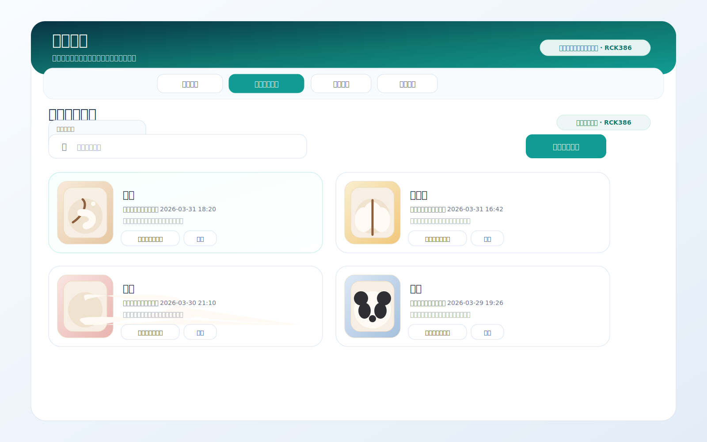
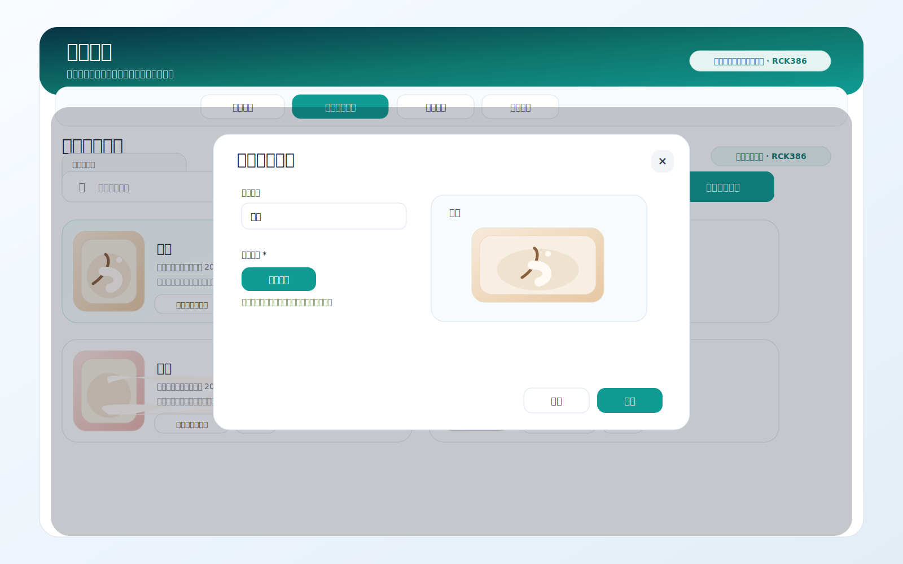
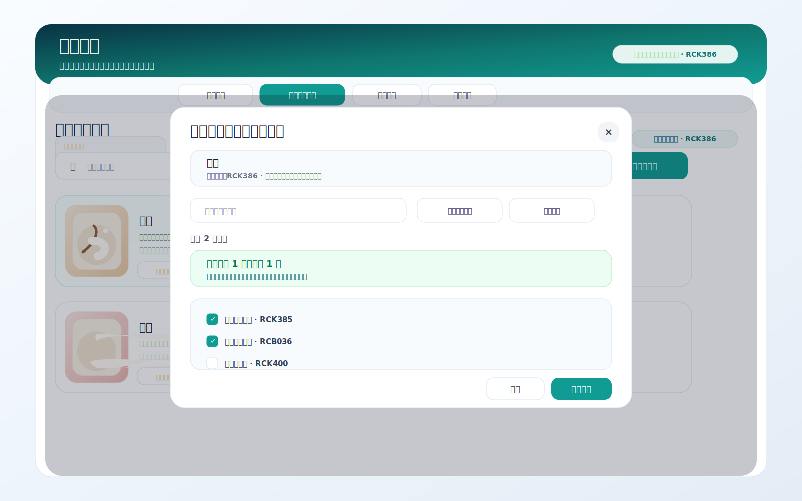
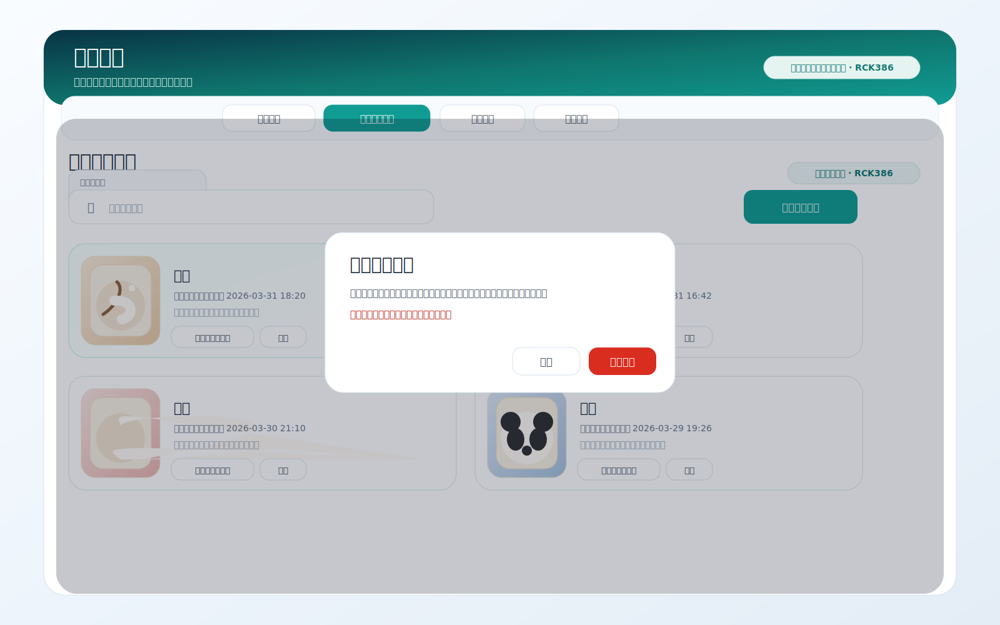

# 产品需求文档：商品管理印花图片设置（按用户流程）

> 使用说明：`Markdown` 版本适合在仓库内查看；如需在浏览器或飞书文档中阅读，优先使用同目录的 [prd-menu-management-imprint-image-settings.html](./prd-menu-management-imprint-image-settings.html)。如需查看拆分索引或标签管理相关需求，可回到 [prd-menu-management-tag-imprint-settings.md](./prd-menu-management-tag-imprint-settings.md)。

## 1. 介绍 / 概述

商品管理当前已经覆盖分类、商品、基础设置和批量改价等核心能力，但在实际试用和日常运营过程中，印花图片仍存在明显缺口：

- 缺少设备级素材管理能力。
- 客户无法在后台自行上传、删除和复制素材，只能通过人工提需求处理。
- 同名素材、复制覆盖和设备范围等规则缺少明确产品约束。

`印花图片设置` 的职责是维护设备级印花素材，决定当前设备有哪些可用图片素材，以及这些素材是否需要复制到其他设备。

本次需求以“用户流程”为主线，覆盖商品管理中的印花图片设置能力，并明确其边界、规则与验收标准。

默认用户角色：

- 客户管理员：针对试用设备或正式设备自主完成后台素材配置。
- 运营人员：上传印花图片、删除素材、复制印花素材到其他设备。

## 2. 目标

- 让客户可以按设备自主维护印花图片素材，不再依赖人工代操作。
- 让印花图片上传后支持快速复制到其他设备，降低重复配置成本。
- 让同名素材、删除重传和复制覆盖规则清晰可控，降低误操作风险。
- 让印花图片设置在商品管理中形成独立、完整的设备素材配置闭环。
- 让素材卡片保持轻量，不过度展示业务耦合状态。

## 3. 用户流程 / 用户故事

### UF-001：进入印花图片设置并查看当前设备素材

**描述：** 作为运营人员，我希望在商品管理中进入独立的印花图片设置页签，并按当前设备查看已有素材，这样我能明确自己正在维护哪台设备的图片资源。

**主流程：**
1. 用户进入 `商品管理` 页面。
2. 用户切换到 `印花图片设置` Tab。
3. 页面展示当前设备作用域、总计印花数、搜索框与素材列表。
4. 用户按名称搜索印花素材，查看当前设备下的结果。

**验收标准：**
- [ ] `印花图片设置` 为商品管理中的独立 Tab。
- [ ] 页面明确展示“当前设备生效”的作用域提示。
- [ ] 页面展示 `总计印花数` 统计。
- [ ] 页面提供按名称搜索素材的能力。
- [ ] 素材卡片只展示图片、名称、更新时间和操作按钮，不展示强业务耦合状态。

**参考截图：**

### UF-002：上传印花图片到当前设备

**描述：** 作为客户管理员，我希望为当前设备上传印花图片，并立即看到上传结果，这样我可以自主维护设备素材。

**主流程：**
1. 用户进入印花图片设置页签。
2. 用户点击 `上传印花图片`。
3. 系统打开上传弹窗。
4. 用户输入印花名称并选择本地图片文件。
5. 页面预览本地图片。
6. 用户点击保存。
7. 系统将素材保存到当前设备素材库中，并刷新列表。

**验收标准：**
- [ ] 上传时必须填写印花名称。
- [ ] 上传时必须选择图片文件。
- [ ] 本地图片选择后可即时预览。
- [ ] 保存成功后，素材立即出现在当前设备列表中。
- [ ] 同一设备下不允许存在同名印花素材。
- [ ] 若上传同名素材，系统阻止保存，并提示“请先删除后再上传”。
- [ ] 本期不支持对已有素材改名。
- [ ] 本期不支持对已有素材直接更换图片。

**参考截图：**

### UF-003：将印花图片复制到其他设备

**描述：** 作为运营人员，我希望在上传成功后，将当前设备的印花图片一键复制到其他设备，这样我不需要重复上传相同素材。

**主流程：**
1. 用户在素材卡片上点击 `复制到其他设备`。
2. 系统打开复制弹窗。
3. 用户搜索设备或点位，并勾选目标设备。
4. 系统展示复制预检查结果。
5. 用户确认后开始复制。
6. 系统将素材复制到目标设备，并反馈成功结果。

**验收标准：**
- [ ] 复制弹窗支持搜索设备编号与点位名称。
- [ ] 复制支持多选目标设备。
- [ ] 复制前展示预检查结果，区分 `新增` 与 `覆盖`。
- [ ] 目标设备存在同名素材时，本次复制执行覆盖。
- [ ] 目标设备不存在同名素材时，本次复制执行新增。
- [ ] 复制成功且无失败项时，弹窗自动关闭。
- [ ] 当前系统仅有一台设备时，不展示复制入口，也不弹出复制提示。

**参考截图：**

### UF-004：删除印花图片后重新上传新版素材

**描述：** 作为运营人员，我希望在不再需要某张印花图片时先删除它，再重新上传新版素材，这样素材维护逻辑保持简单明确。

**主流程：**
1. 用户在素材卡片上点击 `删除`。
2. 系统弹出确认提示。
3. 用户确认后，系统删除当前设备下该素材。
4. 用户再次通过上传流程录入新的同名或不同名素材。

**验收标准：**
- [ ] 素材卡片提供删除入口。
- [ ] 删除前必须进行确认。
- [ ] 删除后，当前设备列表中立即移除该素材。
- [ ] 删除后允许重新上传同名素材。
- [ ] 页面文案需明确：如需修改现有素材，需删除后重新上传。

**参考截图：**

## 4. 功能需求

- FR-1：印花图片设置必须作为商品管理中的独立 Tab。
- FR-2：印花图片设置必须按当前设备维度生效。
- FR-3：页面必须展示当前设备作用域提示。
- FR-4：页面必须展示总计印花数。
- FR-5：页面必须支持按印花名称搜索素材。
- FR-6：页面必须支持上传印花图片。
- FR-7：上传时必须校验印花名称与图片文件均已填写。
- FR-8：系统必须支持本地图片预览。
- FR-9：同一设备下不得存在重名印花素材。
- FR-10：同名上传时，系统必须阻止保存，并提示用户先删除后再上传。
- FR-11：页面必须支持删除印花素材。
- FR-12：页面必须支持复制印花素材到其他设备。
- FR-13：复制时必须支持搜索设备编号与点位名称。
- FR-14：复制时必须支持多选目标设备。
- FR-15：复制前必须展示预检查结果，并区分新增与覆盖。
- FR-16：目标设备存在同名素材时，复制执行覆盖。
- FR-17：目标设备不存在同名素材时，复制执行新增。
- FR-18：当系统仅存在一台设备时，页面不得展示复制入口。
- FR-19：上传成功后，如存在其他设备，系统可引导继续复制。
- FR-20：印花素材卡片必须保持轻量，只展示图片、名称、更新时间与操作按钮。
- FR-21：印花素材卡片不得展示名称键、联动状态、未引用提示等强业务耦合信息。
- FR-22：印花素材卡片中的操作按钮必须保持统一视觉样式，不得使用两套明显不同的按钮体系。
- FR-23：本期不得支持印花素材改名。
- FR-24：本期不得支持印花素材直接更换图片。
- FR-25：当需要修改现有素材时，必须通过“删除后重新上传”的方式完成。
- FR-26：当本地素材数据损坏时，系统必须安全回退为空库，不影响页面继续使用。

## 5. 非目标

- 本期不支持印花素材全局共享库。
- 本期不支持印花素材改名。
- 本期不支持印花素材直接更换图片。
- 本期不在印花素材卡片中提供业务联动诊断能力。

## 6. 成功标准

- 客户可以在后台独立完成当前设备的印花图片上传、删除与跨设备复制。
- 同名印花素材的处理规则清晰，避免因误覆盖带来配置风险。
- 商品管理中的印花图片设置形成完整配置闭环，减少人工支持与重复沟通。
