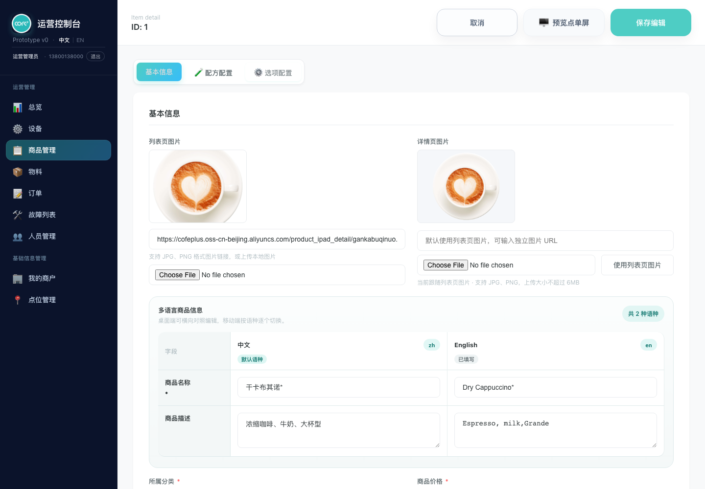
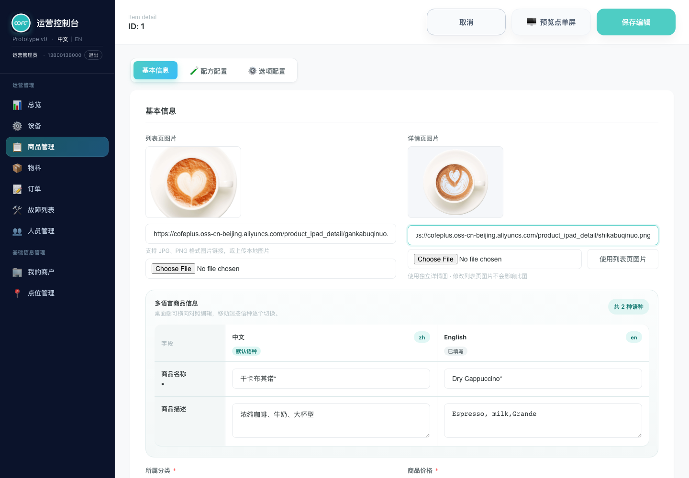
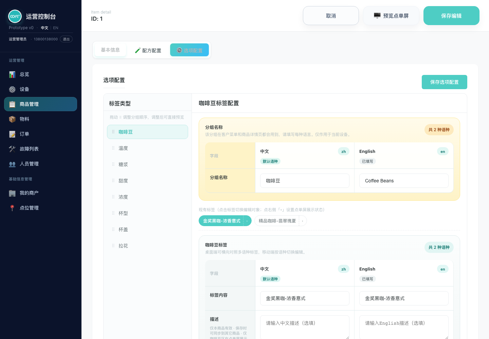
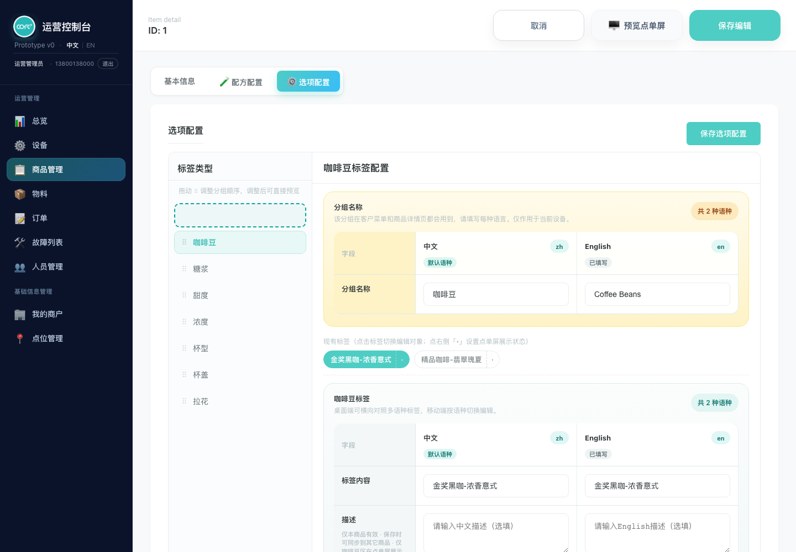
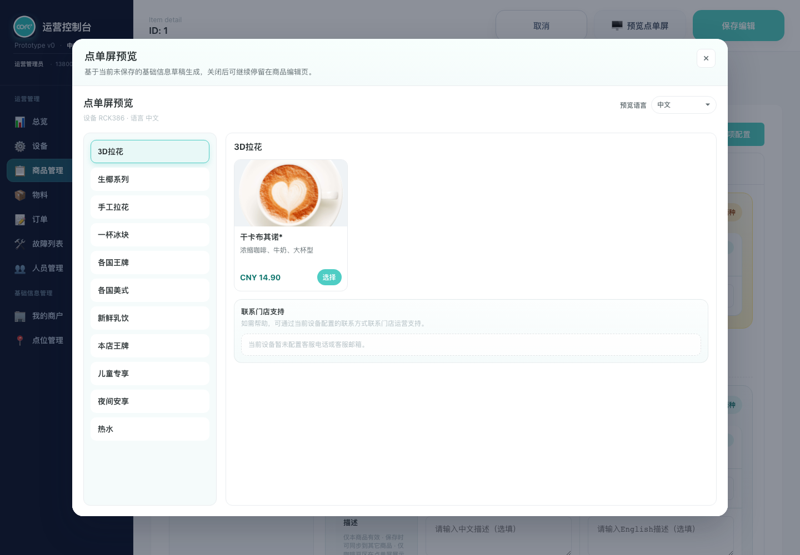
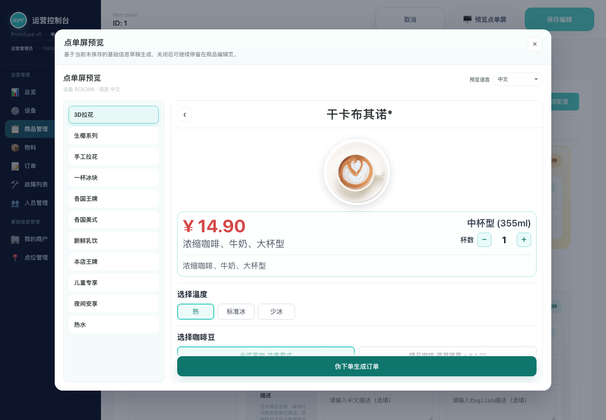
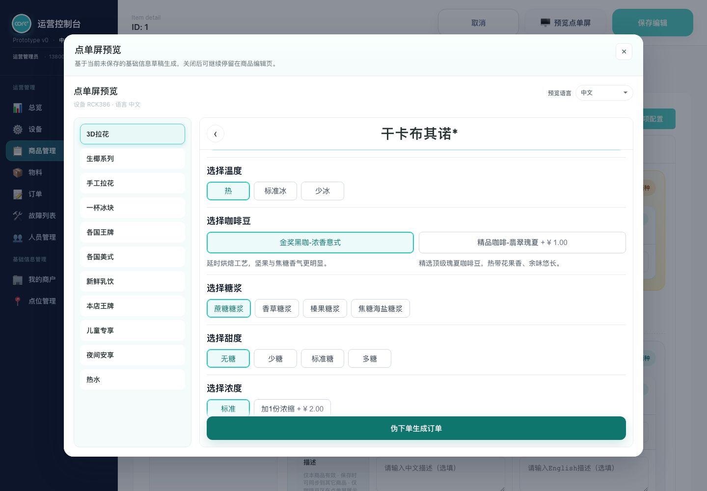

# 产品需求文档：商品详情图片与选项分组排序

协作评审：[飞书文档](https://hi-dolphin.feishu.cn/docx/TdU5du7tXoItGKxi2xhcdGRHnPf) ｜ [网站阅读版](https://prd.cofeplus.dpdns.org/tasks/prd-product-detail-images-option-group-order.html)

版本：1.0 ｜ 日期：2026-09-09 ｜ 状态：需求及本地原型评审版

本次需求新增独立详情页图片，并将选项分组排序统一为与分类导航一致的拖拽交互。两项修改均支持不保存直接预览点单屏。

截图来自本次本地原型的实际页面。图片替换示例仅用于展示两种图片可独立配置，不代表正式商品素材；本文及文档网站的发布不代表商品管理功能已发布到生产环境。

## 1. 背景与目标

需求来源为本次商品管理优化要求及后续交互确认。运营需要分别维护商品列表和详情展示素材，并根据顾客选择习惯调整选项分组的展示顺序；分组排序必须与既有分类导航交互一致。

目标用户：负责商品维护的运营人员、商品管理员。协作读者：产品、设计、研发和测试人员。

- 同一商品可使用不同的列表页图片和详情页图片；未单独设置时无需重复维护。
- 通过拖动分组直接改变点单屏的选择顺序，无需逐次点击上移或下移按钮。
- 运营修改后可立即检查点单屏效果；保存后再次进入仍保留配置。

## 2. 范围与入口

| 对象 | 入口与作用范围 |
| --- | --- |
| 列表页图片、详情页图片 | 商品管理 → 商品“编辑” → 基本信息；作用于当前编辑商品 |
| 选项分组排序 | 商品管理 → 商品“编辑” → 选项配置；作用于当前编辑商品的分组展示顺序 |
| 点单屏预览 | 商品编辑页顶部“预览点单屏”，以及商品管理中的已有预览入口 |
| 权限 | 沿用当前商品的查看、编辑和保存权限，不新增权限项 |

本期不扩展商品轮播图、多张详情图、裁剪编辑器、图片多语言版本、批量图片替换和批量分组排序。分类顺序、组内选项顺序、配方、默认项、附加价格及选项展示状态沿用既有能力。

## 3. 商品图片规则与流程

### 3.1 图片类型与默认关系

| 图片类型 | 展示位置 | 默认规则 |
| --- | --- | --- |
| 列表页图片 | 点单屏商品列表的商品卡片 | 沿用商品已有图片 |
| 详情页图片 | 点单屏点击商品后打开的详情页面 | 未单独设置时使用当前列表页图片 |

“默认一致”表示持续跟随，而非首次复制一份。未设置独立详情图时，运营更换列表图，详情图也同步变为新列表图。历史商品无需补录即可正常展示。

桌面端在基本信息中并排展示两类图片及各自输入入口，便于对照；窄屏按纵向排列。当前详情图应明确提示“跟随列表页图片”或“使用独立详情图”。相同图片在列表和详情中可沿用各自既有展示比例。

### 3.2 独立设置详情图

1. 运营进入商品基本信息，查看当前列表图与详情图。
2. 在“详情页图片”输入图片链接，或选择本地图片上传；明确支持 JPG、PNG，本地图片不超过 6MB。
3. 读取成功后，详情图预览更新，并提示当前使用独立详情图。
4. 列表图保持原样；此后修改列表图也不覆盖独立详情图。
5. 运营可直接打开点单屏预览检查效果，或点击“保存编辑”保留修改。

### 3.3 恢复使用列表页图片

运营点击“使用列表页图片”后，移除当前独立详情图设置，立即显示当前列表图，并恢复跟随关系。清空独立详情图链接时同样回到跟随状态。该操作进入当前编辑内容，仍需保存后才保留为正式商品配置。

| 当前状态 | 操作 | 预期结果 |
| --- | --- | --- |
| 跟随列表图 | 更换列表图 | 列表图与详情图同步更新 |
| 使用独立详情图 | 更换列表图 | 仅列表图更新 |
| 使用独立详情图 | 更换详情图 | 仅详情图更新 |
| 使用独立详情图 | 点击“使用列表页图片”或清空详情图链接 | 详情图恢复跟随当前列表图 |
| 无列表图、无独立详情图 | 进入基本信息或预览 | 显示既有无图占位，不出现错误商品图片 |
| 无列表图、有独立详情图 | 打开预览 | 列表显示无图占位，详情显示独立图片 |

## 4. 选项分组拖拽排序

### 4.1 展示与操作约定

选项配置左侧继续承担分组导航，每组左侧显示与分类导航一致的“⠿”拖拽手柄。点击分组名称只切换编辑对象；拖动分组调整排序。取消上下箭头按钮。

分组顺序作用于当前商品，不修改其他商品或商品分类导航顺序。未配置新顺序的历史商品沿用既有点单屏分组顺序；编辑页与预览的顺序应一致。拖动整组不会改变组内选项、文案、默认选择、附加价格、隐藏或不可用状态。

### 4.2 桌面端与触屏流程

1. 运营进入“选项配置”，找到需要移动的分组，例如“温度”。
2. 使用左侧“⠿”手柄开始拖动；触屏按住手柄后拖动。
3. 经过其他分组时，虚线占位提示当前落点；拖到分组上半区域表示放在它之前，下半区域表示放在它之后。
4. 在有效落点释放后，列表按新顺序排列；支持一次拖动跨越多个分组，以及移到首位或末位。
5. 当前正在编辑的分组和未保存内容保持不变，不因拖拽自动跳转。
6. 运营可立即预览点单屏；通过“保存编辑”或现有“保存选项配置”入口保存分组顺序。

键盘操作：分组获得焦点后可通过 Alt + ↑ / ↓ 调整相邻顺序，移动后焦点保留在该分组。到达首位或末位时继续向外移动不产生变化。

取消拖动或触屏拖动被系统取消时恢复原顺序，并清理占位；不能产生重复或缺失的分组。正常释放后仅更新当前编辑内容，不自动保存商品。

## 5. 点单屏预览与保存

### 5.1 不保存直接预览

1. 运营修改详情图，并将“温度”拖到首位。
2. 不点击保存，直接点击商品编辑页顶部“预览点单屏”。
3. 点单屏商品列表仍显示列表页图片。
4. 点击当前商品进入详情，显示独立详情图；未设置独立图时显示当前列表图。
5. 选项分组按本次拖拽后的顺序显示，“温度”排在第一位；分组内原有选项表现保持不变。
6. 关闭预览回到编辑页，刚才的图片和排序仍在，可以继续修改。

### 5.2 保存后的行为

“预览点单屏”不等同于保存或发布。保存商品成功后，再次进入商品编辑页或从商品管理打开点单屏预览，应读取已保存的图片设置和分组顺序。点击“保存选项配置”保存选项分组顺序；基本信息中的图片修改通过“保存编辑”保存。

切换点单屏预览语言只切换既有多语言内容，不改变图片设置和分组顺序。多分类入口展示同一个商品时，使用该商品同一套图片与分组设置。

本期不改变真实设备的商品同步和“刷新点单屏”流程；关闭预览或在预览内点击商品均不触发设备发布。若选择取消编辑离开，未保存的本次修改不应覆盖已保存配置。

## 6. 异常、兼容与边界

| 场景 | 预期反馈或处理 |
| --- | --- |
| 本地文件不是图片 | 提示请选择图片文件，不替换当前有效图片 |
| 本地图片超过 6MB | 提示图片过大，不替换当前有效图片 |
| 本地图片读取失败 | 提示读取失败，允许重新选择 |
| 详情图片链接无法加载 | 在图片编辑预览中提示加载失败，允许修改链接或恢复列表图 |
| 商品没有单独设置详情图 | 自动使用列表图，无需人工迁移 |
| 旧商品没有新排序配置 | 采用既有点单屏顺序并在编辑页保持一致 |
| 拖回原位置或取消拖动 | 顺序不变，无重复项、无遗留占位 |
| 某组选项不可用或隐藏 | 原有状态继续生效，拖动不恢复选项状态 |
| 保存校验不通过 | 沿用现有错误提示，留在编辑页；修正后可重新保存 |

质量要求：连续调整图片和分组后，多次打开预览应显示最新编辑结果；拖动、切换编辑对象、关闭预览均不得丢失当前未保存的选项内容。桌面与触屏的拖动落点应有可见反馈。

## 7. 验收标准

| 编号 | 验收操作 | 通过标准 |
| --- | --- | --- |
| A01 | 打开未设置独立详情图的历史商品 | 详情图使用当前列表图，展示跟随提示 |
| A02 | 跟随状态下更换列表图 | 两处图片预览同步更新 |
| A03 | 上传或输入独立详情图 | 详情图更新，列表图不变；状态提示变更 |
| A04 | 独立详情图状态下更换列表图 | 详情图不变 |
| A05 | 点击“使用列表页图片”，再更换列表图 | 恢复跟随，后续继续同步 |
| A06 | 上传非图片、超限文件或模拟读取失败 | 出现对应错误提示，原有图片不被替换 |
| A07 | 将中间分组拖到首位、末位并跨组移动 | 释放后落位正确，虚线占位清理，无重复或缺失 |
| A08 | 拖动时保留另一分组的未保存文案 | 拖动后仍编辑原分组，文案保持不变 |
| A09 | 取消鼠标拖动或触屏拖动 | 原顺序恢复，拖动状态清理 |
| A10 | 使用触屏手柄与键盘调整顺序 | 顺序正确，键盘焦点保留，首尾不越界 |
| A11 | 不保存，预览列表并进入商品详情 | 列表图与详情图各自正确，分组按最新草稿顺序展示 |
| A12 | 关闭预览，再次打开 | 编辑内容保留，预览内容一致，未自动保存 |
| A13 | 保存商品后退出并重新进入 | 图片关系、独立图片及分组顺序保留 |
| A14 | 保存选项配置后重新进入 | 分组顺序保留；不要求同时保存未提交的图片输入 |
| A15 | 切换预览语言或同商品的不同分类入口 | 图片及分组顺序一致，已有多语言和选项状态不变 |
| A16 | 取消尚未保存的编辑，再次进入 | 已保存的商品配置不受未保存修改影响 |

## 8. 依赖与评审说明

依赖商品管理现有的图片选择、商品保存、选项配置、权限和点单屏预览能力。本次变更不定义新的后端接口或设备发布机制。

已确认事项：详情图默认跟随列表图且支持独立修改；排序采用与分类导航一致的拖拽交互；两项均纳入点单屏预览。

生产环境上线时间及真实设备联调结果尚未在本次任务中确认；本文记录已确认的产品行为，截图证明本地原型状态，不代替生产设备验收。
