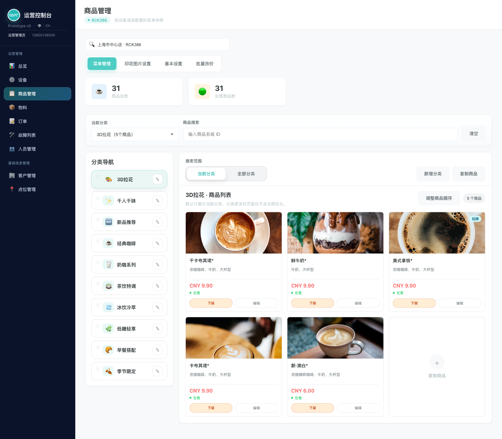
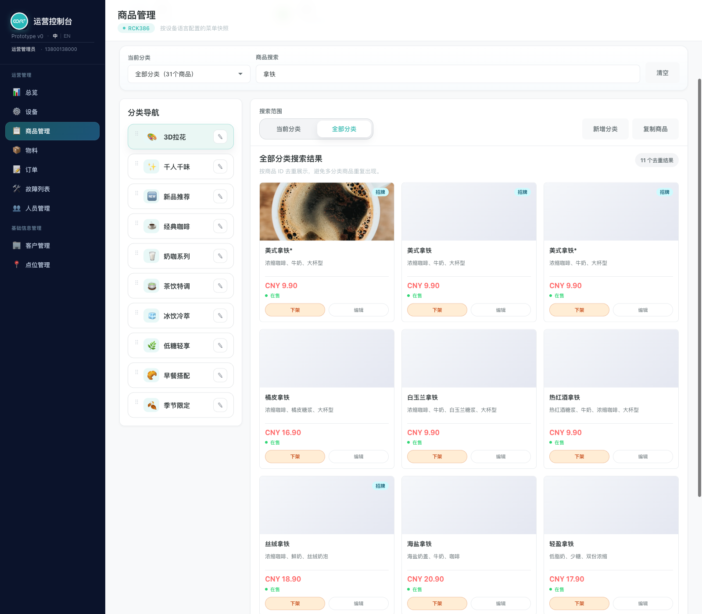
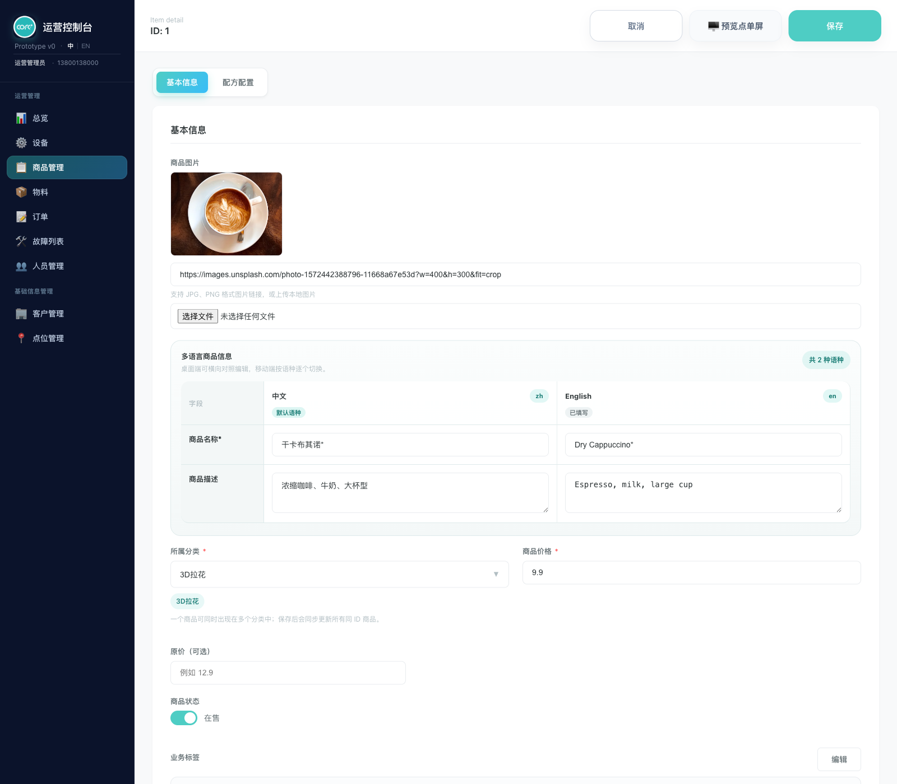
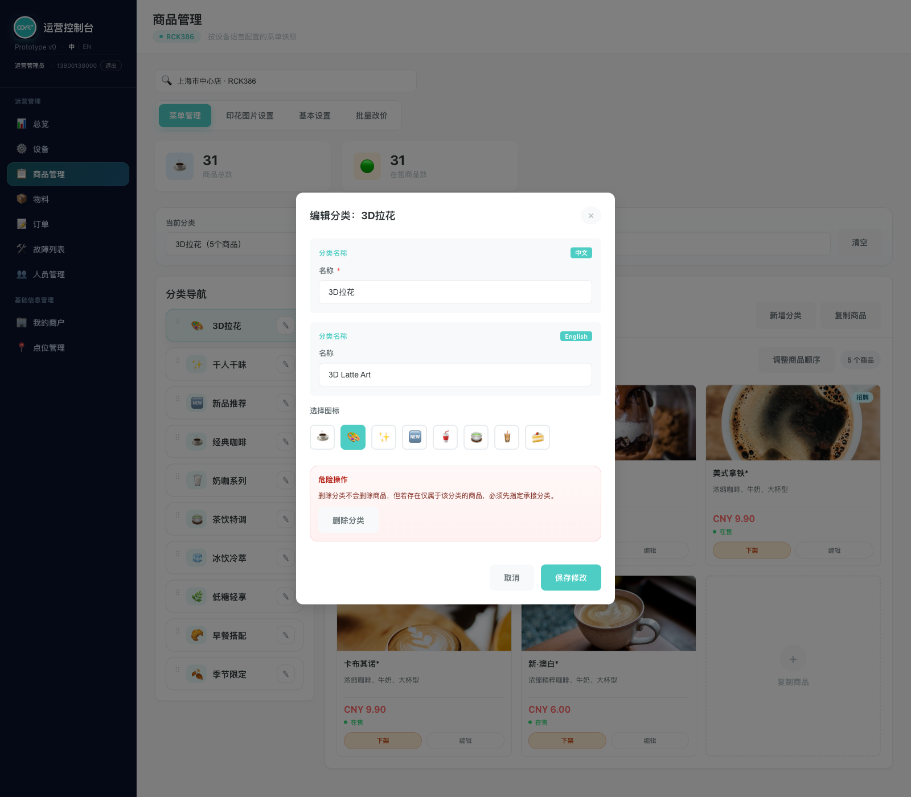
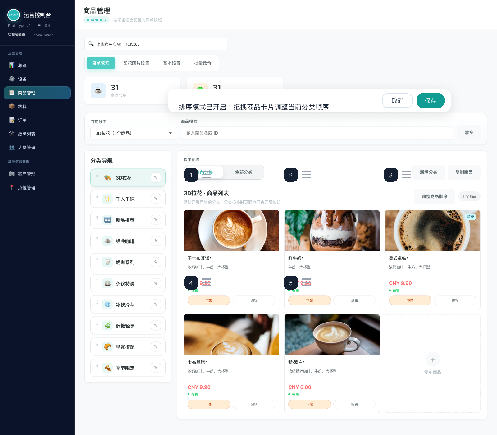
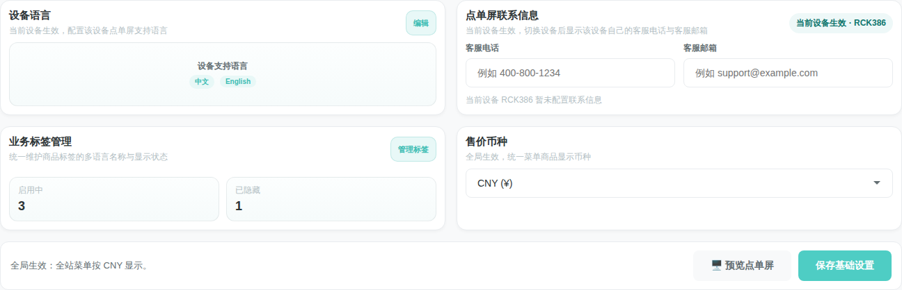
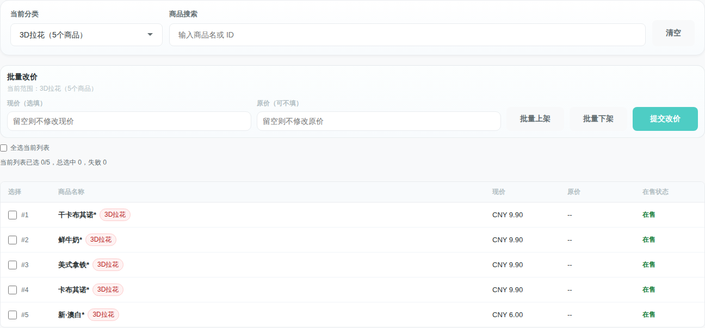
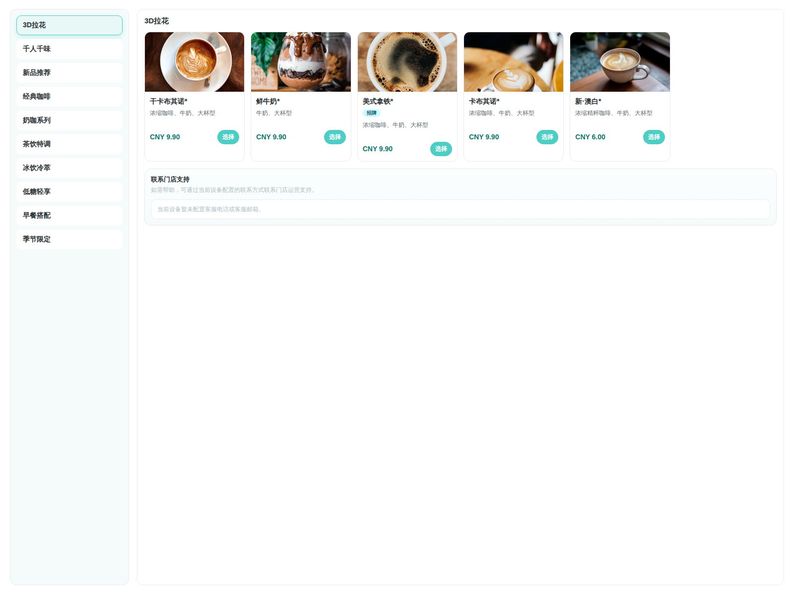

# 产品需求文档：商品管理（按用户流程）

> 使用说明：`Markdown` 版本适合在仓库内查看；如需在浏览器或飞书文档中阅读，优先使用同目录的 [prd-product-management-user-flow.html](./prd-product-management-user-flow.html)。
> 截图标准：PRD 截图以生产域名 https://cofeplus.pages.dev 的页面表现为准。

## 1. 介绍 / 概述

商品管理是 COFE+ 后台运营人员管理咖啡机菜单商品的核心模块，涵盖分类导航、商品卡片管理、商品编辑、基本设置、批量改价以及点单屏预览等完整运营链路。

复制商品流程已拆分为独立文档，见同目录 `prd-copy-product-flow.html`；复制商品每次只能复制到一台目标设备，不支持一次复制到多台机器。

该模块以商品管理页面为主入口，通过三个内层 Tab 组织不同工作区：

- **菜单管理**：分类导航 + 商品卡片网格 + 共享筛选，完成日常商品上下架、编辑、排序和分类维护。
- **基本设置**：设备语言配置、点单屏联系信息、业务标签管理、售价币种。
- **批量改价**：复用共享筛选条件，对选中商品进行批量固定改价或批量上下架。

商品编辑通过商品详情页完成，支持多分类归属、多语言编辑、本地图片上传、配方配置和业务标签配置。

默认用户角色：

- 运营人员：管理商品上下架状态、编辑商品信息、调整分类与排序、维护设备菜单配置。
- 商户管理员：按当前商户范围维护菜单，配置设备语言和联系信息。

## 2. 目标

- 让运营人员进入商品管理后，通过共享筛选和分类导航快速定位目标商品。
- 让商品卡片在桌面端提供上下架与编辑双按钮，在移动端保持无横向滚动的卡片布局。
- 让编辑商品流程支持多分类归属，同一商品可同时出现在多个分类中。
- 让分类管理支持新增、编辑多语言名称与图标、删除时商品迁移。
- 让基本设置将语言、联系信息、业务标签和币种集中管理，并联动点单屏预览。
- 让批量改价支持部分成功，失败项保留选中以便重试。

## 3. 用户流程 / 用户故事

### UF-001：进入商品管理并查看商品概览

**描述：** 作为运营人员，我希望进入商品管理页面后，先看到当前设备的商品统计和分类导航，这样我能快速了解当前菜单状况。

**主流程：**
1. 用户通过后台侧栏进入商品管理页面。
2. 页面加载当前设备菜单数据，顶部展示设备搜索框。
3. 内层 Tab 按顺序展示：`菜单管理`、`基本设置`、`批量改价`。
4. 默认进入 `菜单管理` Tab。
5. 顶部统计卡展示 `商品总数` 与 `在售商品数`。
6. 下方共享筛选区提供分类选择和商品搜索。

**验收标准：**
- [ ] 页面标题为 `商品管理`，与后台其他页面保持一致的头部风格。
- [ ] 设备搜索支持按设备编号和点位名称搜索。
- [ ] 三个内层 Tab 按 `菜单管理`、`基本设置`、`批量改价` 顺序展示。
- [ ] 页面默认打开 `菜单管理` Tab。
- [ ] 支持从外部链接直接打开指定工作区。
- [ ] 统计卡仅展示 `商品总数` 和 `在售商品数`，按商品 ID 去重计算。

**参考截图：**

### UF-002：通过分类导航和共享筛选定位商品

**描述：** 作为运营人员，我希望通过左侧分类导航和共享筛选快速定位目标商品，这样我不需要在一大堆商品中翻找。

**主流程：**
1. 用户在共享筛选区选择分类或输入商品关键词。
2. 左侧分类导航同步高亮当前分类。
3. 商品网格按筛选条件刷新，仅展示当前分类或搜索结果。
4. 用户可切换搜索范围为 `当前分类` 或 `全部分类`。

**验收标准：**
- [ ] 共享筛选区包含分类下拉、商品搜索输入和清空按钮。
- [ ] 共享筛选区位于统计卡下方，在 `菜单管理` 和 `批量改价` Tab 间移动。
- [ ] 切换 Tab 时共享筛选条件保留，清空后恢复默认分类并清除搜索条件。
- [ ] 分类导航桌面端不展示数量徽标，分类名可完整换行显示。
- [ ] 搜索范围使用分段切换（`当前分类` / `全部分类`），并同步选中态。
- [ ] 全部分类搜索结果按商品 ID 去重，不展示分类标签。
- [ ] 移动端分类选择改为底部抽屉，支持分类排序模式。

**参考截图：**

### UF-003：管理商品上下架状态

**描述：** 作为运营人员，我希望在商品卡片上直接切换上下架状态，这样我可以快速控制哪些商品对顾客可见。

**主流程：**
1. 用户在商品卡片上看到 `上架` 或 `下架` 按钮。
2. 用户点击按钮切换状态。
3. 页面刷新商品卡片状态和顶部统计数字。

**验收标准：**
- [ ] 每张商品卡片提供 `上架` / `下架` 与 `编辑` 双按钮。
- [ ] 上架和下架按钮使用不同状态色区分。
- [ ] 业务标签叠加在商品图片上方展示。
- [ ] 桌面端卡片 footer 不横向挤压价格区。
- [ ] 切换上下架后统计卡实时更新。

**参考截图：**

### UF-004：编辑商品信息

**描述：** 作为运营人员，我希望点击编辑后跳转到商品详情页，完成多语言商品名、价格、图片、业务标签等信息的编辑，这样我可以维护完整的商品数据。

**主流程：**
1. 用户点击商品卡片上的 `编辑` 按钮。
2. 系统进入商品详情页，并保留商品数据和当前筛选状态。
3. 用户在商品详情页编辑基本信息、配方配置和业务标签。
4. 用户点击 `保存` 提交修改。
5. 系统跳回菜单管理页，恢复之前的筛选条件和滚动位置。

**验收标准：**
- [ ] 进入商品详情页时链接保持简洁，商品详情数据随页面跳转完整传递。
- [ ] 跳转时保存当前筛选条件与滚动位置，返回后恢复。
- [ ] 页面临时数据传递异常时，系统使用备用传递方式，确保仍能进入商品详情页。
- [ ] 商品详情页提供基本信息和配方配置两个 Tab。
- [ ] 基本信息包含商品图片（URL 或本地上传）、所属分类（支持多选）、商品价格、原价、商品状态、业务标签。
- [ ] 一个商品可同时归属多个分类，保存后同步更新所有同 ID 商品。
- [ ] 商品售价统一展示基础售价与原价，不再区分税前税后。

**参考截图：**

### UF-005：管理分类（新增 / 编辑 / 删除）

**描述：** 作为运营人员，我希望在菜单管理工作区内完成分类的新增、编辑和删除操作，这样我可以保持菜单结构清晰。

**主流程：**
1. 用户点击 `新增分类` 打开分类弹窗。
2. 用户填写分类多语言名称和图标，提交新增。
3. 用户点击分类导航行的编辑入口，修改分类信息。
4. 用户点击分类删除入口，选择承接分类后确认删除。

**验收标准：**
- [ ] `新增分类` 按钮仅保留在菜单管理工作区工具栏，不在顶部操作区。
- [ ] 新增与编辑使用统一弹窗，支持多语言名称和图标编辑。
- [ ] 编辑时不允许重名覆盖已有分类。
- [ ] 分类名优先使用商品数据中维护的多语言名称。
- [ ] 删除分类时需区分空分类、共享商品和需迁移商品。
- [ ] 删除分类时将仅属于该分类的商品迁移到用户选择的承接分类。
- [ ] 删除弹窗只保留删除说明，不展示顶部统计概览。
- [ ] 桌面端分类支持拖拽排序，移动端通过底部抽屉的排序模式完成。

**参考截图：**

### UF-007：调整商品所属分类与排序（本次未实现）

> 本次状态：未实现，暂不纳入本次提测与验收范围；商品所属分类调整、分类排序、商品排序相关需求均保留为后续版本待办。

**描述：** 作为运营人员，我希望调整商品归属分类，并在后续版本中支持分类和商品显示顺序调整，这样我可以控制商品在点单屏上的分类展示和排列。

**后续主流程（本次不实现）：**
1. 用户进入商品编辑页。
2. 用户在商品分类字段中选择或取消选择商品所属分类。
3. 用户保存商品，系统同步更新同 ID 商品在各分类下的归属关系。
4. 用户返回商品管理页后，按分类筛选能看到更新后的商品归属结果。
5. 用户在当前分类模式下看到 `调整商品顺序` 入口。
6. 用户拖拽商品卡片调整顺序并保存。
7. 分类排序通过分类导航或移动端底部抽屉完成。

**后续验收标准（本次不验收）：**
- [ ] 商品编辑页支持选择多个所属分类。
- [ ] 保存后，同 ID 商品在各分类下的归属关系同步更新。
- [ ] 从某分类移出商品后，该分类筛选结果不再展示该商品。
- [ ] 将商品加入新分类后，新分类筛选结果展示该商品。
- [ ] 当前分类模式提供调整商品顺序入口，全部分类模式不显示。
- [ ] 保存当前分类商品顺序时不影响其他分类。
- [ ] 桌面端排序草稿变化后立即刷新当前排序列表。
- [ ] 桌面端分类支持拖拽排序，包含拖拽手柄与可拖拽属性。
- [ ] 移动端分类排序通过底部抽屉的排序模式完成，支持触摸拖拽。
- [ ] 排序结果保存到当前浏览器，并在刷新页面后保留。

**参考截图：**

当前截图展示排序能力，仅保留为后续设计参考；本次不作为验收依据。

### UF-009：配置基本设置

**描述：** 作为运营人员，我希望在基本设置 Tab 中统一管理设备语言、点单屏联系信息、业务标签和币种，这样我可以集中完成设备的菜单配置。

**主流程：**
1. 用户切换到 `基本设置` Tab。
2. 用户配置设备支持语言、联系信息、业务标签和售价币种。
3. 用户点击 `保存基础设置` 统一保存。
4. 用户可点击 `预览点单屏` 查看配置效果。

**验收标准：**
- [ ] 基本设置包含设备语言、点单屏联系信息、业务标签管理和售价币种四张卡片。
- [ ] 桌面端设置卡片改为两列布局。
- [ ] 设备语言卡片保留编辑入口和语言列表，不展示卡片内设备编号和默认语言摘要。
- [ ] 联系信息包含客服电话和客服邮箱，非法邮箱阻止保存。
- [ ] 业务标签通过独立抽屉管理，统一维护多语言名称与显示状态。
- [ ] 设备无可见语言时阻止保存业务标签改动。
- [ ] 保存业务标签失败时回滚基础设置快照并保持抽屉打开。
- [ ] 保存后仅将币种应用到菜单商品，不再处理税率配置。
- [ ] 保存后按设备独立保存联系信息，并刷新已打开的点单屏预览。
- [ ] 切换设备时若联系信息未保存，提供保存、放弃、取消三个选项。
- [ ] 已保存的联系信息数据异常时，系统安全回退为空值。

**参考截图：**

### UF-010：管理设备语言

**描述：** 作为运营人员，我希望为每台设备独立配置点单屏支持的语言，这样不同地区的设备可以展示不同语言菜单。

**主流程：**
1. 用户在设备语言卡片点击 `编辑` 打开语言弹窗。
2. 弹窗展示当前设备已启用语言列表，支持隐藏和恢复。
3. 用户通过预置语种下拉新增语言。
4. 用户设置默认语言并保存。

**验收标准：**
- [ ] 新增语言使用预置语种下拉框，不再支持自由输入。
- [ ] 新增语言后保存当前设备语言配置。
- [ ] 当前设备已显示和已隐藏的语言不出现在新增语种下拉中。
- [ ] 无可添加语种时禁用添加按钮。
- [ ] 隐藏语言后仅从当前设备可见语言中移除，保留语言数据。
- [ ] 隐藏当前默认语言后回退到剩余第一种可见语言。
- [ ] 切换到新设备时自动初始化默认语言配置。

**参考截图：**

### UF-011：批量改价

**描述：** 作为运营人员，我希望通过批量改价 Tab 对选中商品统一修改价格或上下架状态，并支持部分成功，这样我可以高效完成大批量调整。

**主流程：**
1. 用户切换到 `批量改价` Tab。
2. 页面复用共享筛选条件，展示商品列表和批量编辑区。
3. 用户勾选商品，输入目标价格或选择上下架操作。
4. 用户点击提交，系统按商品逐条执行。
5. 成功项自动取消选中，失败项保留选中以便重试。

**验收标准：**
- [ ] 批量改价复用共享筛选的分类和搜索条件。
- [ ] 工作区展示共享范围摘要和批量编辑区。
- [ ] 商品列表为文本行，不展示商品图片。
- [ ] 移动端改为无横向滚动的堆叠卡片布局。
- [ ] 支持全选和按商品名搜索过滤，全选只作用于筛选结果。
- [ ] 多分类商品在全量列表中按商品 ID 去重，按唯一商品计数。
- [ ] 批量固定改价：原价可不填，填写时必须大于现价。
- [ ] 批量固定改价：原价留空时保持商品原价。
- [ ] 批量固定改价：支持部分成功，失败项保留选中。
- [ ] 批量固定改价：重试失败项成功后清除失败状态。
- [ ] 批量固定改价：仅改原价时保持现价，对不合法行做部分失败。
- [ ] 批量上下架：按勾选项执行，支持部分成功。
- [ ] 退出批量模式后清除成功样式状态。

**参考截图：**

### UF-012：预览点单屏

**描述：** 作为运营人员，我希望在保存基本设置后预览点单屏效果，确认商品分类、商品名称、价格和联系信息展示正确。

**主流程：**
1. 用户在基本设置 Tab 点击 `预览点单屏`。
2. 系统打开点单屏预览弹层，默认选中第一个分类。
3. 用户切换分类和语言查看不同展示效果。
4. 用户点击商品查看详情预览，含标签选项和附加价格。

**验收标准：**
- [ ] 预览弹层打开后默认选中一个分类并渲染商品。
- [ ] 切换分类后右侧商品列表联动更新。
- [ ] 按菜单管理维护的分类顺序展示分类。
- [ ] 读取菜单管理中已保存的商品编辑与分类归属数据。
- [ ] 提供语言切换下拉，与设备语言配置一致。
- [ ] 打开时优先使用设备配置的默认语言。
- [ ] 切换预览语言后刷新商品文案，但不改写设备默认语言。
- [ ] 业务标签显示前两个启用标签并隐藏停用标签。
- [ ] 切换语言后业务标签文案同步。
- [ ] 点击商品打开详情预览层，展示选项、附加价格和伪下单按钮。
- [ ] 伪下单按钮区域吸底显示，避免长内容被遮挡。
- [ ] 详情浮层复用当前设备联系信息，保存后重绘。
- [ ] 隐藏语言后不在预览下拉中显示该语言选项。

**参考截图：**

- [ ] 有原价时显示划线原价。

## 4. 功能需求

- FR-1：系统必须提供商品管理主页面，通过三个内层 Tab 组织不同工作区。
- FR-2：三个 Tab 必须按 `菜单管理`、`基本设置`、`批量改价` 顺序展示。
- FR-3：页面默认打开 `菜单管理` Tab，支持从外部链接直接打开指定工作区。
- FR-4：设备搜索必须同时支持设备编号和点位名称匹配。
- FR-5：统计卡必须仅展示 `商品总数` 和 `在售商品数`，按商品 ID 去重计算。
- FR-6：共享筛选区必须包含分类下拉、商品搜索输入和清空按钮。
- FR-7：共享筛选区必须在 `菜单管理` 和 `批量改价` Tab 间移动，保留筛选条件。
- FR-8：搜索范围必须支持 `当前分类` 和 `全部分类` 切换。
- FR-9：全部分类搜索结果必须按商品 ID 去重且不展示分类标签。
- FR-10：商品卡片必须统一提供上下架与编辑双按钮，使用不同状态色区分。
- FR-11：业务标签必须叠加在商品图片上方展示。
- FR-12：同一商品可同时归属多个分类，保存后同步更新所有同 ID 商品。
- FR-13：编辑商品必须支持多分类归属选择。
- FR-14：商品售价必须统一展示基础售价与原价，不再区分税前税后。
- FR-15：跳转商品详情时必须保存当前筛选条件与滚动位置，返回后恢复。
- FR-16：分类新增/编辑必须使用统一弹窗，支持多语言名称和图标。
- FR-17：编辑分类时不允许重名覆盖已有分类。
- FR-18：删除分类时必须将仅属于该分类的商品迁移到承接分类。
- FR-19：`新增分类` 按钮仅保留在菜单管理工作区工具栏。
- FR-20（后续版本）：分类和商品排序需要支持桌面端拖拽和移动端触摸拖拽，本次不纳入验收。
- FR-21（后续版本）：保存当前分类商品顺序时不得影响其他分类，本次不纳入验收。
- FR-30：基本设置必须包含设备语言、联系信息、业务标签和售价币种。
- FR-31：新增设备语言必须使用预置语种下拉框。
- FR-32：隐藏语言后必须保留语言数据，仅从可见列表移除。
- FR-33：隐藏当前默认语言后必须回退到剩余第一种可见语言。
- FR-34：联系信息必须包含客服电话和客服邮箱，非法邮箱阻止保存。
- FR-35：切换设备时若联系信息未保存，必须提供保存、放弃、取消三个选项。
- FR-36：设备无可见语言时必须阻止保存业务标签改动。
- FR-37：保存基本设置后必须将币种应用到商品，且不再处理税率配置。
- FR-38：保存基本设置后必须刷新已打开的点单屏预览。
- FR-39：批量改价必须复用共享筛选条件。
- FR-40：批量固定改价必须支持部分成功，失败项保留选中。
- FR-41：批量上下架必须支持部分成功。
- FR-42：批量改价列表必须按商品 ID 去重展示。
- FR-43：退出批量模式后必须清除成功样式状态。
- FR-44：点单屏预览必须按菜单管理维护的分类顺序展示。
- FR-45：点单屏预览必须提供语言切换并与设备语言配置一致。
- FR-46：点单屏预览业务标签最多展示前两个启用标签。
- FR-47：点单屏详情预览伪下单按钮必须吸底显示。
- FR-48：移动端共享筛选必须改为底部抽屉并支持分类排序模式。
- FR-49：移动端商品管理页不得出现同屏重复的大号标题。
- FR-50：已保存的本地数据异常时必须安全回退为空值。

## 5. 关键规则矩阵

| 规则类别 | 触发场景 | 核心规则 | 结果 |
| --- | --- | --- | --- |
| 多分类归属 | 保存商品 | 商品可同时归属多个分类，保存后同步所有同 ID 商品 | 同一商品出现在多个分类下 |
| 去重规则 | 统计和列表 | 按商品 ID 去重计算总数和在售数 | 避免多归属商品重复计数 |
| 上下架规则 | 点击上架/下架 | 切换商品可见状态并更新统计 | 统计卡实时更新 |
| 分类重名校验 | 编辑分类 | 不允许重名覆盖已有分类 | 阻止保存并提示 |
| 分类删除迁移 | 删除非空分类 | 仅属于该分类的商品迁移到承接分类 | 商品不丢失 |
| 搜索范围规则 | 切换搜索范围 | `当前分类` 仅展示当前分类商品，`全部分类` 展示去重结果 | 搜索结果符合预期 |
| 设备作用域规则 | 切换设备 | 语言配置和联系信息按设备隔离 | 各设备独立配置 |
| 语言隐藏规则 | 隐藏默认语言 | 回退到剩余第一种可见语言 | 预览和配置保持一致 |
| 邮箱校验 | 保存联系信息 | 非法邮箱格式阻止保存 | 提示输入正确邮箱 |
| 批量改价部分成功 | 批量提交 | 成功项自动取消选中，失败项保留 | 支持重试失败项 |
| 批量改价去重 | 全量列表展示 | 多分类商品按 ID 去重 | 计数和展示准确 |
| 原价校验 | 固定改价 | 原价可不填，填写时必须大于现价 | 不合法行做部分失败 |
| 联系信息未保存 | 切换设备 | 提供保存、放弃、取消三个选项 | 防止意外丢失编辑 |
| 预览语言联动 | 切换预览语言 | 刷新商品文案和标签，不改写设备默认语言 | 预览与配置独立 |
| 业务标签联动 | 保存基本设置 | 无可见语言时阻止保存标签改动 | 防止无效标签配置 |
| 异常数据回退 | 读取已保存联系信息 | 联系信息数据异常时安全回退为空值 | 页面不崩溃 |
| UF-007 整体能力（后续版本） | 保存商品 / 保存排序 | 商品分类归属、分类排序、商品排序相关能力 | 本次不纳入验收，后续实现 |
