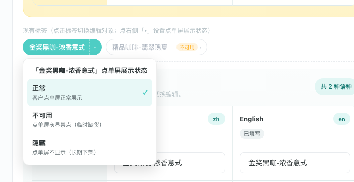
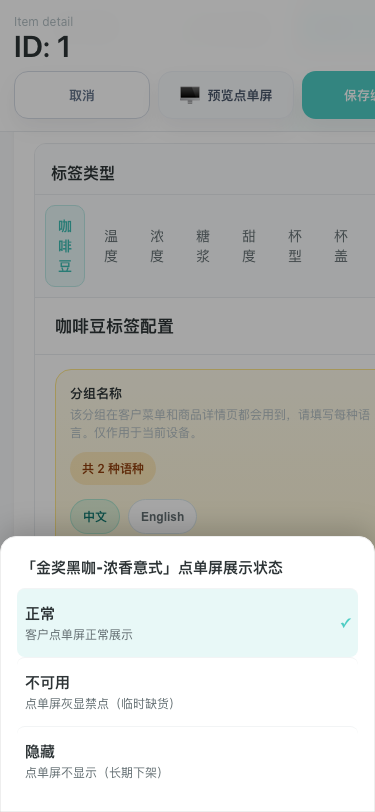
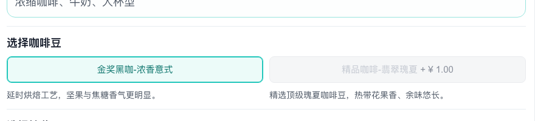

# 产品需求文档：商品选项点单屏展示状态（隐藏 / 不可用）

> 使用说明：`Markdown` 版本适合在仓库内查看；如需在浏览器中阅读带截图的完整版本，优先使用同目录的 [prd-product-option-display-status.html](./prd-product-option-display-status.html)。

## 1. 介绍 / 概述

商品的每个选项组（咖啡豆、温度、浓度、糖浆、甜度、杯型、杯盖等）下有多个选项。此前，选项一旦配置就必然出现在客户点单屏上，且始终可以被点选。运营在实际经营中有两类高频诉求无法满足：

- **临时缺货**：某个选项（例如某款糖浆）暂时没有物料，希望客户能看到它存在，但不能点选，避免下单后无法制作。
- **长期下架**：某个选项不再售卖，希望它从点单屏上彻底消失，但保留配置数据，便于将来恢复。

本需求为每个选项引入「点单屏展示状态」，共三种：

| 状态 | 点单屏表现 | 适用场景 |
|------|-----------|---------|
| 正常 | 正常展示、可点选 | 默认状态 |
| 不可用 | 灰显禁点，客户可见但无法选择 | 临时缺货 |
| 隐藏 | 不显示 | 长期下架 |

状态在商品编辑页的「选项配置」页签中设置，立即生效于该商品的点单屏预览；保存商品后随商品数据一起持久化。

## 2. 目标

- 让运营能在不删除选项配置的前提下，控制单个选项在客户点单屏上的可见性与可点性。
- 「设置状态」与「切换编辑对象」两个动作互不干扰：高频的切换动作不应被低频的状态菜单打断。
- 状态分布一眼可见：运营进入选项配置页签，无需逐个点开即可看出哪些选项被隐藏或停用。
- 保证点单屏永远有可点的选项：每个选项组至少保留一个「正常」状态的选项。
- 默认选项永远可用：默认选项被隐藏或停用时，系统自动迁移默认并明确告知运营。

## 3. 适用范围

- 页面路径：菜单管理 > 商品管理 > 编辑商品 > 选项配置
- 消费端影响面：菜单管理页内的「预览点单屏」（含未保存草稿的即时预览）
- 适用对象：运营人员、商品管理员

不在本文件范围内的内容：

- 商品整体的上架 / 下架（商品级状态，另有现成功能）
- 选项的新增、删除、改名、多语言文案维护（沿用选项配置既有能力）
- 配方层面的选项组合校验（属于配方管理）

## 4. 交互设计

### 4.1 标签双热区

「选项配置」页签中，每个选项以标签形式横向排列。每个标签分为两个热区：

- **标签主体**（左侧，显示选项名称）：点击仅切换当前编辑对象，用于维护文案、附加价格、默认项等，不弹出任何菜单。
- **状态热区**（右侧，显示状态徽标与「▾」符号）：点击弹出「点单屏展示状态」菜单；再次点击同一个「▾」收起菜单。

设计动机：切换编辑对象是高频动作，设置状态是低频动作。若点击标签必弹菜单，运营只想切换时会被反复打断。双热区让两个动作各有明确入口。

### 4.2 状态徽标

- 「正常」状态的标签，状态热区只显示低调的「▾」符号。
- 「不可用」状态的标签，状态热区显示橙色「不可用」徽标。
- 「隐藏」状态的标签，状态热区显示灰色「已隐藏」徽标，且标签整体以虚线边框弱化。

徽标常驻展示，运营扫一眼标签行即可掌握整组选项的状态分布。

### 4.3 状态菜单

点击状态热区后弹出菜单，标题为「『选项名』点单屏展示状态」，包含三个选项，每项附一行说明：

- 正常 —— 客户点单屏正常展示
- 不可用 —— 点单屏灰显禁点（临时缺货）
- 隐藏 —— 点单屏不显示（长期下架）

当前状态项带勾选标记。点击任意项立即生效并收起菜单，无需额外确认。

- **桌面端**：菜单以浮层形式锚定在标签下方，随页面滚动跟随标签移动；点击菜单外区域或按 Esc 键收起。
- **移动端**（视口宽度 768px 及以下）：菜单以底部动作面板形式弹出，带半透明遮罩；点击遮罩收起。两个热区在移动端加大可点面积。

## 5. 用户故事

### US-001：临时停用缺货选项

**描述：** 作为运营人员，某款糖浆临时缺货时，我希望把它设为「不可用」，客户能看到该选项存在但无法点选，等补货后我再恢复。

**验收标准：**

- [ ] 在选项配置页签中，点击该选项标签右侧的状态热区，可弹出状态菜单。
- [ ] 选择「不可用」后，标签立即出现「不可用」徽标。
- [ ] 点单屏预览中，该选项灰显且无法点选，若有附加价格仍然展示。
- [ ] 将状态改回「正常」后，点单屏恢复可点选。

### US-002：长期下架选项

**描述：** 作为运营人员，某个选项不再售卖时，我希望把它设为「隐藏」，客户点单屏上完全看不到它，但它的多语言文案、附加价格等配置保留，将来恢复售卖时不用重新配置。

**验收标准：**

- [ ] 选择「隐藏」后，标签出现「已隐藏」徽标并以虚线边框弱化。
- [ ] 点单屏预览中该选项不出现。
- [ ] 该选项在选项配置页签中仍然可见、可编辑，文案与价格配置不丢失。
- [ ] 将状态改回「正常」后，点单屏重新展示该选项。

### US-003：切换编辑对象不受状态菜单打扰

**描述：** 作为运营人员，我在多个选项之间来回切换维护文案时，不希望每次点击标签都弹出状态菜单。

**验收标准：**

- [ ] 点击标签主体只切换编辑对象，不弹出状态菜单。
- [ ] 只有点击标签右侧的「▾」状态热区才弹出菜单。
- [ ] 菜单弹出后，再次点击同一个「▾」可收起；点击菜单外区域也可收起。

### US-004：默认选项被隐藏或停用时自动迁移

**描述：** 作为运营人员，当我把当前默认选项设为「隐藏」或「不可用」时，我希望系统自动把默认迁移到第一个正常选项，并明确告诉我迁移结果，避免点单屏出现默认选中一个不可点选项的矛盾状态。

**验收标准：**

- [ ] 对当前默认选项设置「隐藏」或「不可用」时，默认选项自动改为该组第一个「正常」状态的选项。
- [ ] 页面弹出提示，说明原选项已隐藏/不可用、默认选项已改为哪个选项。
- [ ] 对非默认选项设置状态，不触发默认迁移。

### US-005：每组至少保留一个正常选项

**描述：** 作为运营人员，我不能把一个选项组的全部选项都隐藏或停用，否则客户在点单屏上无从选择。

**验收标准：**

- [ ] 当某选项是该组最后一个「正常」状态的选项时，将它设为「不可用」或「隐藏」的操作被拦截。
- [ ] 拦截时页面提示「每组至少保留一个正常选项」，原状态保持不变。
- [ ] 恢复为「正常」的操作永远允许。

### US-006：未保存也能在点单屏预览中看到状态效果

**描述：** 作为运营人员，我改完选项状态后想立刻点「预览点单屏」确认效果，不想先保存商品。

**验收标准：**

- [ ] 修改状态后不保存，直接打开点单屏预览，「不可用」选项灰显禁点、「隐藏」选项不出现。
- [ ] 预览效果与保存后的正式效果一致。

## 6. 功能要求

### 6.1 状态设置

- FR-1：每个选项组内的每个选项，必须支持独立设置「正常 / 不可用 / 隐藏」三种点单屏展示状态；未设置过状态的选项一律视为「正常」。
- FR-2：状态入口位于选项标签右侧的独立热区，与标签主体（切换编辑对象）分离。
- FR-3：状态菜单中的选择立即生效，无需二次确认；菜单选择后自动收起。
- FR-4：状态菜单必须区分桌面端（锚定浮层）与移动端（底部动作面板）两种形态。

### 6.2 状态可见性

- FR-5：「不可用」与「隐藏」状态必须在选项标签上常驻显示徽标；「正常」状态不显示徽标。
- FR-6：「隐藏」状态的标签需额外弱化（虚线边框），与「不可用」形成视觉区分。

### 6.3 守卫规则

- FR-7：每个选项组必须至少保留一个「正常」状态的选项；违反时拦截操作并提示「每组至少保留一个正常选项」。
- FR-8：当前默认选项被设为「不可用」或「隐藏」时，默认选项自动迁移到该组第一个「正常」选项，并以提示告知运营迁移结果。
- FR-9：恢复「正常」永远允许，且不触发任何迁移。

### 6.4 点单屏表现

- FR-10：「隐藏」选项不得出现在点单屏；「不可用」选项必须展示但灰显禁点，附加价格照常显示。
- FR-11：若历史数据中的默认选项处于「隐藏」或「不可用」状态，点单屏自动回退到该组第一个可点选项作为默认。
- FR-12：点单屏预览必须支持未保存草稿：编辑中的状态变更不保存也能在预览中生效，且与保存后的效果一致。

### 6.5 数据保存

- FR-13：选项状态随商品一起保存，保存后重新进入编辑页状态保持。
- FR-14：没有状态数据的存量商品行为不变（全部选项按「正常」处理），不需要数据迁移。

## 7. 状态变更结果矩阵

| 操作 | 目标选项 | 结果 |
|------|---------|------|
| 设为不可用 / 隐藏 | 非默认选项，组内还有其他正常选项 | 直接生效，无迁移 |
| 设为不可用 / 隐藏 | 当前默认选项，组内还有其他正常选项 | 生效，默认自动迁移到第一个正常选项，弹出迁移提示 |
| 设为不可用 / 隐藏 | 该组最后一个正常选项 | 拦截，提示「每组至少保留一个正常选项」 |
| 恢复正常 | 任意选项 | 永远允许，无迁移 |

## 8. 非目标

- 不提供按设备、按时段的选项状态（当前为商品级设置）。
- 不提供批量设置多个选项状态的入口。
- 不改变商品级上架 / 下架逻辑。
- 不在商品列表页展示选项状态汇总。

## 9. 成功标准

- 运营处理「临时缺货」与「长期下架」不再需要删除选项或改文案标注。
- 运营切换编辑对象时零误弹状态菜单。
- 点单屏不会出现「默认选中了一个不可点选项」或「整组无可点选项」的状态。
- 状态设置后不保存即可通过点单屏预览确认效果。

## 10. 修订记录

| 日期 | 说明 |
|------|------|
| 2026-07-14 | 首版：三态状态模型、标签双热区交互、守卫与默认迁移规则、点单屏草稿预览 |
