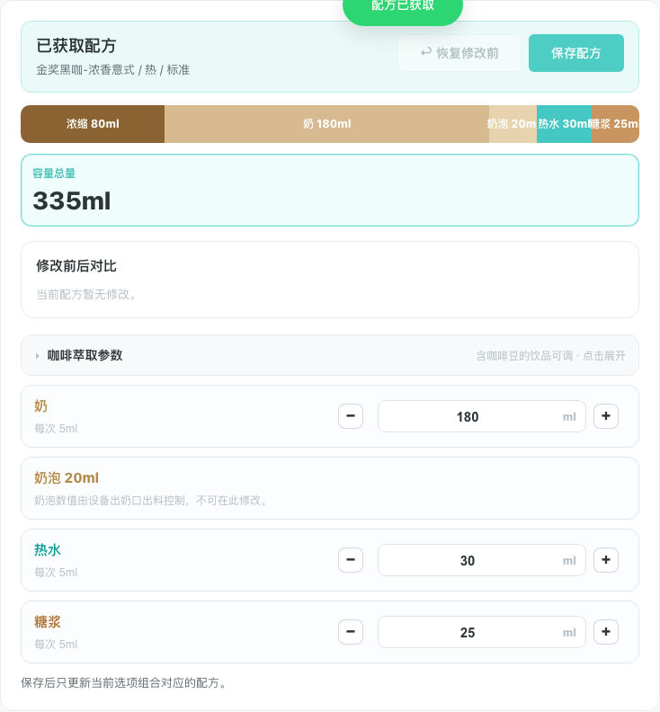
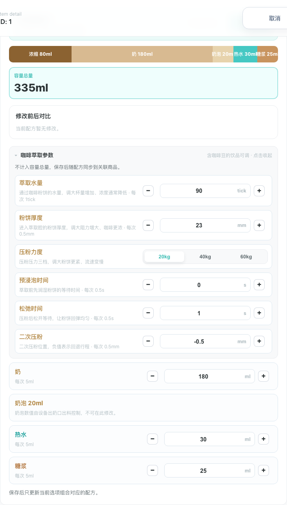
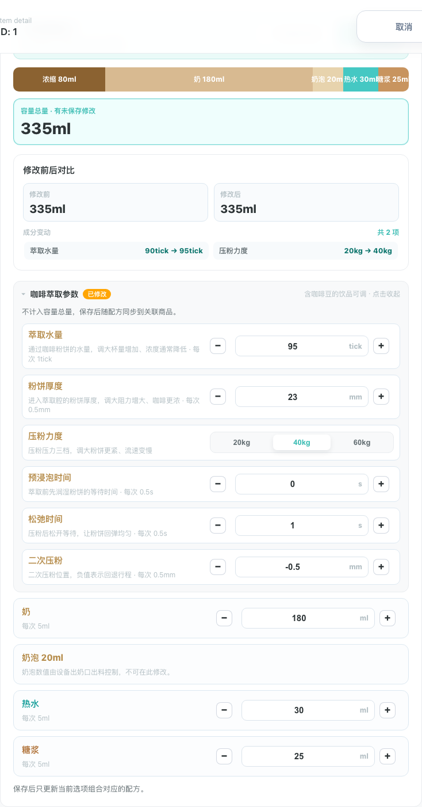
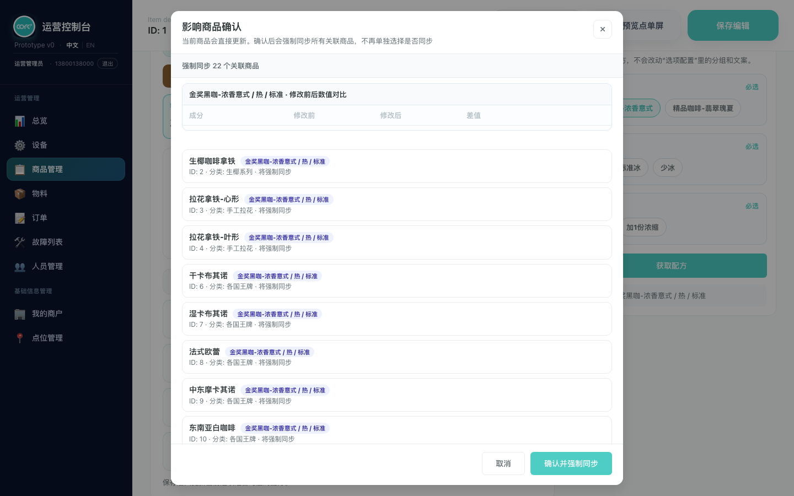
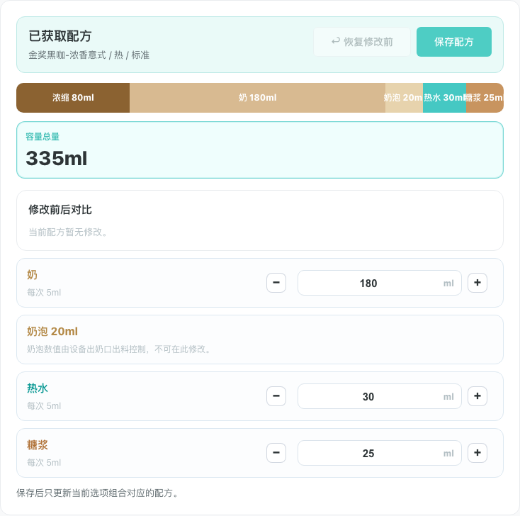

# 产品需求文档：咖啡萃取参数配置

> 使用说明：Markdown 版本适合在仓库内查看；如需在浏览器或飞书文档中阅读，优先使用同目录的 [prd-recipe-brew-params.html](./prd-recipe-brew-params.html)。
>
> 更新于 2026-08-24：有咖啡豆的饮品在配方配置中可调整六项设备萃取工艺参数。参数范围与档位对齐配方下发字段文档（Eversys 28 列基础列）。

## 1. 介绍 / 概述

商品详情页"🧪 配方配置"页签原来只能调整物料用量（浓缩、奶、糖浆等 ml/g 数值）。本需求为**有咖啡豆的饮品**新增"咖啡萃取参数"分区：运营可以调整六项设备萃取层的工艺参数——萃取水量、粉饼厚度、压粉力度、预浸泡时间、松弛时间、二次压粉。

萃取参数与物料用量是两类数据：物料用量决定"放多少料"，直接影响理论容量；萃取参数决定"怎么萃取"（水流、压粉、时序），不改变物料总量，也不计入容量总量。参数随配方一起保存，并沿用现有配方的强制同步机制同步到关联商品。

本 PRD 覆盖"🧪 配方配置"页签内的萃取参数分区。配方获取流程、物料用量编辑、保存链路沿用《配方管理（选项驱动获取配方）》PRD 的既有规则。

## 2. 目标与非目标

### 2.1 目标

- 有咖啡豆的饮品在获取配方后，可以查看并调整六项萃取参数。
- 参数范围与档位对齐设备下发字段口径，避免下发无效值。
- 压粉力度按三档（20kg / 40kg / 60kg）切换，不允许连续数值。
- 萃取参数默认收起，减少对既有物料编辑的干扰；有未保存修改时收起态可见徽标提示。
- 萃取参数变化进入"修改前后对比"和"影响确认弹窗"，与物料变化同一套保存与同步链路。
- 无豆饮品不展示萃取参数分区。

### 2.2 非目标

- 不定义点单端前台如何展示萃取参数（客户不可见）。
- 不改变配方获取流程和物料用量编辑规则。
- 不定义设备底层下发协议的实现细节；本 PRD 只约定界面取值范围与存储值口径。
- 不开放豆仓选择（BeanH）与系数列（Modulus，恒为 10）。
- 不修改整机重启提示与配方文件维护的浓缩基数行为。

## 3. 页面范围与信息架构

### 3.1 页面路径

- 菜单管理 → 商品管理 → 点击商品进入商品详情 → 切换到"🧪 配方配置"页签 → 选择咖啡豆 / 温度 / 浓度 → 获取配方。

### 3.2 分区位置

获取配方成功后，左侧主编辑区从上到下依次为：

| 区域 | 内容 |
| --- | --- |
| 已获取配方摘要 | 组合名称、恢复修改前、保存配方按钮 |
| 容量总量卡与物料段条 | 理论容量信息（不含萃取参数） |
| 修改前后对比 | 物料与萃取参数的变更列表 |
| **咖啡萃取参数分区（本 PRD）** | 默认收起；展开后六项参数 |
| 物料用量编辑行 | 奶、奶泡、热水、冰、糖浆等（浓缩只读行已下线） |

### 3.3 参数定义与口径

| 参数 | 存储 key | 单位 | 步进 / 范围 | 默认值 | 说明 |
| --- | --- | --- | --- | --- | --- |
| 萃取水量 | waterQuantity | tick | 1 / 0–262 | 90 | 通过粉饼的水量，调大杯量增加、浓度通常降低；模板机口径 [0,262] |
| 粉饼厚度 | cakeThickness | mm | 0.5 / 3–32 | 23 | 进入萃取腔的粉饼厚度，调大阻力增大、咖啡更浓；对应 CakeTh [3.0,32.0]mm |
| 压粉力度 | tamping | kg 档位 | 三档 64 / 92 / 120（= 20 / 40 / 60kg） | 64（20kg） | 离散档位，界面显示 kg；对应 PowderP |
| 预浸泡时间 | preInfusion | s | 0.5 / 0–10 | 0 | 萃取前先润湿粉饼的等待时间；对应 PreBrew [0,10.0]s |
| 松弛时间 | relaxTime | s | 0.5 / 0–10 | 1 | 压粉后松开等待；对应 RelaxT [0,10.0]s |
| 二次压粉 | secondTamping | mm | 0.5 / −5–5 | −0.5 | 二次压粉位置，负值表示回退行程；对应 PressAf [−5.0,5.0]mm |

存储说明：萃取参数随配方按选项组合保存与同步。压粉力度存下发口径值（64/92/120），界面展示 kg 档位。

### 3.4 参考截图总览

## 4. 用户流程 / 用户故事

### UF-001：获取配方后看到收起的萃取参数分区

**描述：** 作为运营人员，我获取某个含豆组合的配方后，可以在"修改前后对比"下方看到"咖啡萃取参数"分区，默认收起、不干扰物料编辑。

**主流程：**

1. 用户选择咖啡豆、温度、浓度并点击"获取配方"。
2. 左侧展示配方成分。
3. "修改前后对比"下方出现"咖啡萃取参数"分区标题行，右侧显示"含咖啡豆的饮品可调 · 点击展开"。
4. 分区默认收起，不展示参数行。

**验收标准：**

- [ ] 分区默认为收起状态。
- [ ] 收起时仅显示标题行，不占大量页面空间。
- [ ] 标题行右侧必须有"点击展开"类引导文案。

**参考截图：**

### UF-002：展开分区并调整连续参数

**描述：** 作为运营人员，我点开分区后可以查看六项参数，用减号 / 数值 / 加号步进器调整连续参数（萃取水量、粉饼厚度、预浸泡、松弛、二次压粉）。

**主流程：**

1. 用户点击分区标题行，分区展开。
2. 分区顶部显示说明："不计入容量总量，保存后随配方同步到关联商品。"
3. 每个连续参数一行：左侧名称与调参说明（如"每次 0.5mm"），右侧 − / 数值 / ＋ 步进器。
4. 用户点 ＋ 或 − 调整，数值按步进对齐；输入框直接输入非法值时按范围截断、按步进对齐。
5. 调整后"修改前后对比"立即出现该参数的变更行。

**验收标准：**

- [ ] 连续参数必须提供减号、数字输入、加号三件套。
- [ ] 每行必须展示参数的业务说明（调大通常会怎样）。
- [ ] 数值超出范围必须截断到范围边界；非步进整数必须对齐到最近档。
- [ ] 二次压粉允许负值（最低 −5mm）。

**参考截图：**

### UF-003：切换压粉力度档位

**描述：** 作为运营人员，我调整压粉力度时只能在三档之间切换（20kg / 40kg / 60kg），不能输入任意 kg 数。

**主流程：**

1. 用户查看压粉力度行，看到三个档位按钮。
2. 当前档位高亮（默认 20kg）。
3. 用户点击其他档位按钮，高亮切换。
4. "修改前后对比"显示档位变化，如"压粉力度 20kg → 40kg"。

**验收标准：**

- [ ] 压粉力度必须以档位按钮组呈现，不提供连续步进器或自由输入。
- [ ] 档位仅有 20kg / 40kg / 60kg 三档。
- [ ] 对比列表与影响弹窗必须显示 kg 档位口径（20kg → 40kg），不显示内部存储值（64 → 92）。
- [ ] 历史数据中的旧 kg 连续值读取时归一到最近档位。

**参考截图：**

### UF-004：收起分区后感知未保存修改

**描述：** 作为运营人员，我调整过萃取参数后把分区收起，仍能从徽标知道有未保存修改，不会遗忘。

**主流程：**

1. 用户调整任一萃取参数。
2. 用户点击标题行收起分区。
3. 标题行出现"已修改"徽标。
4. 用户保存或恢复修改前后，徽标随变更状态消失。

**验收标准：**

- [ ] 有未保存的萃取参数修改时，收起态必须显示"已修改"徽标。
- [ ] 无修改时不显示徽标。
- [ ] 保存配方或恢复修改前后徽标必须消失。

**参考截图：**

### UF-005：保存萃取参数并同步关联商品

**描述：** 作为运营人员，我保存配方时，萃取参数与物料变化一起进入影响确认弹窗；确认后同步到所有关联商品。

**主流程：**

1. 用户调整萃取参数（可与物料调整混合）。
2. 点击"保存配方"。
3. 影响确认弹窗列出全部变更：连续参数显示"修改前 → 修改后"与增量，档位参数显示"20kg → 40kg"。
4. 用户点击确认，配方（含萃取参数）写入当前商品并强制同步关联商品。
5. 重新获取该组合配方，参数保持保存后的值。

**验收标准：**

- [ ] 影响弹窗必须包含萃取参数变更行，与物料变更同表展示。
- [ ] 确认后关联商品同步的配方必须携带相同的萃取参数。
- [ ] 保存后重新获取配方，参数值必须与保存值一致。
- [ ] "恢复修改前"必须同时回退萃取参数与物料。

**参考截图：**

### UF-006：无豆饮品不展示萃取参数

**描述：** 作为运营人员，我在无豆饮品（如冰水）的配方页不应看到萃取参数——这些参数对非咖啡饮品无意义。

**主流程：**

1. 用户进入一个编辑过选项且不含咖啡豆的商品。
2. 切换到配方配置页签，获取配方。
3. 左侧只有物料编辑区，没有"咖啡萃取参数"分区。

**验收标准：**

- [ ] 商品选项数据中无咖啡豆（beans）分组的饮品不得展示萃取参数分区。
- [ ] 无豆饮品的配方数据不得携带萃取参数。
- [ ] 含豆与无豆的判定以商品选项数据为准，不受设备级标签模板影响。

**参考截图：**

### UF-007：移动端使用

**描述：** 作为运营人员，我在移动端也能展开分区并调整参数。

**主流程：**

1. 移动端进入配方配置并获取配方。
2. 分区默认收起，标题行可点击。
3. 展开后参数行纵向堆叠，步进器与档位按钮可点按。

**验收标准：**

- [ ] 分区在移动端默认收起。
- [ ] 参数行不横向溢出。
- [ ] 档位按钮与步进器的点按区域不小于常规触控标准。

## 5. 功能需求

### 5.1 数据模型

- FR-001：萃取参数存储于配方的萃取参数数据对象中，随选项组合配方一起保存。
- FR-002：六个参数 key 为 waterQuantity / cakeThickness / tamping / preInfusion / relaxTime / secondTamping。
- FR-003：数值读取时必须按参数表（步进 / 范围 / 档位）归一化；非法值截断，非档位值归到最近档。
- FR-004：历史数据中的旧 kg 连续值（压粉力度）读取时归一到最近档位，不需要数据迁移脚本。

### 5.2 展示与交互

- FR-005：分区仅在获取配方成功后渲染，默认收起。
- FR-006：分区位置在"修改前后对比"之后、物料编辑行之前。
- FR-007：展开 / 收起通过标题行点击切换，标题行必须携带 aria-expanded 状态。
- FR-008：连续参数渲染 − / 数值 / ＋ 步进器；档位参数渲染按钮组。
- FR-009：每个参数行必须展示业务说明文案（调大通常会怎样）。
- FR-010：有未保存萃取参数修改时，收起态标题行显示"已修改"徽标。

### 5.3 变更对比与保存

- FR-011：萃取参数变化必须进入"修改前后对比"列表。
- FR-012：影响确认弹窗中，连续参数显示数值与增量（如 +5tick），档位参数显示 kg 档位（20kg → 40kg）。
- FR-013：保存链路沿用既有"保存配方 → 影响确认 → 强制同步"流程，不新增独立入口。
- FR-014："恢复修改前"必须同时回退萃取参数。
- FR-015：萃取参数不计入容量总量、容量条与容量偏差。

### 5.4 含豆判定

- FR-016：仅含咖啡豆的饮品展示分区；判定以商品自身的选项数据（是否配置咖啡豆分组）为准，在页面加载时锁定，不受设备级标签模板影响。
- FR-017：未编辑过选项的商品（无选项数据）跟随系统默认模板视为含豆。
- FR-018：无豆饮品的配方在读取与保存时不携带萃取参数数据。

## 6. 保存结果说明矩阵

| 场景 | 萃取参数分区 | 参数可调 | 保存行为 |
| --- | --- | --- | --- |
| 含豆饮品，获取配方成功 | 显示（默认收起） | 可调 | 与物料变化一起进入影响确认后保存 |
| 含豆饮品，未获取配方 | 不显示 | — | 不可保存 |
| 无豆饮品（编辑过选项） | 不显示 | — | — |
| 未编辑过选项的商品 | 显示（默认含豆口径） | 可调 | 同含豆饮品 |
| 调整后收起分区 | 显示 + 已修改徽标 | 可调 | 保存或恢复后徽标消失 |

## 7. 设计与文案规则

- 分区标题固定为"咖啡萃取参数"，右侧固定展示"含咖啡豆的饮品可调"范围说明。
- 展开后的说明文案必须包含"不计入容量总量，保存后随配方同步到关联商品"。
- 档位按钮高亮色与既有选中态一致；"已修改"徽标使用警示色。
- 对比列表中档位参数显示 kg 口径，禁止暴露内部存储值（64/92/120）。
- 每个参数的业务说明必须用运营语言（"调大杯量增加、浓度通常降低"），不使用设备协议术语。

## 8. 可访问性与响应式要求

- 分区标题行作为按钮必须可键盘聚焦，Enter / 空格可切换展开收起。
- 展开状态必须通过 aria-expanded 暴露。
- 档位按钮组携带 role="group" 与 aria-label；激活档位携带 aria-pressed。
- 移动端参数行纵向堆叠，步进器与档位按钮不横向溢出。

## 9. 成功标准

- 含豆饮品获取配方后可完整调整六项参数并成功保存。
- 参数取值范围与档位与下发字段文档一致，无法输入越界值。
- 压粉力度只能三档切换，对比与弹窗显示 kg 口径。
- 收起态徽标准确反映未保存修改。
- 无豆饮品不出现分区。
- 保存后重新获取配方，参数值与保存值一致；关联商品同步一致。

## 10. 回归测试要求

- 配置测试：确认六个参数定义与范围 / 档位口径（含 64/92/120 三档）。
- 归一化测试：越界截断、步进对齐、档位归一、旧 kg 值迁移。
- 渲染测试：默认收起、展开六行、档位按钮组、位置在物料行之前。
- 变更测试：萃取参数进入 diff，档位显示 kg 口径，连续参数显示增量。
- 判定测试：含豆展示、无豆剥离、快照优先级。
- 响应式测试：移动端分区收起、参数行不溢出。
- PRD 站点测试：首页保留本 PRD 链接，HTML 版本可独立打开。

## 11. 历史关系

- 配方获取流程、物料用量编辑、保存与强制同步机制沿用《配方管理（选项驱动获取配方）》PRD。
- 浓缩（基底咖啡液）只读行已随萃取参数上线而下线：其数值由配方文件维护且不可改，工艺参数已开放到本分区。
- 参数范围与压粉三档口径对齐配方下发字段文档（Eversys 28 列基础列）；豆仓选择（BeanH）与系数列（Modulus）明确不在本期范围。
