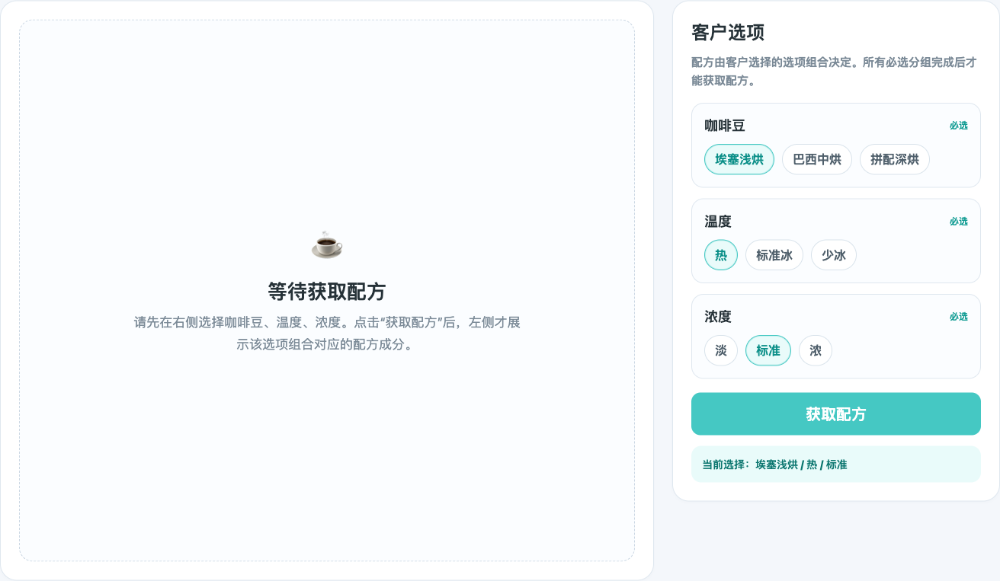
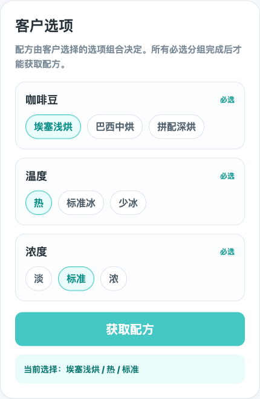
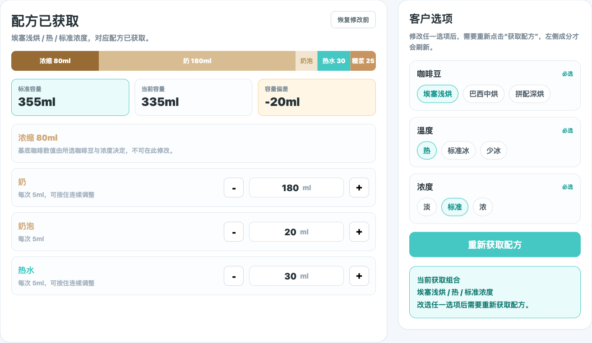
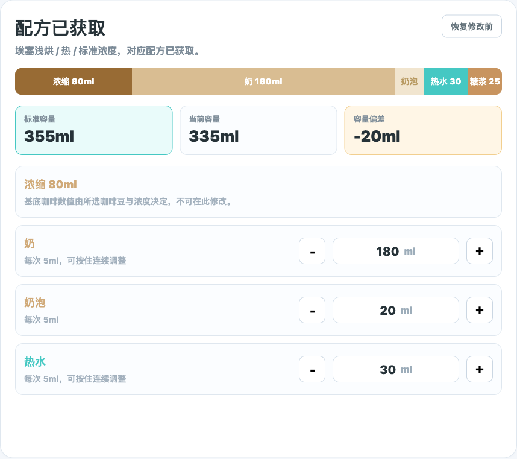

# 产品需求文档：配方管理（选项驱动获取配方）

> 使用说明：Markdown 版本适合在仓库内查看；如需在浏览器或飞书文档中阅读，优先使用同目录的 [prd-recipe-management-main-editor.html](./prd-recipe-management-main-editor.html)。
>
> 更新于 2026-06-04：配方成分不再进入页面后直接展示。运营人员需要先按客户购买场景选择咖啡豆、温度、浓度，再点击“获取配方”，页面才展示该选项组合对应的配方成分。

## 1. 介绍 / 概述

商品详情页的“🧪 配方配置”用于维护一款商品在客户不同选项组合下的实际制作剂量。

本版需求发生变化：配方不再是进入页面即可直接编辑的静态内容。配方由客户选择的选项组合决定，至少需要先选择“咖啡豆”“温度”“浓度”三个分组下的具体选项，再点击“获取配方”。只有获取成功后，左侧才展示该组合对应的配方成分、标准容量、当前容量、容量偏差和成分剂量。

本 PRD 只覆盖商品详情页中的“🧪 配方配置”页签。客户可见标签、默认选项、价格和多语言文案继续由“⚙️ 选项配置”页签管理。

## 2. 目标与非目标

### 2.1 目标

- 让运营人员先看到客户可选择的配方条件分组：咖啡豆、温度、浓度。
- 要求运营人员选中特定选项组合后，才能获取并查看对应配方。
- 未获取配方前，左侧不展示成分剂量，避免用户误以为看到的是当前有效配方。
- 获取配方后，左侧展示该选项组合下的成分编辑能力。
- 修改任一客户选项后，明确提示需要重新获取配方，避免用旧配方继续编辑。
- 保留获取配方后的标准容量、容量偏差、成分剂量调整和保存能力。

### 2.2 非目标

- 不定义点单端前台如何展示这些选项。
- 不定义“⚙️ 选项配置”页签的标签、默认、价格、多语言文案规则。
- 不定义复制商品流程下的特殊保存逻辑。
- 不定义设备底层配方文件字段和制作参数协议。
- 不要求在配方配置中新增或删除咖啡豆、温度、浓度选项；这些选项来源于商品已有选项配置。

## 3. 页面范围与信息架构

### 3.1 页面路径

- 菜单管理
- 商品管理
- 点击商品进入商品详情
- 切换到“🧪 配方配置”页签

### 3.2 顶部页签

商品详情页顶部应提供三个一级配置入口：

| 页签 | 职责 | 本 PRD 是否覆盖 |
| --- | --- | --- |
| 基本信息 | 商品名称、图片、分类等基础资料 | 否 |
| 🧪 配方配置 | 选择客户选项组合、获取配方、编辑成分剂量 | 是 |
| ⚙️ 选项配置 | 标签库、默认选项、价格、多语言文案 | 否 |

### 3.3 配方配置布局

配方配置页签由四个核心区域组成：

| 区域 | 获取配方前 | 获取配方后 |
| --- | --- | --- |
| 左侧主区域 | 展示“等待获取配方”空状态 | 展示当前选项组合对应的配方成分 |
| 客户选项区 | 展示咖啡豆、温度、浓度分组及其选项 | 保持可见，允许改选后重新获取 |
| 获取配方按钮 | 必选分组完成后可点击 | 显示为“重新获取配方” |
| 底部保存栏 | 不允许保存配方成分 | 获取配方且有修改后展示保存状态 |

### 3.4 参考截图总览

## 4. 用户流程 / 用户故事

### UF-001：进入配方配置并看到等待获取状态

**描述：** 作为运营人员，我进入配方配置后，需要先知道当前还没有获取配方，必须先选择客户选项组合。

**主流程：**

1. 用户进入商品详情页。
2. 用户切换到“🧪 配方配置”页签。
3. 左侧主区域显示“等待获取配方”空状态。
4. 右侧显示客户选项区，包含咖啡豆、温度、浓度三个分组。
5. 页面提示选完必选分组并点击“获取配方”后，左侧才展示配方成分。

**验收标准：**

- [ ] 页面初始状态不得直接展示成分剂量编辑行。
- [ ] 左侧空状态必须说明“先选择选项，再获取配方”。
- [ ] 右侧必须展示咖啡豆、温度、浓度三个分组。
- [ ] 每个分组下必须展示可选项，而不只是展示分组名称。

**参考截图：**

### UF-002：选择咖啡豆

**描述：** 作为运营人员，我需要在咖啡豆分组下选择一个具体选项，因为不同咖啡豆会影响基底配方。

**主流程：**

1. 用户查看咖啡豆分组。
2. 页面展示该商品可用的咖啡豆选项。
3. 用户点击一个咖啡豆选项。
4. 被选中的咖啡豆显示选中状态。

**验收标准：**

- [ ] 咖啡豆分组必须标记为必选。
- [ ] 咖啡豆分组下至少展示一个选项。
- [ ] 同一时间只能选中一个咖啡豆。
- [ ] 选中状态必须清晰可见。

**参考截图：**

### UF-003：选择温度

**描述：** 作为运营人员，我需要选择温度选项，例如热、标准冰、少冰，因为温度决定该组合下的出品温度和冰量逻辑。

**主流程：**

1. 用户查看温度分组。
2. 页面展示热、标准冰、少冰等温度选项。
3. 用户点击一个温度选项。
4. 被选中的温度显示选中状态。

**验收标准：**

- [ ] 温度分组必须标记为必选。
- [ ] 温度分组下展示当前商品支持的温度选项。
- [ ] 同一时间只能选中一个温度。
- [ ] 温度变化后，已获取的配方需要被标记为需要重新获取。

**参考截图：**

### UF-004：选择浓度

**描述：** 作为运营人员，我需要选择浓度选项，例如淡、标准、浓，因为浓度会影响浓缩或基底咖啡相关剂量。

**主流程：**

1. 用户查看浓度分组。
2. 页面展示淡、标准、浓等浓度选项。
3. 用户点击一个浓度选项。
4. 被选中的浓度显示选中状态。

**验收标准：**

- [ ] 浓度分组必须标记为必选。
- [ ] 浓度分组下展示当前商品支持的浓度选项。
- [ ] 同一时间只能选中一个浓度。
- [ ] 浓度变化后，已获取的配方需要被标记为需要重新获取。

**参考截图：**

### UF-005：点击获取配方

**描述：** 作为运营人员，我希望在完成必选分组后点击“获取配方”，再查看该选项组合对应的配方。

**主流程：**

1. 用户完成咖啡豆、温度、浓度选择。
2. “获取配方”按钮进入可点击状态。
3. 用户点击“获取配方”。
4. 页面展示获取中的状态。
5. 获取成功后，左侧显示配方成分和容量信息。

**验收标准：**

- [ ] 必选分组未全部完成时，“获取配方”不可点击或必须给出明确缺失提示。
- [ ] 必选分组全部完成后，“获取配方”可点击。
- [ ] 点击后需要展示获取中状态，避免重复点击。
- [ ] 获取失败时必须说明失败原因，并允许用户重试。
- [ ] 获取成功前，左侧不得展示成分编辑。

**参考截图：**

### UF-006：获取成功后展示左侧配方成分

**描述：** 作为运营人员，我获取配方成功后，需要在左侧看到该选项组合对应的成分，才能继续调整。

**主流程：**

1. 页面获取配方成功。
2. 左侧主区域展示当前客户选项组合。
3. 左侧展示标准容量、当前容量、容量偏差。
4. 左侧展示配方段条和成分剂量行。
5. 右侧保留客户选项区，允许改选后重新获取。

**验收标准：**

- [ ] 左侧标题必须能体现当前配方已获取。
- [ ] 左侧副标题或摘要必须显示当前客户选项组合。
- [ ] 左侧必须展示标准容量、当前容量、容量偏差。
- [ ] 成分剂量行只在获取配方成功后出现。

**参考截图：**

### UF-007：改选客户选项后重新获取配方

**描述：** 作为运营人员，我在获取配方后如果改了咖啡豆、温度或浓度，需要明确知道左侧配方已经不是当前选项的结果，必须重新获取。

**主流程：**

1. 用户已经获取配方。
2. 用户改选咖啡豆、温度或浓度任一选项。
3. 页面提示“需要重新获取配方”。
4. 左侧成分保持上一次结果但进入不可保存状态，或回到等待重新获取状态。
5. 用户点击“重新获取配方”后，左侧刷新为新组合配方。

**验收标准：**

- [ ] 改选任一必选分组后，不得静默沿用旧配方。
- [ ] 页面必须明确提示需要重新获取配方。
- [ ] 重新获取前，不允许保存旧选项组合下的成分修改到新选项组合。
- [ ] 重新获取成功后，左侧配方和容量信息全部刷新。

### UF-008：调整获取后的成分剂量

**描述：** 作为运营人员，我获取配方后，希望继续调整可编辑成分剂量，并看到容量变化。

**主流程：**

1. 用户获取配方成功。
2. 用户在左侧查看成分剂量行。
3. 用户通过减号、数值输入、加号调整可编辑成分。
4. 页面实时刷新当前容量、容量偏差和修改状态。

**验收标准：**

- [ ] 每个可编辑成分必须有明确名称、当前数值和单位。
- [ ] 液体成分默认以 5ml 为步长。
- [ ] 数值不得小于 0。
- [ ] 空值、非法值在失焦时归一为有效数值。
- [ ] 成分变化后，容量、偏差、修改状态和保存栏同步更新。

**参考截图：**

### UF-009：识别由选项决定的只读成分

**描述：** 作为运营人员，我需要知道哪些成分由咖啡豆或浓度决定，不能直接在页面修改。

**主流程：**

1. 用户获取配方成功。
2. 页面展示只读成分，例如浓缩。
3. 只读成分展示当前剂量和原因说明。

**验收标准：**

- [ ] 由咖啡豆或浓度决定的成分必须显示为只读。
- [ ] 只读成分不显示可编辑输入或加减按钮。
- [ ] 只读说明使用业务语言，例如“由所选咖啡豆与浓度决定，不可在此修改”。
- [ ] 只读成分仍参与配方预览和容量展示，除非业务规则明确排除。

### UF-010：保存获取后的配方

**描述：** 作为运营人员，我保存前需要知道保存的是哪个客户选项组合下的配方，以及是否影响关联商品。

**主流程：**

1. 用户获取配方成功。
2. 用户调整一个或多个成分。
3. 底部保存栏汇总当前修改状态。
4. 用户点击“保存配方”。
5. 如果存在关联商品，页面展示关联商品确认列表。
6. 用户确认同步范围。
7. 页面保存当前客户选项组合下的配方。

**验收标准：**

- [ ] 未获取配方前不得保存成分。
- [ ] 保存栏必须展示当前客户选项组合。
- [ ] 当前商品始终直接保存。
- [ ] 关联商品列表不得包含当前商品自身。
- [ ] 保存成功后，页面更新当前选项组合下的修改前基准。

### UF-011：移动端使用

**描述：** 作为运营人员，我可能在窄屏设备上维护商品配方，需要仍然能先选客户选项，再获取配方并编辑成分。

**主流程：**

1. 用户在移动端或窄屏打开商品详情页。
2. 客户选项区优先展示，避免用户误以为左侧空状态可以直接编辑。
3. 用户完成选择并获取配方。
4. 页面纵向展示客户选项、配方成分和保存栏。

**验收标准：**

- [ ] 移动端客户选项分组不能横向溢出。
- [ ] 选项按钮有足够点击面积。
- [ ] 获取配方按钮在移动端清晰可见。
- [ ] 获取配方后，成分编辑行和保存栏不互相遮挡。

## 5. 功能需求

### 5.1 页面入口与初始状态

- FR-001：进入配方配置页签时，页面先展示客户选项区和等待获取配方状态。
- FR-002：未获取配方前，左侧不得展示成分剂量编辑行。
- FR-003：页面必须展示咖啡豆、温度、浓度三个分组。
- FR-004：每个分组必须展示分组下的可选项。
- FR-005：必选分组未完成时，不允许获取配方。

### 5.2 客户选项选择

- FR-006：咖啡豆、温度、浓度均为必选分组。
- FR-007：每个必选分组同一时间只能选中一个选项。
- FR-008：选中状态必须清晰可见。
- FR-009：页面应展示当前已选组合摘要。
- FR-010：如果某个分组没有可用选项，页面应展示异常提示，并禁止获取配方。

### 5.3 获取配方

- FR-011：所有必选分组完成后，“获取配方”按钮可点击。
- FR-012：点击获取配方后，页面进入获取中状态。
- FR-013：获取成功后，左侧展示配方成分和容量校验。
- FR-014：获取失败后，页面展示失败原因和重试入口。
- FR-015：获取成功后，按钮文案改为“重新获取配方”或等价表达。

### 5.4 选项变化后的状态

- FR-016：获取成功后，如果用户改选咖啡豆、温度或浓度，页面必须提示需要重新获取配方。
- FR-017：重新获取前，不允许把旧配方保存到新选项组合。
- FR-018：重新获取成功后，左侧成分和容量信息全部刷新。

### 5.5 获取后的主编辑器

- FR-019：主编辑器标题展示当前配方已获取状态。
- FR-020：主编辑器必须展示当前客户选项组合。
- FR-021：标准容量必须独立成块展示，不得只作为小号辅助文字出现。
- FR-022：当前容量和容量偏差根据获取后的配方结果展示。
- FR-023：容量偏差只提示，不拦截保存。
- FR-024：配方段条应展示当前配方的主要成分占比。

### 5.6 成分剂量编辑

- FR-025：可编辑成分提供减号按钮、数字输入框、单位和加号按钮。
- FR-026：默认步长为 5ml；如成分有专属步长，以业务配置为准。
- FR-027：剂量最小值为 0。
- FR-028：剂量变化必须同步刷新容量、偏差、修改状态和保存栏。
- FR-029：由客户选项决定的成分必须显示为只读，并说明原因。

### 5.7 保存配方

- FR-030：未获取配方前不允许保存成分。
- FR-031：获取配方后，只有发生成分修改才允许保存。
- FR-032：保存栏必须展示当前客户选项组合。
- FR-033：保存成功反馈需要说明保存的是哪个选项组合下的配方。
- FR-034：本次 PRD 不要求改变现有商品和关联商品的保存结果。

## 6. 保存结果说明矩阵

| 场景 | 左侧配方成分 | 获取配方按钮 | 保存配方 | 最终结果说明 |
| --- | --- | --- | --- | --- |
| 未选择任何选项 | 不展示 | 不可获取或提示缺失 | 不可保存 | 用户必须先完成必选选项 |
| 只选择部分必选分组 | 不展示 | 不可获取或提示缺失 | 不可保存 | 缺少分组需明确提示 |
| 咖啡豆、温度、浓度均已选择 | 不展示 | 可获取 | 不可保存 | 点击获取后才展示配方 |
| 获取配方成功但未修改 | 展示 | 可重新获取 | 不保存或提示无修改 | 不产生配方变更 |
| 获取配方成功且已修改 | 展示 | 可重新获取 | 可保存 | 保存当前选项组合下的配方 |
| 获取成功后改选任一客户选项 | 旧配方不得作为新组合保存 | 需要重新获取 | 不可保存 | 重新获取后刷新配方 |

## 7. 设计与文案规则

- “获取配方”是展示左侧成分的明确分界点，未点击前不展示成分编辑。
- “咖啡豆”“温度”“浓度”分组必须有清晰标题和必选标记。
- 已选选项使用主色高亮，未选选项保持中性状态。
- 改选任一选项后，页面必须用业务语言提示“需要重新获取配方”。
- “标准容量”仍是获取配方后的关键校验信息，必须在主编辑器中突出展示。
- 保存栏文案必须说明当前客户选项组合，避免保存到错误组合。

## 8. 可访问性与响应式要求

- 选项按钮、获取配方按钮、加减按钮和保存按钮必须可通过键盘聚焦。
- 每个选项分组应有明确分组标题，不只依赖颜色区分。
- 移动端客户选项区应优先展示，避免用户先看到空配方区却不知道下一步。
- 移动端选项按钮可换行，不得横向溢出。
- 获取配方后，底部保存栏需要预留底部间距，不能遮挡最后一个输入项。

## 9. 成功标准

- 运营人员进入配方配置后，能明确看到必须先选择客户选项并获取配方。
- 咖啡豆、温度、浓度三个分组和分组下选项清晰可见。
- 必选分组未完成前，不能获取配方。
- 点击“获取配方”成功后，左侧才展示配方成分。
- 改选任一客户选项后，不能静默沿用旧配方保存。
- 获取配方后，标准容量、当前容量、容量偏差和成分编辑能力保持清晰。

## 10. 回归测试要求

- 结构测试：确认页面初始状态展示客户选项区和等待获取配方空状态。
- 选项测试：确认咖啡豆、温度、浓度分组及其选项均展示。
- 获取测试：确认必选分组完成前不能获取配方，完成后可以获取。
- 展示测试：确认获取成功前不展示左侧成分，获取成功后才展示。
- 改选测试：确认改选任一客户选项后必须重新获取配方，不能直接保存旧配方。
- 编辑测试：获取配方后修改成分，容量、偏差和保存栏同步更新。
- 响应式测试：移动端选项分组不横向溢出，获取配方按钮和保存栏不遮挡内容。
- PRD 站点测试：首页保留本 PRD 链接，HTML 版本可独立打开。

## 11. 历史关系

上一版 PRD 描述的是旧的配方编辑模型。当前需求已经调整为“客户选项驱动获取配方”，因此涉及“🧪 配方配置”主路径的评审、开发和测试，应以本 PRD 为准。
