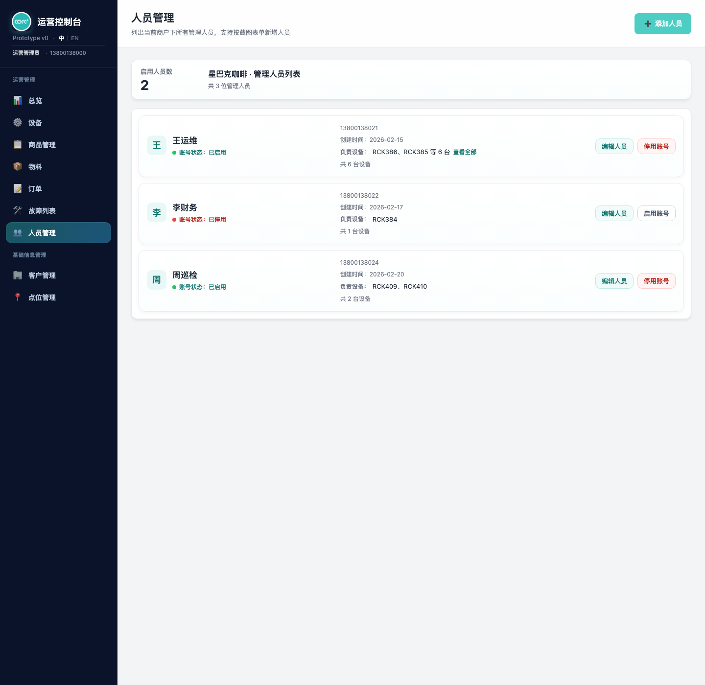
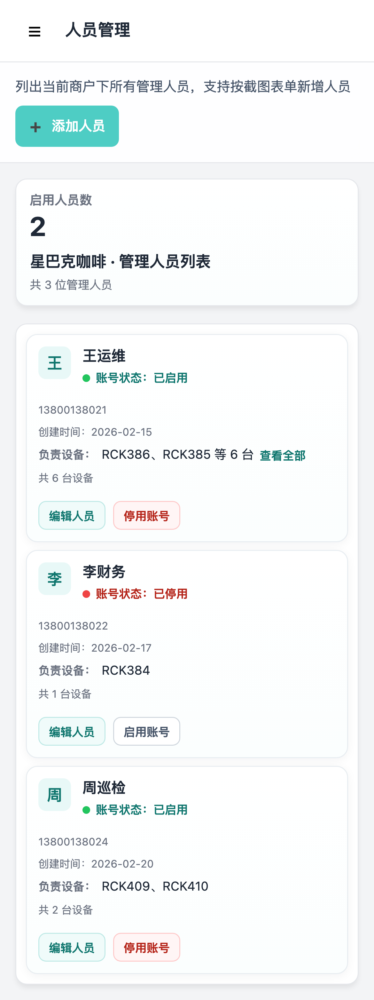
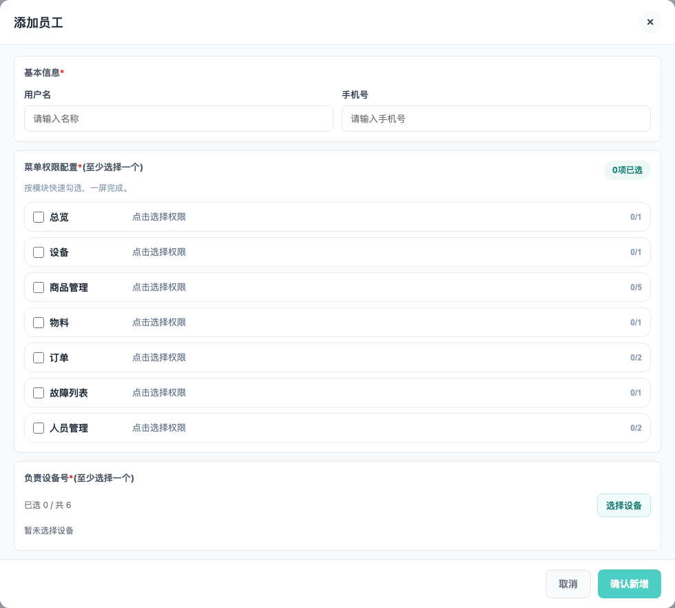
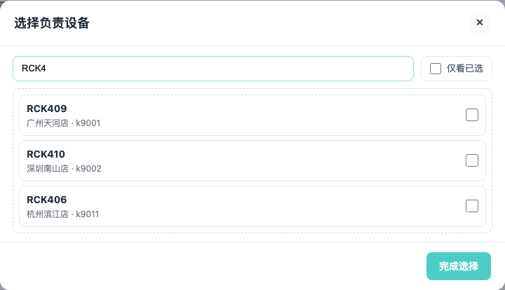
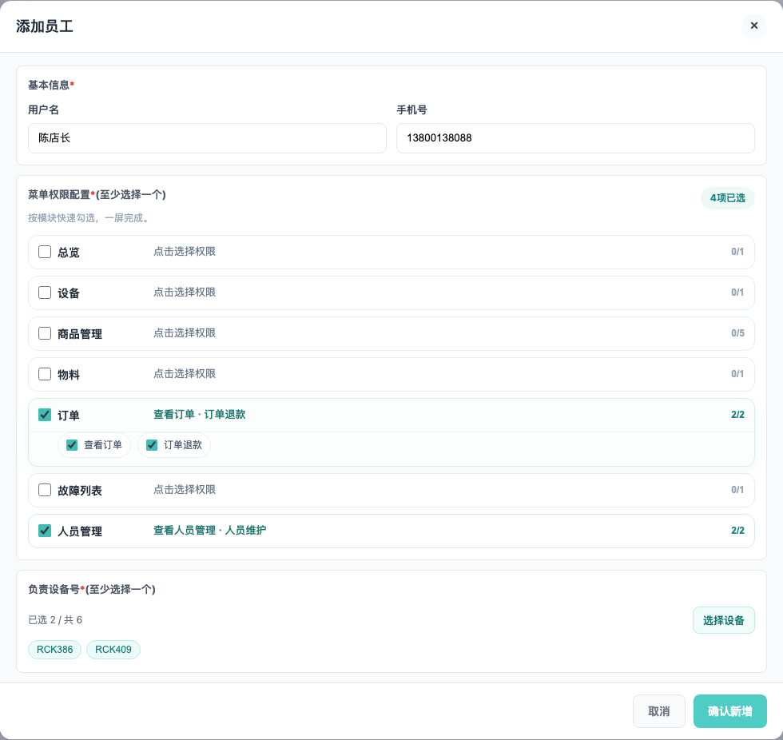

# 产品需求文档：人员管理（按用户流程）

> 使用说明：`Markdown` 版本适合在仓库内查看；如需在浏览器或飞书文档中阅读，优先使用同目录的 [prd-staff-management-user-flow.html](./prd-staff-management-user-flow.html)。

## 1. 介绍 / 概述

人员管理不是单纯的“员工名册”页面，而是后台运营人员用于查看当前商户下管理人员状态、维护菜单权限、分配负责设备以及启用 / 停用账号的统一入口。

该页面需要同时满足两类核心使用场景：

- 桌面端：高密度查看管理人员、快速编辑、快速切换账号状态。
- 移动端：在不横向滚动的前提下，完成核心查看，并提供进入新增 / 编辑流程的入口。

本次需求以“用户流程”为主线，覆盖人员管理页面中的顶部汇总、人员列表、新增 / 编辑弹窗、轻量权限配置、负责设备选择器、账号状态切换以及桌面端设备摘要展开能力。

默认用户角色：

- 运营人员：查看人员状态、创建人员、维护权限、分配负责设备。
- 商户管理员：按当前商户范围维护人员信息，并控制账号启用状态。

## 2. 目标

- 让运营人员进入页面后，先看到当前商户下的启用人员数与管理人员列表。
- 让新增 / 编辑人员流程聚焦在最必要的信息，不再出现历史遗留授权与 `openId` 输入。
- 让菜单权限配置在小弹窗里保持轻量、易扫读、易勾选。
- 让负责设备选择过程同时支持设备编号与点位名称搜索，并明确只能选择当前商户下的设备，降低设备分配成本。
- 让桌面端在单屏内展示更多人员信息，同时保留完整设备查看能力。
- 让移动端保持后台页面统一导航风格，并避免重复标题与横向滚动。

## 3. 用户流程 / 用户故事

### UF-001：进入人员管理并查看当前商户下的人员概览

**描述：** 作为运营人员，我希望进入人员管理页面后，先看到当前商户下启用人员数和管理人员列表，这样我能快速判断当前人员配置情况。

**主流程：**
1. 用户进入人员管理页面。
2. 页面按当前商户范围加载管理人员数据。
3. 顶部展示 `启用人员数` 与 `管理人员列表` 标题信息。
4. 列表中展示每位管理人员的姓名、账号状态、手机号、创建时间、负责设备摘要与操作按钮。

**验收标准：**
- [ ] 页面标题为 `人员管理`，且与后台其他页面保持一致的头部风格。
- [ ] 页面不提供独立的商户切换控件，而是按当前商户范围展示数据。
- [ ] 顶部汇总区至少展示 `启用人员数` 和 `共 X 位管理人员`。
- [ ] 桌面端列表以紧凑单层卡片方式展示人员信息，而不是拆分独立权限面板或设备面板。
- [ ] 列表空状态下，页面明确提示“当前商户暂无管理人员，点击右上角添加人员创建”。

**参考截图：**

### UF-002：在移动端进入人员管理并完成核心查看

**描述：** 作为移动端运营人员，我希望在手机上查看人员管理页面时，保持与后台其他页面一致的导航结构，并能快速看到说明文案与新增入口。

**主流程：**
1. 用户在移动端打开人员管理页面。
2. 页面顶部保留后台导航菜单按钮与当前页名称。
3. 下方展示页面说明文案与 `添加人员` 入口。
4. 用户继续浏览管理人员卡片列表。

**验收标准：**
- [ ] 移动端顶部保留后台导航入口，不移除侧边栏菜单能力。
- [ ] 移动端顶部显示 `人员管理`，但同屏不重复出现第二个大号 `人员管理` 标题。
- [ ] 页面说明文案与 `添加人员` 按钮在移动端仍清晰可见。
- [ ] 管理人员卡片在常见大屏手机宽度下无需横向滚动即可完整阅读。
- [ ] 移动端页面背景、间距和按钮风格与后台其他页面保持一致。

**参考截图：**

### UF-003：打开新增 / 编辑弹窗并填写基础信息

**描述：** 作为运营人员，我希望通过统一弹窗完成新增或编辑人员，并只填写最必要的基础信息，这样流程更短、更清晰。

**主流程：**
1. 用户点击 `添加人员` 或某条人员记录上的 `编辑人员`。
2. 系统打开统一的人员维护弹窗。
3. 用户填写或修改 `用户名`、`手机号`。
4. 用户继续完成权限配置与设备分配。

**验收标准：**
- [ ] 新增与编辑共用同一弹窗。
- [ ] 新增状态下弹窗标题为 `添加员工`，提交按钮文案为 `确认新增`。
- [ ] 编辑状态下弹窗标题为 `编辑员工`，提交按钮文案为 `保存修改`。
- [ ] 基础信息区仅保留 `用户名` 与 `手机号` 两个输入项。
- [ ] 页面不再展示 `运维小程序授权`、`微信公众号授权`、两个 `openId` 输入，也不展示公众号推送配置。

**参考截图：**

### UF-004：配置菜单权限

**描述：** 作为运营人员，我希望在小弹窗中快速完成菜单权限勾选，这样我可以在一屏内理解模块范围并完成授权。

**主流程：**
1. 用户进入 `菜单权限配置` 区域。
2. 页面按模块展示权限行，例如总览、设备、商品管理、物料、订单、故障列表、人员管理。
3. 用户按模块勾选权限，必要时展开模块查看子权限项。
4. 页面实时更新已选数量、模块摘要与模块计数。

**验收标准：**
- [ ] 权限区域采用轻量行式布局，而不是大卡片栅格。
- [ ] 顶部展示权限说明文案与总选中数量胶囊。
- [ ] 每个权限模块至少展示模块名、摘要文本与 `x/x` 计数。
- [ ] 权限模块包括：`总览`、`设备`、`商品管理`、`物料`、`订单`、`故障列表`、`人员管理`。
- [ ] `商品管理` 模块至少包含：`查看商品管理`、`新增语言`、`更改币种`、`编辑商品`、`编辑配方`。
- [ ] `订单` 模块至少包含：`查看订单`、`订单退款`。
- [ ] `人员管理` 模块至少包含：`查看人员管理`、`人员维护`。
- [ ] 至少选择一个权限才能提交。
- [ ] 当某模块存在子权限时，勾选子权限会自动带上该模块的一级查看权限；取消一级查看权限会清空该模块其他子权限。

**参考截图：**

### UF-005：选择负责设备

**描述：** 作为运营人员，我希望通过独立的设备选择器，从当前商户下的设备中分配负责设备，并支持按设备编号或点位名称搜索，这样我可以快速锁定目标设备。

**主流程：**
1. 用户在弹窗中点击 `选择设备`。
2. 系统打开 `选择负责设备` 弹窗，并明确提示“仅可选择当前商户下的设备”。
3. 用户按设备编号或点位名称搜索当前商户下的设备。
4. 用户勾选设备，必要时切换 `仅看已选`。
5. 用户点击 `完成选择`，回到人员弹窗查看已选设备摘要。

**验收标准：**
- [ ] 设备选择器为独立弹窗，不与权限区域混杂展示。
- [ ] 弹窗标题、说明文案或空状态提示中，明确告知“仅可选择当前商户下的设备”。
- [ ] 搜索框支持同时匹配 `设备编号` 与 `点位名称`。
- [ ] 提供 `仅看已选` 切换，方便复查已选设备。
- [ ] 设备列表仅展示当前商户下的设备，不允许跨商户选择设备。
- [ ] 当前商户下无设备时，页面明确提示需先在设备管理中录入设备。
- [ ] 主弹窗中展示 `已选 X / 共 Y` 统计与已选设备摘要。
- [ ] 至少选择一个负责设备才能提交。

**参考截图：**

### UF-006：保存新增或编辑人员并完成校验

**描述：** 作为运营人员，我希望在保存人员信息前得到明确校验反馈，并在成功后立即看到结果，这样我可以降低误操作和漏填风险。

**主流程：**
1. 用户填写基础信息、权限和负责设备。
2. 用户点击提交按钮。
3. 系统依次校验必填项、手机号格式、权限与设备选择情况。
4. 校验通过后，系统保存人员数据并关闭弹窗。
5. 列表刷新，页面提示“人员新增成功”或“人员信息已更新”。

**验收标准：**
- [ ] `用户名` 与 `手机号` 为必填项。
- [ ] 手机号必须符合合法手机号格式。
- [ ] 必须至少选择一个权限。
- [ ] 必须至少选择一个当前商户下的负责设备。
- [ ] 新增人员默认账号状态为 `已启用`。
- [ ] 编辑成功后更新原记录，不新增重复人员。
- [ ] 保存成功后刷新列表与顶部统计。

**参考截图：**

### UF-007：启用 / 停用账号

**描述：** 作为运营人员，我希望在列表中快速切换账号启用状态，并在操作前获得确认提示，这样我可以安全管理人员登录权限。

**主流程：**
1. 用户在人员列表中看到 `停用账号` 或 `启用账号` 按钮。
2. 用户点击按钮。
3. 系统弹出确认提示。
4. 用户确认后，系统更新账号状态并刷新列表展示。

**验收标准：**
- [ ] 页面明确展示每位人员的账号状态：`已启用` 或 `已停用`。
- [ ] 已启用人员显示 `停用账号` 按钮；已停用人员显示 `启用账号` 按钮。
- [ ] 停用前给出“停用后该人员将无法登录”的确认提示。
- [ ] 状态切换成功后，页面提示 `账号已启用` 或 `账号已停用`。
- [ ] 状态切换仅影响账号启用状态，不修改人员权限和负责设备。

**参考截图：**

### UF-008：在桌面端查看负责设备摘要并展开完整设备列表

**描述：** 作为桌面端运营人员，我希望在列表里先看到负责设备摘要，并在设备过多时按需展开完整列表，这样我可以兼顾信息密度和完整查看。

**主流程：**
1. 用户在桌面端查看管理人员卡片。
2. 当负责设备较少时，页面直接展示全部设备编号。
3. 当负责设备较多时，页面展示前两台设备编号与设备总数。
4. 用户点击 `查看全部` 展开完整设备列表；再次点击可 `收起`。

**验收标准：**
- [ ] 当负责设备为 `0` 台时，摘要显示 `-`。
- [ ] 当负责设备为 `1~3` 台时，页面直接展示全部设备编号，不显示 `查看全部`。
- [ ] 当负责设备为 `4` 台及以上时，页面展示前 `2` 台设备编号与 `等 N 台` 摘要。
- [ ] 设备过多时提供 `查看全部 / 收起` 切换。
- [ ] 展开状态仅作用于当前卡片，不影响其他人员记录。

**参考截图：**

## 4. 功能需求

- FR-1：系统必须提供统一的人员管理页面，覆盖汇总、列表、新增、编辑、权限配置、设备分配、账号状态切换等核心能力。
- FR-2：页面默认按当前商户范围展示管理人员数据，不额外提供独立商户切换控件。
- FR-3：页面顶部必须展示 `启用人员数`。
- FR-4：页面顶部必须展示当前商户名称与 `管理人员列表` 标题组合。
- FR-5：列表卡片必须展示姓名、账号状态、手机号、创建时间、负责设备摘要和操作按钮。
- FR-6：新增与编辑必须共用同一弹窗。
- FR-7：基础信息区必须仅保留 `用户名` 与 `手机号`。
- FR-8：页面不得展示运维小程序授权、微信公众号授权、两个 `openId` 输入和公众号推送设置。
- FR-9：菜单权限配置必须采用轻量行式模块布局。
- FR-10：权限区域必须展示总选中数量。
- FR-11：权限模块必须支持展开查看子权限项。
- FR-12：系统必须支持以下权限模块：总览、设备、商品管理、物料、订单、故障列表、人员管理。
- FR-13：系统必须支持父子权限联动规则。
- FR-14：至少选择一个权限才能保存。
- FR-15：负责设备必须通过独立设备选择器完成分配，且选择范围仅限当前商户下的设备。
- FR-16：设备搜索必须同时支持设备编号与点位名称。
- FR-17：设备选择器必须支持 `仅看已选` 过滤。
- FR-18：主弹窗必须展示已选设备统计与设备摘要。
- FR-19：至少选择一个当前商户下的负责设备才能保存。
- FR-20：用户名和手机号必须为必填项。
- FR-21：手机号必须通过格式校验。
- FR-22：新增人员成功后，系统默认其账号状态为 `已启用`。
- FR-23：保存成功后必须刷新列表与顶部汇总。
- FR-24：编辑人员时，弹窗必须回填原有用户名、手机号、权限和设备数据。
- FR-25：列表必须提供 `编辑人员` 操作入口。
- FR-26：列表必须提供 `停用账号 / 启用账号` 操作入口。
- FR-27：停用前必须给出明确确认提示。
- FR-28：账号状态切换不得影响权限与负责设备数据。
- FR-29：桌面端负责设备展示必须支持摘要与按需展开。
- FR-30：当设备数大于 `3` 台时，系统必须提供 `查看全部 / 收起`。
- FR-31：移动端必须保留后台导航入口。
- FR-32：移动端页面不得出现同屏重复的大号 `人员管理` 标题。
- FR-33：移动端人员列表与操作按钮必须避免横向滚动。
- FR-34：列表页不得再展示独立权限面板、公众号推送面板或 `openId` 信息。

## 5. 关键规则矩阵

| 规则类别 | 触发场景 | 核心规则 | 结果 |
| --- | --- | --- | --- |
| 基础信息校验 | 点击保存人员 | `用户名`、`手机号` 必填 | 缺失时阻止提交，并提示用户补全 |
| 手机号校验 | 点击保存人员 | 手机号必须符合合法格式 | 非法时阻止提交，并提示输入正确手机号 |
| 权限选择校验 | 点击保存人员 | 至少选择一个权限 | 未选择时阻止提交 |
| 权限父子联动 | 勾选模块子权限 | 勾选子权限自动带上模块一级查看权限 | 摘要与计数实时更新 |
| 权限父子联动 | 取消模块一级查看权限 | 该模块下其他子权限一并清空 | 模块摘要恢复为空状态 |
| 设备范围规则 | 打开设备选择器 | 仅展示并允许选择当前商户下的设备 | 禁止跨商户分配负责设备 |
| 设备选择校验 | 点击保存人员 | 至少选择一个当前商户下的负责设备 | 未选择时阻止提交 |
| 设备搜索规则 | 打开设备选择器 | 同时支持设备编号与点位名称搜索 | 降低设备检索成本 |
| 设备视图规则 | 设备较多时 | 支持 `仅看已选` 过滤 | 便于复查已选设备 |
| 新增保存规则 | 新增人员成功 | 自动生成人员 ID、创建时间、默认启用状态 | 新记录进入列表顶部或当前数据集中 |
| 编辑保存规则 | 编辑人员成功 | 更新原记录，不新增重复项 | 列表刷新并提示“人员信息已更新” |
| 账号状态规则 | 停用 / 启用账号 | 切换前需确认 | 成功后刷新状态文案与按钮 |
| 桌面端设备摘要规则 | 列表展示设备 | `0` 台显示 `-`；`1~3` 台直接展示；`4+` 台显示前两台 + `等 N 台` | 在密度与完整性之间平衡 |
