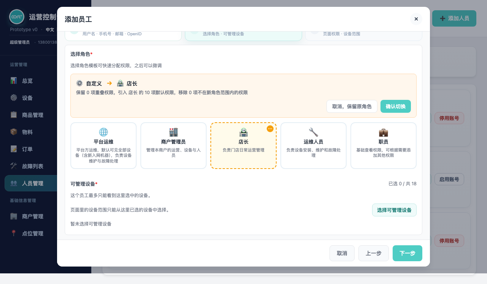
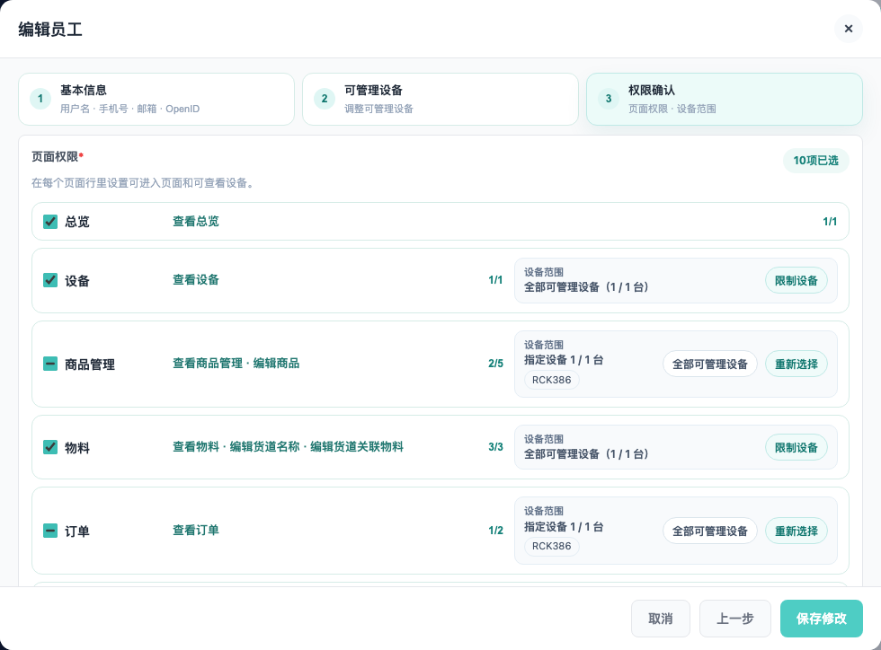
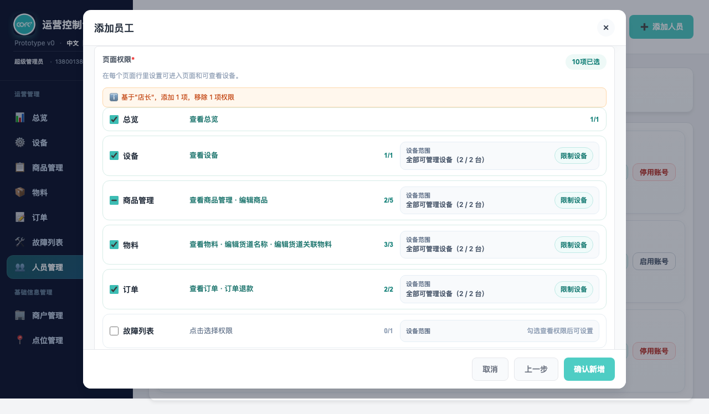
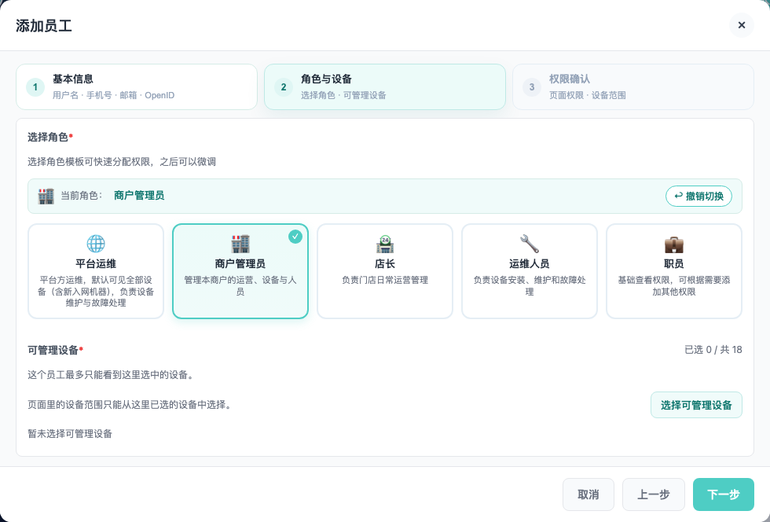
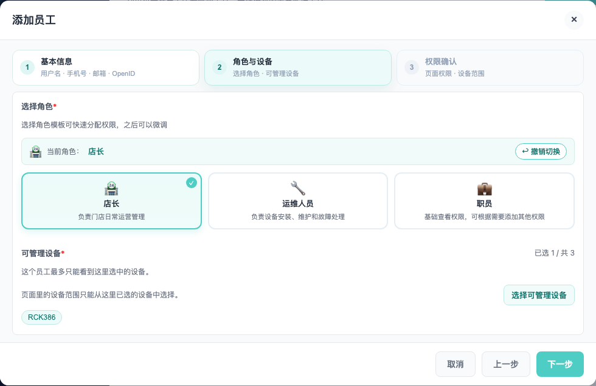
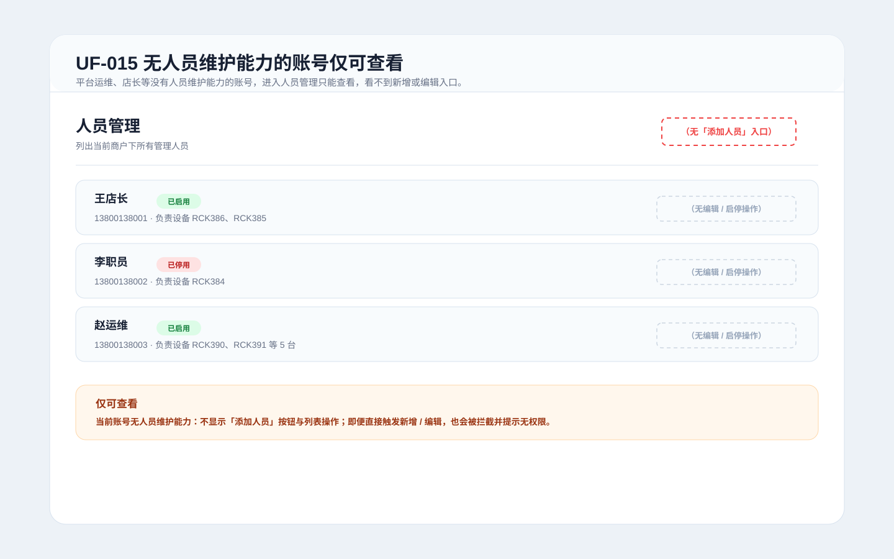

# 产品需求文档：人员管理（v2.4 设备逐台分配与范围跟人走）

> 使用说明：本文件是人员管理页的唯一需求来源，每条规则只在一处正式定义，其余章节以引用方式指向定义点。`Markdown` 版本适合在仓库内查看；如需在浏览器中阅读，请使用同目录的 [prd-staff-management-user-flow.html](./prd-staff-management-user-flow.html)。

## 0. 版本记录

| 版本 | 日期 | 主要变化 |
| --- | --- | --- |
| v2.4 | 2026-07-07 | 确立四条分配原则：角色只在首次分配时有效（编辑不再出现角色）；给他人分配的设备不能超过分配者本人的数据权限；设备可跨商户自由勾选（取消同商户锁定）；各业务页数据范围跟人走、不再跟商户走。移除「所属商户」选择：超管新建的人员暂不归属商户 |
| v2.3 | 2026-07-06 | 文档结构重构（规则单点定义，用户流程 15 个合并为 11 个）；基础信息新增「邮箱」选填字段，用于 Google 账号登录绑定；更新基础信息截图 |
| v2.2 | 2026-07-03 | 新增「平台运维」「商户管理员」两个角色；引入「数据范围」维度；人员新增 / 编辑改为分级授权并增加维护门禁；基础信息标注必填 / 选填 |
| v2.1 | 2026-06-01 | 引入 6 角色模板体系前身（4 角色）；角色切换改为两步确认 + 一次撤销；权限微调提示条 |
| v1.x | 2026-05 | 初版：人员列表、基础信息、负责设备、启用 / 停用 |

## 1. 概述与目标

人员管理是后台运营人员维护「谁能登录、能看到哪些机器、能做哪些操作」的统一入口，覆盖人员列表、新增 / 编辑、角色与权限分配、可管理设备分配、账号启停。

页面需同时服务两端：桌面端高密度查看与快速维护；移动端在不横向滚动的前提下完成核心查看。

**四条分配原则（本版本的模型基石，各章节据此展开）：**

1. **角色只在首次分配时有效**：角色是新建人员时一次性快速套上「数据（设备）+ 操作（权限）」的方式。保存后角色仅作留档展示，之后一切调整都通过勾选完成。
2. **分配不越权**：给他人分配的设备不能超过分配者本人的数据权限（商户管理员只能从自己名下设备里选）。
3. **编辑不再出现角色**：编辑人员时不显示角色选择，只能通过权限勾选与设备勾选变更该员工的能力。
4. **数据范围跟人走**：各业务页（设备、订单、故障、物料等）的可见设备由员工本人记录上的设备白名单（或全平台标记）决定，不再按其所属商户圈定。

**目标：**

- 进入页面即可看到启用人员数与管理人员列表（超级管理员跨商户看全部）。
- 新增 / 编辑聚焦必要信息，必填与选填一眼可辨。
- 新建时通过角色模板一键分配权限与默认设备范围，并支持在模板基础上微调。
- 角色切换（仅新建流程内）不静默丢失已有微调：两步确认 + 一次撤销。
- 人员的新增 / 编辑受分级授权约束：不同登录身份能创建的角色、能分配的设备范围不同（见第 2.3 节）。
- 可管理设备选择支持设备编号与点位名称搜索；候选清单跟随分配者本人的数据权限。

**非目标：**

- 不提供「所属商户」手动指定：超级管理员新建的人员暂不归属商户，归属关系由后续商户开通流程补齐。
- 不在本期恢复运维小程序授权配置；公众号 OpenID 仅作为故障推送的选填项保留。
- 不支持自定义角色模板的创建；本期为 6 个内建模板 + 手动微调。
- 不把新建流程中的角色切换做成即时生效；所有覆盖权限的切换都必须经过确认。

## 2. 角色与授权模型

本章是角色、数据范围、分级授权的唯一定义点。

### 2.1 角色模板总表

角色模板只在**新建人员**时使用（原则 1）；下表「默认权限范围」「数据范围」即模板套用后落到人员记录上的初始值。

| 角色 | 模板定位 | 数据范围 | 默认权限范围 | 设备如何分配 | 谁能创建它 |
| --- | --- | --- | --- | --- | --- |
| 超级管理员 | 平台方最高权限 | 全平台 | 所有页面查看、人员维护、商品 / 配方 / 物料 / 订单退款、故障处理 | 无需分配（天然全部） | 仅外部途径开通，不在任何创建列表 |
| 平台运维 | 平台方运维 | 全平台 | 总览、设备、故障、物料（含货道编辑）；**不含订单与人员维护** | 无需逐台分配：动态可见全部设备（含新入网机器） | 仅超级管理员 |
| 商户管理员 | 商户自管 | 指定设备 | 人员维护、订单退款、配方编辑等运营全权 | 超级管理员逐台分配 | 仅超级管理员 |
| 店长 | 门店日常运营 | 指定设备 | 总览、设备、商品、物料、订单（含退款）、故障查看 | 超级管理员或商户管理员逐台分配 | 超级管理员、商户管理员 |
| 运维人员 | 设备安装与故障处理 | 指定设备 | 设备、物料（含货道编辑）、故障查看与处理 | 超级管理员或商户管理员逐台分配 | 超级管理员、商户管理员 |
| 职员 | 基础查看 | 指定设备 | 总览、设备、订单查看 | 超级管理员或商户管理员逐台分配 | 超级管理员、商户管理员 |

平台运维与商户管理员的本质区别是**操作权限相反、数据范围不同**：平台运维默认看得到全平台设备但没有人员维护与订单管理操作权限；商户管理员有人员与订单操作权限，但可见设备必须由超级管理员逐台分配。

每个角色模板包含：名称、描述文案、图标、默认权限集合、默认模块设备范围。不选择任何模板即为「自定义」模式：不强制角色，权限完全手动勾选（校验仍按第 4.2 节执行）。

### 2.2 数据范围

「数据范围」决定一个员工能看到哪些机器，与「功能权限」（能对机器做什么）相互独立。本版本只有两档：

- **全平台**：动态可见所有设备，含新入网、尚未分配商户的机器，无需逐台分配。仅超级管理员与平台运维（由角色模板在创建时赋予全平台标记）。
- **指定设备**：仅可见人员记录上被逐台勾选的设备，可再按权限模块收窄。其余全部角色（商户管理员、店长、运维人员、职员、自定义）。

数据范围跟人走（原则 4）：各业务页按登录者本人记录上的设备白名单过滤可见数据；员工换商户、设备换商户都不影响已分配关系。同一数据范围可搭配不同功能权限，「看得到全平台」不等于「什么都能做」——平台运维可跨商户查看设备与故障，却打不开订单页、不能维护人员。

### 2.3 分级授权与人员维护门禁

只有具备「人员维护」能力的登录身份才能新增、编辑、启停人员：

| 登录角色 | 可新增 / 编辑人员 | 可创建的角色（仅新建时可选） | 可分配的设备范围 |
| --- | --- | --- | --- |
| 超级管理员 | 是 | 平台运维、商户管理员、店长、运维人员、职员 | 全平台任意设备（可跨商户混选） |
| 商户管理员 | 是 | 店长、运维人员、职员 | 不超过本人已被分配的设备（原则 2） |
| 平台运维 / 店长 / 运维人员 / 职员 | 否 | — | — |

授权铁律：

- 超级管理员不在任何人的可创建角色列表中，只能通过外部途径开通。
- 无人员维护能力的账号：不显示「添加人员」入口，列表不出现「编辑 / 启停」操作；即便直接触发动作也会被拦截并提示无权限。
- 新增人员不选择商户：超级管理员新建的人员**暂不归属商户**（归属由后续商户开通流程补齐）；商户管理员新建的人员自动归属当前登录商户。
- 编辑人员不出现角色（原则 3）；给他人分配 / 调整设备时，候选清单与保存校验都以分配者本人的数据权限为上限（原则 2），编辑他人时该员工已有的超范围设备保留可见、可移除，但不能新增超范围设备。

### 2.4 权限模块清单

权限模块至少包含：

- 总览：查看总览。
- 设备：查看设备。
- 商品管理：查看商品管理、新增语言、更改币种、编辑商品、编辑配方。
- 物料：查看物料、编辑货道名称、编辑货道物料。
- 订单：查看订单、订单退款。
- 故障列表：查看故障列表。
- 人员管理：查看人员管理、人员维护。

### 2.5 登录方式与账号绑定

员工可通过**小程序**或 **Google 账号**登录，二选一：

- **手机号**（必填）：小程序登录的账号标识，保证每位员工始终有一条可用登录路径。
- **邮箱**（选填）：Google 账号登录的绑定键。使用 Google 登录的员工必须配置邮箱；员工首次用 Google 登录时，系统按邮箱把 Google 账号与员工记录绑定。只用小程序登录的员工可不填。
- **公众号 OpenID**（选填）：与登录无关；配置后当所属商户开启「公众号推送」时，本人接收授权范围内的故障消息。

## 3. 用户流程

每个流程只列该流程特有的验收点；跨流程的模型与规则见第 2、4 章（验收时一并回归）。

### UF-001：进入人员管理并查看人员概览

**描述：** 作为运营人员，我希望进入人员管理页面后，先看到启用人员数和管理人员列表，快速判断人员配置情况。

**主流程：**

1. 用户进入人员管理页面。
2. 页面按登录身份加载管理人员数据：超级管理员跨商户看全部人员（含暂未归属商户者）；其余身份只看本商户人员。
3. 顶部展示「启用人员数」与「管理人员列表」标题信息。
4. 列表展示每位管理人员的姓名、账号状态、手机号、创建时间、可管理设备摘要与操作按钮；超级管理员视角额外展示所属商户（未归属者显示「未归属商户」）。

**验收标准：**

- [ ] 页面标题为「人员管理」，头部风格与后台其他页面一致。
- [ ] 不提供独立的商户切换控件；超级管理员列表标题体现「全平台」口径。
- [ ] 顶部汇总区至少展示「启用人员数」和「共 X 位管理人员」。
- [ ] 桌面端列表为紧凑单层卡片；列表页保持精简，不展示权限面板、公众号推送面板或 OpenID 明细（这些仅在编辑弹窗内维护）。
- [ ] 空状态明确提示暂无管理人员并引导点击右上角添加人员。

**参考截图：**

### UF-002：在移动端进入人员管理并完成核心查看

**描述：** 作为移动端运营人员，我希望在手机上保持与后台其他页面一致的导航结构，并快速看到说明文案与新增入口。

**主流程：**

1. 用户在移动端打开人员管理页面。
2. 顶部保留后台导航菜单按钮与当前页名称。
3. 下方展示页面说明文案与「添加人员」入口。
4. 用户继续浏览管理人员卡片列表。

**验收标准：**

- [ ] 移动端顶部保留后台导航入口，不移除侧边栏菜单能力。
- [ ] 顶部显示「人员管理」，同屏不重复出现第二个大号标题。
- [ ] 管理人员卡片在常见大屏手机宽度下无需横向滚动即可完整阅读。
- [ ] 页面背景、间距和按钮风格与后台其他页面一致。

**参考截图：**

### UF-003：打开新增 / 编辑弹窗并填写基础信息

**描述：** 作为具备人员维护能力的运营人员，我希望通过统一弹窗完成新增或编辑人员，清楚看到哪些基础信息必填、哪些选填。

**主流程：**

1. 用户点击「添加人员」或某条记录上的「编辑人员」。
2. 系统打开统一的人员维护弹窗，进入「基本信息」步骤。任何身份都不出现「所属商户」选择（见第 2.3 节）。
3. 用户填写「用户名」「手机号」（必填），可选填「邮箱」「公众号 OpenID」。
4. 用户继续进入下一步：新增为「角色与设备」，编辑为「可管理设备」（编辑不出现角色，见 UF-005）。

**验收标准：**

- [ ] 新增与编辑共用同一弹窗：新增标题「添加员工」/ 提交按钮「确认新增」；编辑标题「编辑员工」/ 提交按钮「保存修改」。
- [ ] 弹窗内不存在「所属商户」下拉或任何商户选择控件。
- [ ] 「用户名」「手机号」带必填标记；「邮箱」「公众号 OpenID」带「（选填）」标注。
- [ ] 邮箱字段附说明：用于 Google 账号登录，员工可用小程序或 Google 登录二选一，使用 Google 登录的员工必须配置邮箱（定义见第 2.5 节）。
- [ ] 基础信息步骤副标题为「用户名 · 手机号 · 邮箱 · OpenID」。
- [ ] 字段校验遵循第 4.2 节校验规则表。

**参考截图：**

### UF-004：通过角色模板快速分配权限（仅新建场景）

**描述：** 作为运营人员，新建员工时我希望直接选一个角色模板，让系统把该角色应有的权限默认勾上，避免逐项手动勾选。角色只在这次新建中有效（原则 1），保存后不能再换角色。

**主流程：**

1. 用户进入新增弹窗的「角色与设备」步骤。
2. 「选择角色」区域展示当前登录者有权创建的角色卡片（过滤规则见第 2.3 节）。
3. 用户点击一张卡片，系统进入待确认切换状态（新建场景原角色记为「自定义」）。
4. 对比条显示「自定义 -> 店长」及保留 / 新增 / 移除权限数量；若用户已手动勾选过权限，警告行提示这些自定义将被覆盖。
5. 用户点击「确认切换」后，权限树按角色默认勾选，顶部出现绿色「当前角色」条与「撤销切换」按钮。
6. 选中全平台数据范围的角色（平台运维）时，「可管理设备」区提示无需逐台分配；其余角色仍需至少选择一台设备。

**验收标准：**

- [ ] 角色选择区只出现在新增弹窗；编辑弹窗整体隐藏该区（见 UF-005）。
- [ ] 每张角色卡片展示图标、角色名称、角色描述，已确认的卡片显示绿色边框与勾选角标。
- [ ] 点击卡片不立即写入权限，必须经过确认（状态机见第 4.1 节）。
- [ ] 对比条包含原角色名、箭头、新角色名及保留 / 新增 / 移除三类数量。
- [ ] 选中平台运维后，「可管理设备」的必选标记消失，提示改为全平台口径。

**参考截图：**

### UF-005：编辑员工时不再出现角色，仅通过勾选调整

**描述：** 作为运营人员，打开「编辑员工」时我要直接调整这位员工的可管理设备与权限勾选；角色只在他被创建时用过一次，编辑时不应再出现角色概念（原则 1、3）。

**主流程：**

1. 用户点击「编辑人员」，弹窗回填基础信息、权限与可管理设备。
2. 第 2 步标题为「可管理设备」：不显示任何角色卡片、角色条或角色切换入口。
3. 用户直接勾选 / 移除设备（候选清单规则见 UF-007），或进入第 3 步增删权限勾选。
4. 用户保存，员工的角色留档字段保持原值不变。

**验收标准：**

- [ ] 编辑弹窗任何步骤都不出现角色卡片、「当前角色」条、切换对比条或「撤销切换」按钮。
- [ ] 编辑弹窗步骤 2 标题为「可管理设备」（新增为「角色与设备」）。
- [ ] 权限树上方不出现「基于某角色」的微调提示（角色概念不进入编辑态）。
- [ ] 保存修改不改变人员记录上的角色留档与数据范围标记；全平台数据范围的员工在编辑时仍无需选择设备。
- [ ] 历史数据无角色字段时行为一致：编辑照常回填权限与设备。

**参考截图：**

### UF-006：在角色基础上微调权限（仅新建场景）

**描述：** 作为运营人员，新建员工时我希望以角色模板为起点增删权限，得到这位员工真正合适的组合，并清楚看到「比模板多 / 少了什么」。

**主流程：**

1. 用户已在新增弹窗内确认某个角色（UF-004）。
2. 用户在权限树勾选或取消若干权限项。
3. 权限树上方橙色提示条实时显示「基于"<角色名>"角色，已添加 N 项权限，移除 M 项权限」。
4. 用户保存后，微调作为「最终权限 + 与模板的差异」两份记录保存（见第 5 章）。

**验收标准：**

- [ ] 权限区域为行式模块布局，显示总选中数量，模块支持展开查看子权限。
- [ ] 微调统计文案包含基准角色名；当前权限等于角色默认、或当前为自定义模式时，提示条隐藏。
- [ ] 待确认切换期间、以及编辑弹窗内（见 UF-005），提示条一律隐藏。
- [ ] 父子联动：勾选子权限自动带上模块一级查看权限；取消一级查看权限清空该模块其他子权限。

**参考截图：**

### UF-007：选择可管理设备（候选范围跟分配者走）

**描述：** 作为具备人员维护能力的运营人员，我希望通过独立选择器为员工逐台勾选可管理设备，支持按设备编号或点位名称搜索；我能分配出去的设备不能超过我自己的数据权限（原则 2），且不受商户边界限制（原则 4）。

**主流程：**

1. 用户点击「选择可管理设备」。
2. 系统打开「选择可管理设备」弹窗，候选清单按分配者身份解析：
   - 超级管理员 / 平台运维（全平台数据范围）：全平台设备，可跨商户自由混选；
   - 商户管理员等受限身份：仅本人已被分配的设备；编辑他人时，该员工已有设备并入清单（可见、可移除），新增勾选仍限本人范围。
3. 用户按设备编号或点位名称搜索、勾选设备，必要时切换「仅看已选」。
4. 用户点击「完成选择」，回到人员弹窗查看已选统计与摘要。

**验收标准：**

- [ ] 设备选择器为独立弹窗；候选清单遵循上述分配者范围规则，无跨商户禁用锁定，任意候选设备均可自由勾选。
- [ ] 搜索框同时匹配设备编号与点位名称；提供「仅看已选」切换。
- [ ] 主弹窗展示「已选 X / 共 Y」统计与已选设备摘要。
- [ ] 候选清单为空时，明确提示可分配范围不能超过本人数据权限。
- [ ] 各权限模块的设备范围必须落在已选可管理设备内（校验见第 4.2 节）。

**参考截图：**

### UF-008：保存新增或编辑人员并完成校验

**描述：** 作为运营人员，我希望保存前得到明确校验反馈，成功后立即看到结果。

**主流程：**

1. 用户填写基础信息、角色（仅新建、可选）、权限和可管理设备。
2. 用户点击提交按钮，系统按第 4.2 节校验规则表依次校验。
3. 校验不通过：弹窗停留、数据不变，并提示需要修正的内容。
4. 校验通过：保存人员数据、关闭弹窗、刷新列表与顶部统计，提示「人员新增成功」或「人员信息已更新」。

**验收标准：**

- [ ] 校验顺序与提示遵循第 4.2 节；保存字段完整性遵循第 5 章数据契约。
- [ ] 新增人员默认账号状态为「已启用」。
- [ ] 编辑成功后更新原记录，不产生重复人员。

**参考截图：**

### UF-009：启用 / 停用账号

**描述：** 作为运营人员，我希望在列表中快速切换账号启用状态，并在操作前获得确认提示。

**主流程：**

1. 用户在列表点击「停用账号」或「启用账号」。
2. 系统弹出确认提示；停用时明确「停用后该人员将无法登录」。
3. 用户确认后，系统更新状态、刷新列表，提示「账号已启用 / 账号已停用」。

**验收标准：**

- [ ] 每位人员展示账号状态「已启用 / 已停用」，按钮随状态切换。
- [ ] 状态切换仅影响能否登录，不修改权限、角色留档和可管理设备。

**参考截图：**

### UF-010：在桌面端查看可管理设备摘要并展开完整设备列表

**描述：** 作为桌面端运营人员，我希望列表先给设备摘要、设备多时按需展开，兼顾信息密度和完整性。

**主流程：**

1. 用户在桌面端查看管理人员卡片。
2. 设备少时直接展示全部编号；设备多时展示前两台 + 总数。
3. 用户点击「查看全部」展开完整列表，再次点击「收起」。

**验收标准：**

- [ ] 摘要规则：0 台显示「-」；1~3 台直接展示全部且无「查看全部」；4 台及以上展示前 2 台 + 「等 N 台」并提供「查看全部 / 收起」。
- [ ] 展开状态仅作用于当前卡片，不影响其他人员记录。

**参考截图：**

### UF-011：不同身份的新增 / 编辑差异（分级授权场景）

**描述：** 作为不同身份的登录者，我在人员管理里能做的事应随身份不同而不同：超级管理员可分配全平台任意设备、商户管理员只能在本人设备范围内分配、无人员维护能力的账号只能看。

**主流程（三个视角）：**

1. **超级管理员**：新增时角色卡片含平台运维、商户管理员、店长、运维人员、职员；设备候选为全平台、可跨商户混选；保存后人员暂不归属商户，列表以「未归属商户」标识。
2. **商户管理员**：角色卡片仅店长、运维人员、职员；设备候选仅本人已被分配的设备；保存后人员归属当前登录商户。
3. **无人员维护能力的账号**（平台运维、店长等）：页面正常展示概览与列表，但没有「添加人员」入口，列表无「编辑 / 启停」操作。

**验收标准：**

- [ ] 三个视角的入口可见性、可选角色、设备分配上限与第 2.3 节授权矩阵一致。
- [ ] 任何身份的可选角色列表都不含「超级管理员」。
- [ ] 无人员维护能力的账号即便直接触发新增 / 编辑动作，也被拦截并提示无权限。
- [ ] 超级管理员为商户管理员等角色跨商户混选设备时不出现任何禁用锁定。

**参考截图：**

## 4. 交互与校验规则

### 4.1 角色切换状态机（仅新建弹窗）

角色概念只存在于新增弹窗（原则 1、3）；编辑弹窗整体隐藏角色区，本状态机不适用。

| 状态 | 进入条件 | 可见界面 | 允许动作 | 退出结果 |
| --- | --- | --- | --- | --- |
| 自定义（无角色） | 新增弹窗初始态 | 无当前角色条；权限树按现有勾选显示 | 手动改权限、选择角色卡片 | 选择角色后进入「待确认切换」 |
| 已确认角色 | 已确认某个角色 | 绿色当前角色条；对应卡片绿色选中 | 手动微调权限、选择其他角色、保存 | 选其他角色进入「待确认切换」；微调后保持当前角色 |
| 待确认切换 | 点击非当前角色卡片 | 对比条；新角色虚线待确认；原角色仍选中 | 确认切换、取消切换、点回原角色 | 确认后进入「已确认角色」；取消后回到进入前状态 |
| 可撤销 | 确认切换后且尚未手动改动 | 当前角色条右侧显示「撤销切换」 | 撤销切换、手动改权限、保存 | 撤销后还原快照；手动改动后撤销失效 |

状态铁律：

- 打开新增弹窗时，必须清空上一次未完成的切换状态与撤销入口，任何切换提示不得残留。
- 打开编辑弹窗时，角色区整体隐藏，任何角色状态不得出现。
- 只有「确认切换」这一个动作能让「撤销切换」入口出现。
- 待确认期间不得改动已生效的权限与模块设备范围。
- 撤销必须同时还原角色、权限勾选、模块设备范围三项数据；确认切换后手动改动任意权限或设备范围，撤销入口立即消失。

### 4.2 校验规则表

保存（或向导「下一步」跨步）时按下表依次校验；任一不通过则弹窗停留、列表数据不变，并给出对应提示。

| 校验项 | 规则 | 不通过时的提示 |
| --- | --- | --- |
| 用户名 | 必填 | 请填写用户名和手机号 |
| 手机号 | 必填；合法手机号格式；同一商户下手机号不得重复（编辑时允许保留本人原手机号） | 请输入正确的手机号 / 手机号重复提示 |
| 邮箱 | 选填；填写时必须为合法邮箱格式；留空不阻塞保存（仅小程序登录） | 请输入正确的邮箱地址 |
| 权限 | 至少选择一个权限 | 请至少选择一个权限 |
| 可管理设备 | 指定设备范围的人员至少选择一台设备；全平台数据范围（如平台运维）无需选择 | 请至少选择一个可管理设备 |
| 设备分配上限 | 所选设备必须落在分配者本人可分配范围内（原则 2；范围解析见 UF-007） | 分配的设备不能超过你本人的数据权限 |
| 模块设备范围 | 每个权限模块的设备子集必须落在可管理设备列表内；模块设为「指定设备」但清单为空时不得保存 | 引导改为「全部可管理设备」或补选设备 |
| 角色越权 | 仅新建时校验：所选角色必须在登录者可创建范围内（见第 2.3 节） | 当前账号无权创建该角色 |

## 5. 数据保存契约

人员记录至少包含以下字段：

| 字段 | 含义 | 示例 | 备注 |
| --- | --- | --- | --- |
| 人员 ID | 系统生成的唯一标识 | `staff-001` | 编辑保存时不可变 |
| 商户 ID | 所属商户 | `C001` | 超级管理员新建的人员暂不归属（留空），归属由商户开通流程补齐；编辑保存保留原值 |
| 用户名 | 展示名 | `王店长` | 必填 |
| 手机号 | 小程序登录账号 | `13800138000` | 必填；校验见第 4.2 节 |
| 邮箱 | Google 登录绑定键 | `wang@example.com` | 选填；使用 Google 登录的员工必须配置（见第 2.5 节） |
| 公众号 OpenID | 故障推送标识 | — | 选填 |
| 账号状态 | 启用 / 停用 | `已启用` | 新增默认启用 |
| 角色信息 | 角色 ID、名称、应用时间 | `店长，2026-06-01` | 仅新建时写入（原则 1）；编辑保存不改动；自定义时明确标记为自定义 |
| 最终权限 | 保存时实际生效的权限集合 | `查看总览、查看订单` | 不依赖角色信息即可独立读懂 |
| 权限差异记录 | 相对基准角色的新增 / 移除项 | 基准：店长；新增：订单退款 | 基准取创建时留档的角色；自定义时基准记为自定义 |
| 数据范围 | 该员工可见机器范围 | `全平台 / 指定设备` | 仅两档（见第 2.2 节）；创建时由角色模板落定，编辑不改动 |
| 可管理设备列表 | 可管理的设备 | `RCK386, RCK385` | 可跨商户（数据范围跟人走，原则 4）；分配上限见原则 2 |
| 模块设备范围 | 各权限模块可查看的设备子集 | 订单：继承全部；故障：仅 RCK386 | 必须是可管理设备列表的子集 |
| 创建时间 | 记录创建时间 | `2026-06-01` | 编辑保存时不可变 |

保存规则：

- 权限差异记录用保存时的实际权限对比基准角色默认权限计算。
- 编辑保存只更新业务字段，保留原始人员 ID、创建时间、角色留档与数据范围标记。
- 编辑弹窗必须完整回填：用户名、手机号、邮箱、公众号 OpenID、权限、可管理设备与模块范围（不回填角色选择，见 UF-005）。

## 6. 关联实现与测试

- 页面实现：`staff-management.html`
- 角色模板与分级授权：`shared/role-definitions.js`（6 个角色模板、可创建角色白名单、数据范围）
- 数据范围与设备放行：`shared/admin-staff-access.js`
- 行为测试：`tests/staff-management.behavior.test.js`
- 分步向导 runtime 测试：`tests/staff-management.segmented-flow.runtime.test.js`
- 角色治理 runtime 测试：`tests/role-governance.runtime.test.js`
- PRD HTML 回归测试：`tests/prd-staff-management-user-flow-html.test.js`

## 7. 发布检查清单

上线前逐项人工验证（括号内为规则定义处）：

- [ ] 新建弹窗内待确认切换期间权限树未被提前覆盖；确认后撤销可用、手动改动后撤销消失（4.1）。
- [ ] 编辑弹窗任何步骤都不出现角色卡片 / 当前角色条 / 撤销入口；保存不改动角色留档与数据范围（UF-005、第 5 章）。
- [ ] 微调提示条只在新建弹窗「有已确认角色且权限与模板不同」时出现（UF-006）。
- [ ] 保存后角色留档、最终权限、权限差异记录、数据范围、可管理设备、模块设备范围数据完整（第 5 章）。
- [ ] 同一商户下手机号唯一校验生效；邮箱留空可保存、非法格式被拦截（4.2）。
- [ ] 无人员维护能力的账号看不到添加 / 编辑 / 启停入口，直接触发被拦截（2.3、UF-011）。
- [ ] 可选角色随登录身份过滤且都不含超级管理员；弹窗内无任何商户选择控件（2.3、UF-003）。
- [ ] 超级管理员新建人员暂不归属商户，列表显示「未归属商户」；设备候选全平台、跨商户混选无锁定（2.3、UF-007、UF-011）。
- [ ] 商户管理员的设备候选不超过本人已被分配的设备；注入超范围设备被保存校验拦截（原则 2、4.2）。
- [ ] 平台运维创建后无需选设备，登录后可跨商户查看设备 / 故障 / 物料，但打不开订单页、无人员维护入口（2.1、2.2）。
- [ ] 指定设备范围的员工在设备 / 订单 / 故障等业务页只能看到本人被分配的设备数据——即便这些设备分属不同商户（原则 4、2.2）。
- [ ] 基础信息必填 / 选填标注齐全：用户名、手机号必填，邮箱、公众号 OpenID 选填（UF-003）。
- [ ] 移动端无重复大标题、无横向滚动；桌面端设备摘要展开只影响当前卡片（UF-002、UF-010）。
