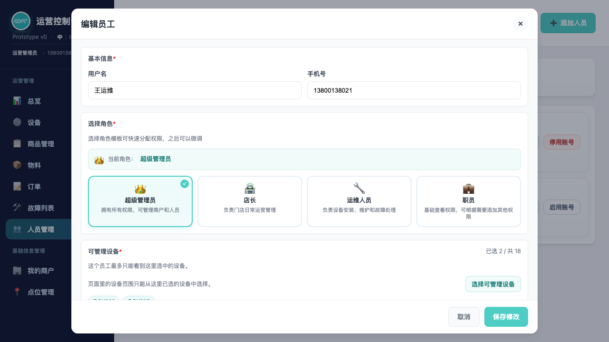
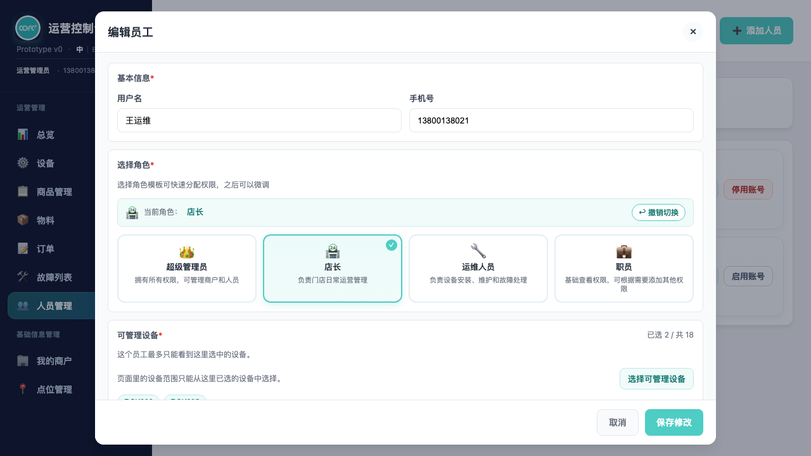
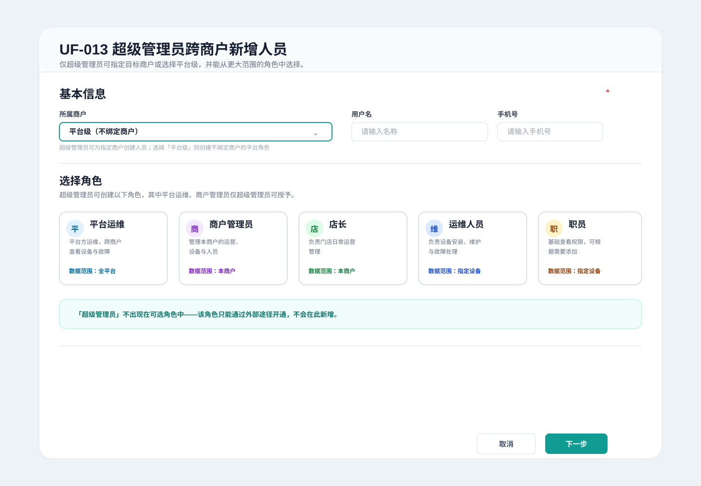
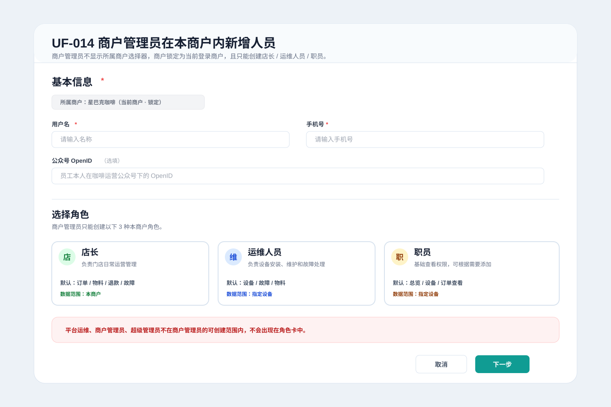

# 产品需求文档：人员管理（v2.3 分级授权与账号体系）

> 使用说明：本文件是人员管理页的唯一需求来源，每条规则只在一处正式定义，其余章节以引用方式指向定义点。`Markdown` 版本适合在仓库内查看；如需在浏览器中阅读，请使用同目录的 [prd-staff-management-user-flow.html](./prd-staff-management-user-flow.html)。

## 0. 版本记录

| 版本 | 日期 | 主要变化 |
| --- | --- | --- |
| v2.3 | 2026-07-06 | 文档结构重构（规则单点定义，用户流程 15 个合并为 11 个）；基础信息新增「邮箱」选填字段，用于 Google 账号登录绑定；更新基础信息截图 |
| v2.2 | 2026-07-03 | 新增「平台运维」「商户管理员」两个角色；引入「数据范围」维度；人员新增 / 编辑改为分级授权并增加维护门禁；基础信息标注必填 / 选填 |
| v2.1 | 2026-06-01 | 引入 6 角色模板体系前身（4 角色）；角色切换改为两步确认 + 一次撤销；权限微调提示条 |
| v1.x | 2026-05 | 初版：人员列表、基础信息、负责设备、启用 / 停用 |

## 1. 概述与目标

人员管理是后台运营人员维护「谁能登录、能看到哪些机器、能做哪些操作」的统一入口，覆盖人员列表、新增 / 编辑、角色与权限分配、负责设备分配、账号启停。

页面需同时服务两端：桌面端高密度查看与快速维护；移动端在不横向滚动的前提下完成核心查看。

**目标：**

- 进入页面即可看到当前商户下的启用人员数与管理人员列表。
- 新增 / 编辑聚焦必要信息，必填与选填一眼可辨。
- 通过角色模板一键分配权限，并支持在模板基础上微调、随时看到与模板的差异。
- 角色切换不静默丢失已有微调：两步确认 + 一次撤销。
- 人员的新增 / 编辑受分级授权约束：不同登录身份能创建的角色、能管理的商户范围不同（见第 2.3 节）。
- 负责设备选择支持设备编号与点位名称搜索，且不可跨商户。

**非目标：**

- 商户及以下角色不提供跨商户切换能力；仅超级管理员可在新增人员时指定目标商户（含平台级）。
- 不在本期恢复运维小程序授权配置；公众号 OpenID 仅作为故障推送的选填项保留。
- 不支持自定义角色模板的创建；本期为 6 个内建模板 + 手动微调。
- 不把角色切换做成即时生效；所有覆盖权限的切换都必须经过确认。

## 2. 角色与授权模型

本章是角色、数据范围、分级授权的唯一定义点。

### 2.1 角色模板总表

| 角色 | 模板定位 | 数据范围 | 默认权限范围 | 默认设备范围 | 谁能创建它 |
| --- | --- | --- | --- | --- | --- |
| 超级管理员 | 平台方最高权限 | 全平台 | 所有页面查看、人员维护、商品 / 配方 / 物料 / 订单退款、故障处理 | 全部机器 | 仅外部途径开通，不在任何创建列表 |
| 平台运维 | 平台方运维 | 全平台 | 总览、设备、故障、物料（含货道编辑）；不含订单与人员维护 | 所有商户及未分配商户的全部机器 | 仅超级管理员 |
| 商户管理员 | 商户自管 | 本商户 | 本商户内运营全权，含人员维护、订单退款、配方编辑 | 本商户全部机器 | 仅超级管理员 |
| 店长 | 门店日常运营 | 本商户 | 总览、设备、商品、物料、订单（含退款）、故障查看 | 本商户全部机器 | 超级管理员、商户管理员 |
| 运维人员 | 设备安装与故障处理 | 指定设备 | 设备、物料（含货道编辑）、故障查看与处理 | 分配到的机器，可按模块收窄 | 超级管理员、商户管理员 |
| 职员 | 基础查看 | 指定设备 | 总览、设备、订单查看 | 分配到的机器，可按模块收窄 | 超级管理员、商户管理员 |

每个角色模板包含：名称、描述文案、图标、默认权限集合、默认模块设备范围。不选择任何模板即为「自定义」模式：不强制角色，权限完全手动勾选（校验仍按第 4.2 节执行）。

### 2.2 数据范围

「数据范围」决定一个角色能看到哪些机器，与「功能权限」（能对机器做什么）相互独立：

- **全平台**：可见所有商户的机器及尚未分配商户的机器（库存、参展机器）。仅超级管理员与平台运维。
- **本商户**：可见当前登录商户名下全部机器。商户管理员、店长。
- **指定设备**：仅可见被分配的机器，可再按权限模块收窄。运维人员、职员。

同一数据范围可搭配不同功能权限，「看得到全平台」不等于「什么都能做」——平台运维可跨商户查看设备与故障，却不查看订单、不维护人员。

### 2.3 分级授权与人员维护门禁

只有具备「人员维护」能力的登录身份才能新增、编辑、启停人员：

| 登录角色 | 可新增 / 编辑人员 | 可创建的角色 | 可管理的商户范围 |
| --- | --- | --- | --- |
| 超级管理员 | 是 | 平台运维、商户管理员、店长、运维人员、职员 | 任意商户 + 平台级 |
| 商户管理员 | 是 | 店长、运维人员、职员 | 仅本商户 |
| 平台运维 / 店长 / 运维人员 / 职员 | 否 | — | — |

授权铁律：

- 超级管理员不在任何人的可创建角色列表中，只能通过外部途径开通。
- 无人员维护能力的账号：不显示「添加人员」入口，列表不出现「编辑 / 启停」操作；即便直接触发动作也会被拦截并提示无权限。
- 新增时仅超级管理员可选目标商户（含「平台级（不绑定商户）」），其余身份的人员一律归属当前登录商户；选择平台运维等平台级角色时不绑定商户。
- 编辑时所属商户锁定为该员工原商户，不可更改；角色调整仍限定在登录者可创建的范围内。

### 2.4 权限模块清单

权限模块至少包含：

- 总览：查看总览。
- 设备：查看设备。
- 商品管理：查看商品管理、新增语言、更改币种、编辑商品、编辑配方。
- 物料：查看物料、编辑货道名称、编辑货道物料。
- 订单：查看订单、订单退款。
- 故障列表：查看故障列表。
- 人员管理：查看人员管理、人员维护。

### 2.5 登录方式与账号绑定

员工可通过**小程序**或 **Google 账号**登录，二选一：

- **手机号**（必填）：小程序登录的账号标识，保证每位员工始终有一条可用登录路径。
- **邮箱**（选填）：Google 账号登录的绑定键。使用 Google 登录的员工必须配置邮箱；员工首次用 Google 登录时，系统按邮箱把 Google 账号与员工记录绑定。只用小程序登录的员工可不填。
- **公众号 OpenID**（选填）：与登录无关；配置后当所属商户开启「公众号推送」时，本人接收授权范围内的故障消息。

## 3. 用户流程

每个流程只列该流程特有的验收点；跨流程的模型与规则见第 2、4 章（验收时一并回归）。

### UF-001：进入人员管理并查看当前商户下的人员概览

**描述：** 作为运营人员，我希望进入人员管理页面后，先看到当前商户下启用人员数和管理人员列表，快速判断人员配置情况。

**主流程：**

1. 用户进入人员管理页面。
2. 页面按当前商户范围加载管理人员数据。
3. 顶部展示「启用人员数」与「管理人员列表」标题信息。
4. 列表展示每位管理人员的姓名、账号状态、手机号、创建时间、负责设备摘要与操作按钮。

**验收标准：**

- [ ] 页面标题为「人员管理」，头部风格与后台其他页面一致。
- [ ] 不提供独立的商户切换控件，数据按当前商户范围展示。
- [ ] 顶部汇总区至少展示「启用人员数」和「共 X 位管理人员」。
- [ ] 桌面端列表为紧凑单层卡片；列表页保持精简，不展示权限面板、公众号推送面板或 OpenID 明细（这些仅在编辑弹窗内维护）。
- [ ] 空状态明确提示「当前商户暂无管理人员，点击右上角添加人员创建」。

**参考截图：**

### UF-002：在移动端进入人员管理并完成核心查看

**描述：** 作为移动端运营人员，我希望在手机上保持与后台其他页面一致的导航结构，并快速看到说明文案与新增入口。

**主流程：**

1. 用户在移动端打开人员管理页面。
2. 顶部保留后台导航菜单按钮与当前页名称。
3. 下方展示页面说明文案与「添加人员」入口。
4. 用户继续浏览管理人员卡片列表。

**验收标准：**

- [ ] 移动端顶部保留后台导航入口，不移除侧边栏菜单能力。
- [ ] 顶部显示「人员管理」，同屏不重复出现第二个大号标题。
- [ ] 管理人员卡片在常见大屏手机宽度下无需横向滚动即可完整阅读。
- [ ] 页面背景、间距和按钮风格与后台其他页面一致。

**参考截图：**

### UF-003：打开新增 / 编辑弹窗并填写基础信息

**描述：** 作为具备人员维护能力的运营人员，我希望通过统一弹窗完成新增或编辑人员，清楚看到哪些基础信息必填、哪些选填。

**主流程：**

1. 用户点击「添加人员」或某条记录上的「编辑人员」。
2. 系统打开统一的人员维护弹窗，进入「基本信息」步骤。
3. 超级管理员可在「所属商户」下拉中选择目标商户或「平台级（不绑定商户）」；其他身份不显示该下拉（见第 2.3 节）。
4. 用户填写「用户名」「手机号」（必填），可选填「邮箱」「公众号 OpenID」。
5. 用户继续进入角色与设备、权限确认步骤。

**验收标准：**

- [ ] 新增与编辑共用同一弹窗：新增标题「添加员工」/ 提交按钮「确认新增」；编辑标题「编辑员工」/ 提交按钮「保存修改」。
- [ ] 「用户名」「手机号」带必填标记；「邮箱」「公众号 OpenID」带「（选填）」标注。
- [ ] 邮箱字段附说明：用于 Google 账号登录，员工可用小程序或 Google 登录二选一，使用 Google 登录的员工必须配置邮箱（定义见第 2.5 节）。
- [ ] 基础信息步骤副标题为「用户名 · 手机号 · 邮箱 · OpenID」。
- [ ] 字段校验遵循第 4.2 节校验规则表。

**参考截图：**

### UF-004：通过角色模板快速分配权限（新建场景）

**描述：** 作为运营人员，新建员工时我希望直接选一个角色模板，让系统把该角色应有的权限默认勾上，避免逐项手动勾选。

**主流程：**

1. 用户进入新增弹窗的「角色与设备」步骤。
2. 「选择角色」区域展示当前登录者有权创建的角色卡片（过滤规则见第 2.3 节）。
3. 用户点击一张卡片，系统进入待确认切换状态（新建场景原角色记为「自定义」）。
4. 对比条显示「自定义 -> 店长」及保留 / 新增 / 移除权限数量；若用户已手动勾选过权限，警告行提示这些自定义将被覆盖。
5. 用户点击「确认切换」后，权限树按角色默认勾选，顶部出现绿色「当前角色」条与「撤销切换」按钮。

**验收标准：**

- [ ] 每张角色卡片展示图标、角色名称、角色描述，已确认的卡片显示绿色边框与勾选角标。
- [ ] 点击卡片不立即写入权限，必须经过确认（状态机见第 4.1 节）。
- [ ] 对比条包含原角色名、箭头、新角色名及保留 / 新增 / 移除三类数量。

**参考截图：**

### UF-005：编辑员工时查看当前角色、切换角色并可撤销

**描述：** 作为运营人员，打开「编辑员工」时我要立即看到这个员工原本的角色；把员工切到另一个角色前，我要先看到这次切换的影响；切完后我还要能反悔一次。

**主流程：**

1. 用户点击「编辑人员」，弹窗回填基础信息、角色、权限与负责设备。
2. 「选择角色」区顶部静默显示绿色「当前角色」条（如「当前角色：店长」），对应卡片绿色高亮。
3. 用户点击另一张角色卡片，进入待确认状态：对比条显示「店长 -> 运维人员」与保留 / 新增 / 移除统计；若原角色上有微调，警告行提示将被覆盖；权限树保持不动。
4. 用户点击「确认切换」：权限树按新角色刷新，「当前角色」条更新，右侧出现「撤销切换」。
5. 用户点击「撤销切换」：角色、权限勾选、模块设备范围一起还原为切换前快照，撤销按钮消失。

**验收标准：**

- [ ] 弹窗打开瞬间不得出现任何「已从 X 切换为 Y」的提示或「撤销切换」按钮；「当前角色」条静默显示、无动效。
- [ ] 历史数据无角色字段时「当前角色」条隐藏，权限树照常回填已存权限。
- [ ] 待确认期间：新角色卡片虚线边框 + 待确认角标，原角色卡片保持绿色选中；再点回原角色等同取消；取消后一切回到点卡片前的状态。
- [ ] 「当前角色」条上不出现「已微调」徽标（微调状态由 UF-006 的提示条承担）。
- [ ] 撤销按钮只出现在「当前角色」条右侧；显隐窗口与还原范围遵循第 4.1 节状态机。

**参考截图：**

### UF-006：在角色基础上微调权限

**描述：** 作为运营人员，我希望以角色模板为起点增删权限，得到这位员工真正合适的组合，并清楚看到「比模板多 / 少了什么」。

**主流程：**

1. 用户已确认某个角色（UF-004 / UF-005）。
2. 用户在权限树勾选或取消若干权限项。
3. 权限树上方橙色提示条实时显示「基于"<角色名>"角色，已添加 N 项权限，移除 M 项权限」。
4. 用户保存后，微调作为「最终权限 + 与模板的差异」两份记录保存（见第 5 章）。

**验收标准：**

- [ ] 权限区域为行式模块布局，显示总选中数量，模块支持展开查看子权限。
- [ ] 微调统计文案包含基准角色名；当前权限等于角色默认、或当前为自定义模式时，提示条隐藏。
- [ ] 待确认切换期间提示条隐藏，避免与对比条信息冲突。
- [ ] 父子联动：勾选子权限自动带上模块一级查看权限；取消一级查看权限清空该模块其他子权限。

**参考截图：**

### UF-007：选择负责设备

**描述：** 作为运营人员，我希望通过独立选择器从当前商户下的设备中分配负责设备，支持按设备编号或点位名称搜索。

**主流程：**

1. 用户点击「选择可管理设备」。
2. 系统打开「选择负责设备」弹窗，明确提示仅可选择当前商户下的设备。
3. 用户按设备编号或点位名称搜索、勾选设备，必要时切换「仅看已选」。
4. 用户点击「完成选择」，回到人员弹窗查看已选统计与摘要。

**验收标准：**

- [ ] 设备选择器为独立弹窗；列表仅展示当前商户下设备，不允许跨商户选择。
- [ ] 搜索框同时匹配设备编号与点位名称；提供「仅看已选」切换。
- [ ] 主弹窗展示「已选 X / 共 Y」统计与已选设备摘要。
- [ ] 当前商户无设备时，明确提示需先在设备管理中录入设备。
- [ ] 各权限模块的设备范围必须落在已选负责设备内（校验见第 4.2 节）。

**参考截图：**

### UF-008：保存新增或编辑人员并完成校验

**描述：** 作为运营人员，我希望保存前得到明确校验反馈，成功后立即看到结果。

**主流程：**

1. 用户填写基础信息、角色（可选）、权限和负责设备。
2. 用户点击提交按钮，系统按第 4.2 节校验规则表依次校验。
3. 校验不通过：弹窗停留、数据不变，并提示需要修正的内容。
4. 校验通过：保存人员数据、关闭弹窗、刷新列表与顶部统计，提示「人员新增成功」或「人员信息已更新」。

**验收标准：**

- [ ] 校验顺序与提示遵循第 4.2 节；保存字段完整性遵循第 5 章数据契约。
- [ ] 新增人员默认账号状态为「已启用」。
- [ ] 编辑成功后更新原记录，不产生重复人员。

**参考截图：**

### UF-009：启用 / 停用账号

**描述：** 作为运营人员，我希望在列表中快速切换账号启用状态，并在操作前获得确认提示。

**主流程：**

1. 用户在列表点击「停用账号」或「启用账号」。
2. 系统弹出确认提示；停用时明确「停用后该人员将无法登录」。
3. 用户确认后，系统更新状态、刷新列表，提示「账号已启用 / 账号已停用」。

**验收标准：**

- [ ] 每位人员展示账号状态「已启用 / 已停用」，按钮随状态切换。
- [ ] 状态切换仅影响能否登录，不修改权限、角色和负责设备。

**参考截图：**

### UF-010：在桌面端查看负责设备摘要并展开完整设备列表

**描述：** 作为桌面端运营人员，我希望列表先给设备摘要、设备多时按需展开，兼顾信息密度和完整性。

**主流程：**

1. 用户在桌面端查看管理人员卡片。
2. 设备少时直接展示全部编号；设备多时展示前两台 + 总数。
3. 用户点击「查看全部」展开完整列表，再次点击「收起」。

**验收标准：**

- [ ] 摘要规则：0 台显示「-」；1~3 台直接展示全部且无「查看全部」；4 台及以上展示前 2 台 + 「等 N 台」并提供「查看全部 / 收起」。
- [ ] 展开状态仅作用于当前卡片，不影响其他人员记录。

**参考截图：**

### UF-011：不同身份的新增 / 编辑差异（分级授权场景）

**描述：** 作为不同身份的登录者，我在人员管理里能做的事应随身份不同而不同：超级管理员跨商户建人、商户管理员只管本商户、无人员维护能力的账号只能看。

**主流程（三个视角）：**

1. **超级管理员**：新增时可选「所属商户」（含平台级）；角色卡片含平台运维、商户管理员、店长、运维人员、职员；选择平台级角色时商户不绑定。
2. **商户管理员**：不显示「所属商户」，商户锁定为当前登录商户；角色卡片仅店长、运维人员、职员。
3. **无人员维护能力的账号**（平台运维、店长等）：页面正常展示概览与列表，但没有「添加人员」入口，列表无「编辑 / 启停」操作。

**验收标准：**

- [ ] 三个视角的入口可见性、可选角色、商户范围与第 2.3 节授权矩阵一致。
- [ ] 任何身份的可选角色列表都不含「超级管理员」。
- [ ] 无人员维护能力的账号即便直接触发新增 / 编辑动作，也被拦截并提示无权限。

**参考截图：**

## 4. 交互与校验规则

### 4.1 角色切换状态机

| 状态 | 进入条件 | 可见界面 | 允许动作 | 退出结果 |
| --- | --- | --- | --- | --- |
| 自定义（无角色） | 新增弹窗初始态，或历史员工无角色字段 | 无当前角色条；权限树按现有勾选显示 | 手动改权限、选择角色卡片 | 选择角色后进入「待确认切换」 |
| 已确认角色 | 已确认某个角色，或编辑员工回填已有角色 | 绿色当前角色条；对应卡片绿色选中 | 手动微调权限、选择其他角色、保存 | 选其他角色进入「待确认切换」；微调后保持当前角色 |
| 待确认切换 | 点击非当前角色卡片 | 对比条；新角色虚线待确认；原角色仍选中 | 确认切换、取消切换、点回原角色 | 确认后进入「已确认角色」；取消后回到进入前状态 |
| 可撤销 | 确认切换后且尚未手动改动 | 当前角色条右侧显示「撤销切换」 | 撤销切换、手动改权限、保存 | 撤销后还原快照；手动改动后撤销失效 |

状态铁律：

- 打开新增或编辑弹窗时，必须清空上一次未完成的切换状态与撤销入口，任何切换提示不得残留。
- 只有「确认切换」这一个动作能让「撤销切换」入口出现。
- 待确认期间不得改动已生效的权限与模块设备范围。
- 撤销必须同时还原角色、权限勾选、模块设备范围三项数据；确认切换后手动改动任意权限或设备范围，撤销入口立即消失。

### 4.2 校验规则表

保存（或向导「下一步」跨步）时按下表依次校验；任一不通过则弹窗停留、列表数据不变，并给出对应提示。

| 校验项 | 规则 | 不通过时的提示 |
| --- | --- | --- |
| 用户名 | 必填 | 请填写用户名和手机号 |
| 手机号 | 必填；合法手机号格式；同一商户下手机号不得重复（编辑时允许保留本人原手机号） | 请输入正确的手机号 / 手机号重复提示 |
| 邮箱 | 选填；填写时必须为合法邮箱格式；留空不阻塞保存（仅小程序登录） | 请输入正确的邮箱地址 |
| 权限 | 至少选择一个权限 | 请至少选择一个权限 |
| 负责设备 | 本商户 / 指定设备范围的角色至少选择一台当前商户下的设备；全平台数据范围的角色（如平台运维）无需选择设备 | 请至少选择一个可管理设备 |
| 模块设备范围 | 每个权限模块的设备子集必须落在负责设备列表内；模块设为「指定设备」但清单为空时不得保存 | 引导改为「全部可管理设备」或补选设备 |
| 角色越权 | 所选角色必须在登录者可创建范围内（见第 2.3 节） | 当前账号无权创建该角色 |
| 目标商户 | 超级管理员为商户级角色新增人员时必须选择商户 | 请选择该人员所属的商户 |

## 5. 数据保存契约

人员记录至少包含以下字段：

| 字段 | 含义 | 示例 | 备注 |
| --- | --- | --- | --- |
| 人员 ID | 系统生成的唯一标识 | `staff-001` | 编辑保存时不可变 |
| 商户 ID | 所属商户 | `C001` | 平台级角色不绑定商户 |
| 用户名 | 展示名 | `王店长` | 必填 |
| 手机号 | 小程序登录账号 | `13800138000` | 必填；校验见第 4.2 节 |
| 邮箱 | Google 登录绑定键 | `wang@example.com` | 选填；使用 Google 登录的员工必须配置（见第 2.5 节） |
| 公众号 OpenID | 故障推送标识 | — | 选填 |
| 账号状态 | 启用 / 停用 | `已启用` | 新增默认启用 |
| 角色信息 | 角色 ID、名称、应用时间 | `店长，2026-06-01` | 自定义时明确标记为自定义，不挂内建角色 ID |
| 最终权限 | 保存时实际生效的权限集合 | `查看总览、查看订单` | 不依赖角色信息即可独立读懂 |
| 权限差异记录 | 相对基准角色的新增 / 移除项 | 基准：店长；新增：订单退款 | 自定义时基准记为自定义 |
| 数据范围 | 该员工可见机器范围 | `全平台 / 本商户 / 指定设备` | 由角色决定（见第 2.2 节） |
| 负责设备列表 | 可管理的设备 | `RCK386, RCK385` | 不能跨商户 |
| 模块设备范围 | 各权限模块可查看的设备子集 | 订单：继承全部；故障：仅 RCK386 | 必须是负责设备列表的子集 |
| 创建时间 | 记录创建时间 | `2026-06-01` | 编辑保存时不可变 |

保存规则：

- 权限差异记录用保存时的实际权限对比角色默认权限计算。
- 编辑保存只更新业务字段，保留原始人员 ID 与创建时间。
- 编辑弹窗必须完整回填：用户名、手机号、邮箱、公众号 OpenID、角色、权限、负责设备与模块范围。

## 6. 关联实现与测试

- 页面实现：`staff-management.html`
- 角色模板与分级授权：`shared/role-definitions.js`（6 个角色模板、可创建角色白名单、数据范围）
- 数据范围与设备放行：`shared/admin-staff-access.js`
- 行为测试：`tests/staff-management.behavior.test.js`
- 分步向导 runtime 测试：`tests/staff-management.segmented-flow.runtime.test.js`
- 角色治理 runtime 测试：`tests/role-governance.runtime.test.js`
- PRD HTML 回归测试：`tests/prd-staff-management-user-flow-html.test.js`

## 7. 发布检查清单

上线前逐项人工验证（括号内为规则定义处）：

- [ ] 待确认切换期间权限树未被提前覆盖；确认后撤销可用、手动改动后撤销消失（4.1）。
- [ ] 编辑已有角色员工时当前角色条静默出现、无撤销按钮（UF-005）。
- [ ] 微调提示条只在「有已确认角色且权限与模板不同」时出现（UF-006）。
- [ ] 保存后角色、最终权限、权限差异记录、数据范围、负责设备、模块设备范围数据完整（第 5 章）。
- [ ] 同一商户下手机号唯一校验生效；邮箱留空可保存、非法格式被拦截（4.2）。
- [ ] 无人员维护能力的账号看不到添加 / 编辑 / 启停入口，直接触发被拦截（2.3、UF-011）。
- [ ] 可选角色随登录身份过滤且都不含超级管理员；仅超级管理员可选目标商户；平台运维创建后不绑定商户、无需选设备（2.3、4.2）。
- [ ] 平台运维登录后可跨商户查看设备 / 故障 / 物料，但看不到订单、无人员维护入口（2.1、2.2）。
- [ ] 基础信息必填 / 选填标注齐全：用户名、手机号必填，邮箱、公众号 OpenID 选填（UF-003）。
- [ ] 移动端无重复大标题、无横向滚动；桌面端设备摘要展开只影响当前卡片（UF-002、UF-010）。
