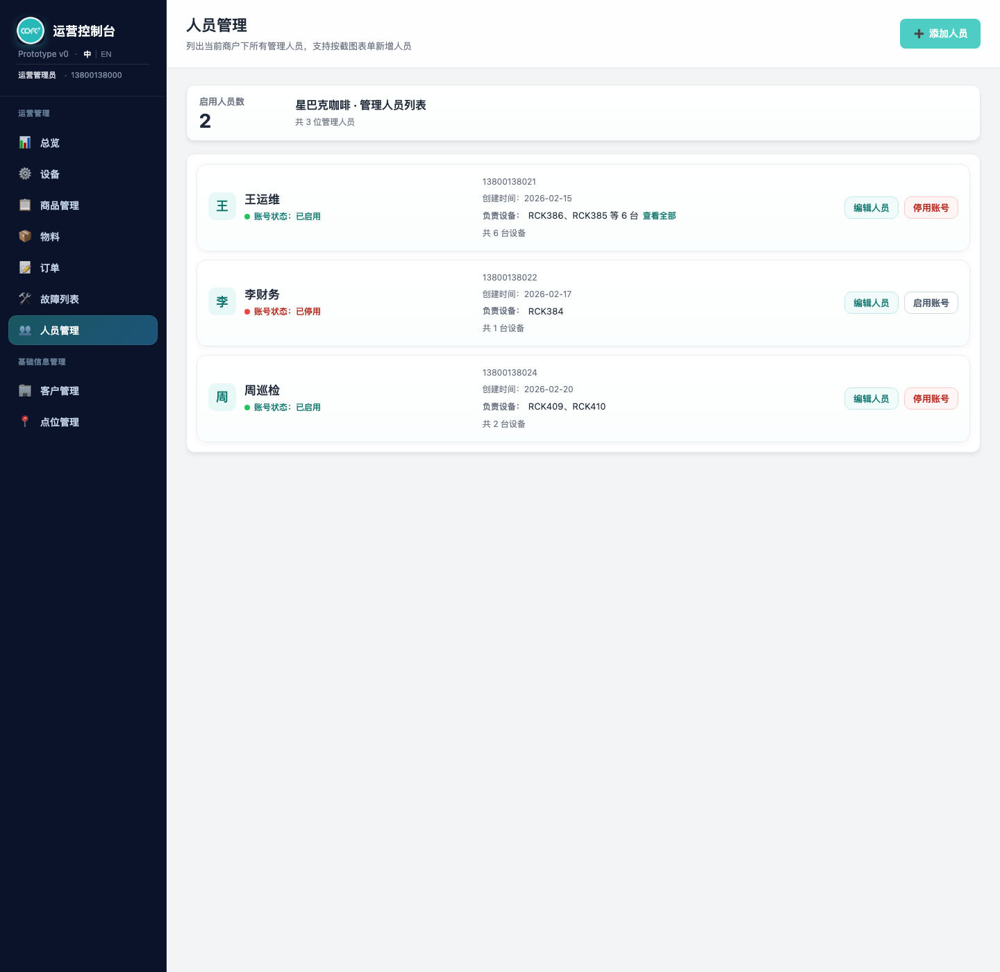
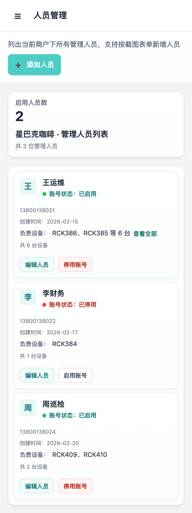
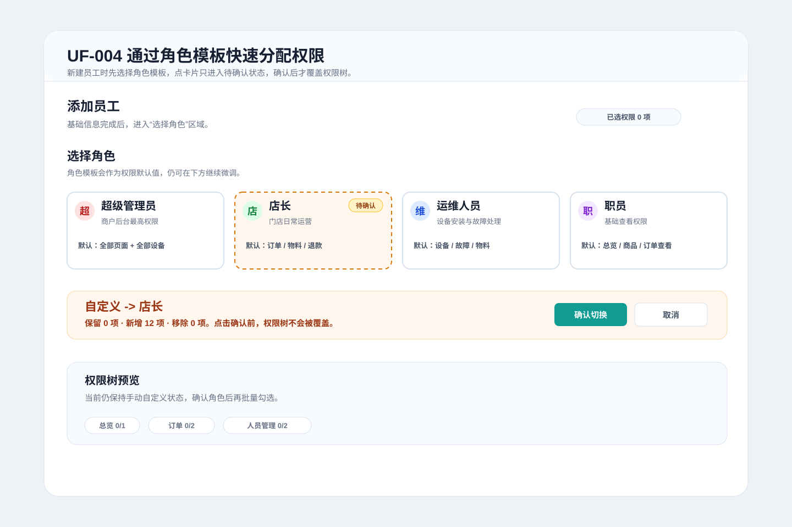
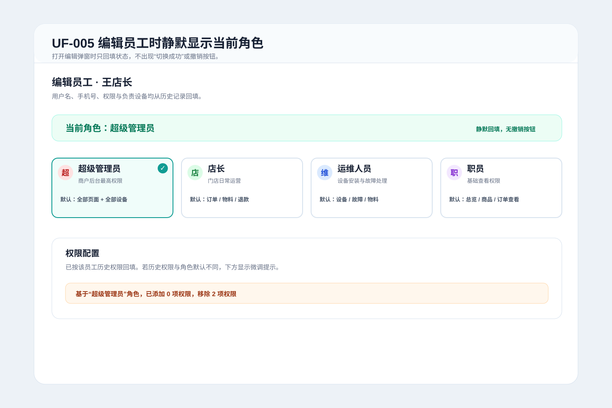
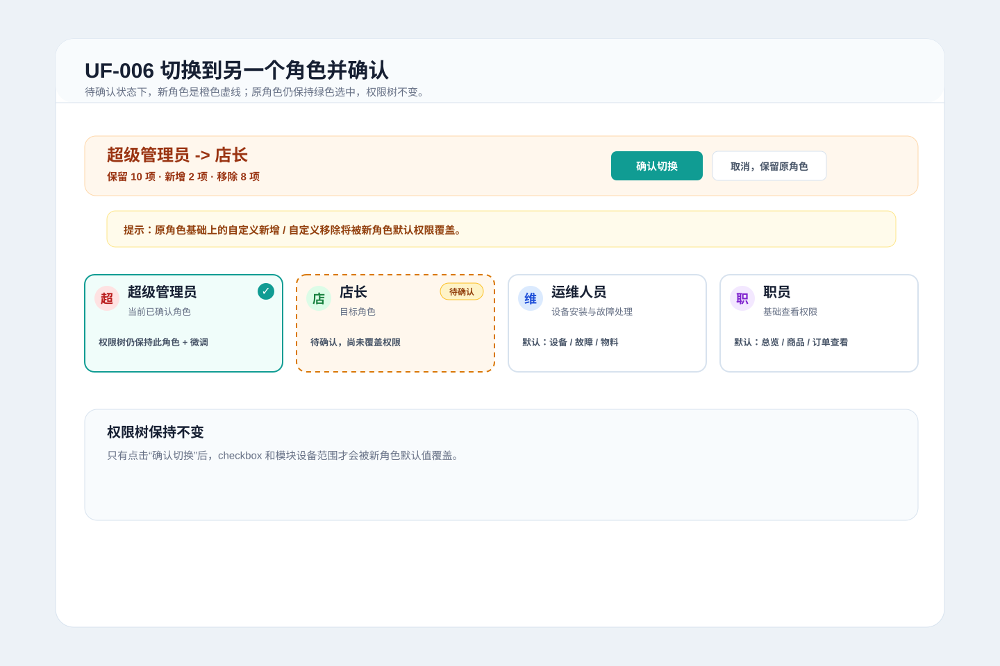
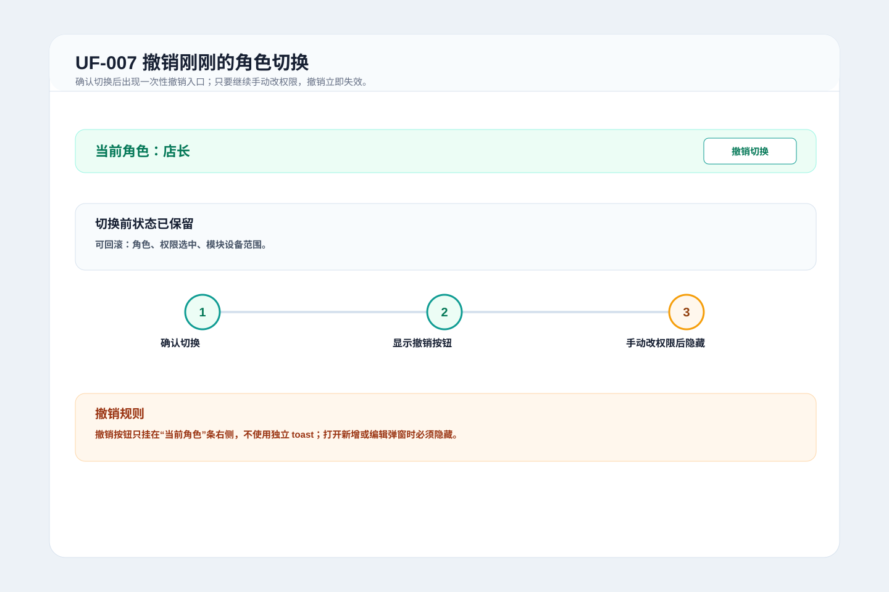
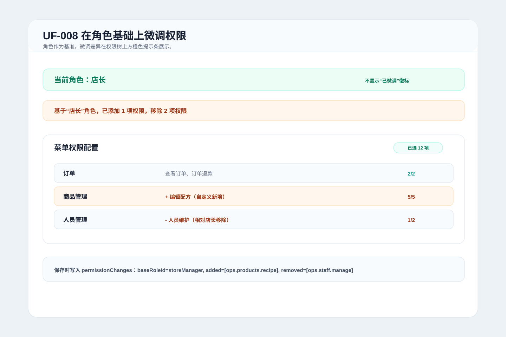
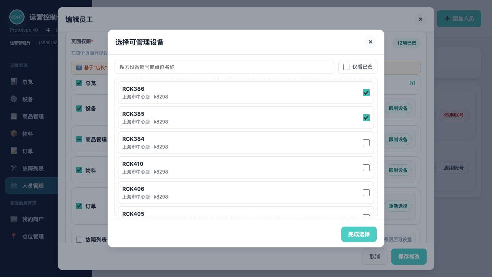
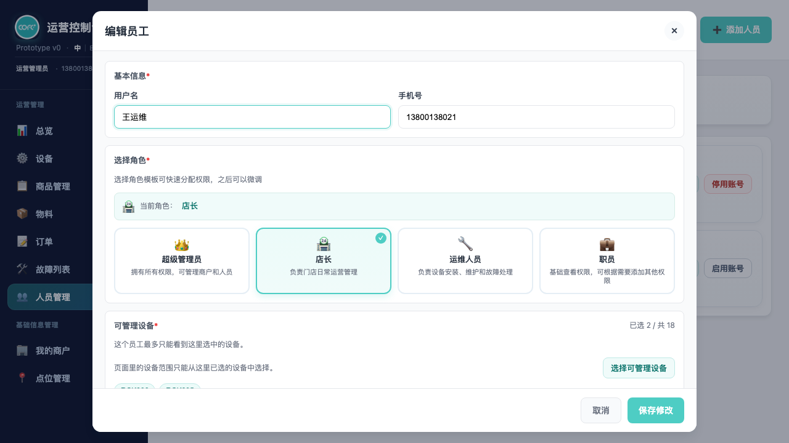

# 产品需求文档：人员管理（按用户流程）

> 版本：v2.1（角色模板权限方案）  
> 更新于 2026-06-01：对齐线上 PRD 版本，并把“角色模板、两步切换、撤销、微调、设备范围、数据保存契约”前置为核心需求，而不是附加说明。
>
> 使用说明：`Markdown` 版本适合在仓库内查看；如需在浏览器或飞书文档中阅读，优先使用同目录的 [prd-staff-management-user-flow.html](./prd-staff-management-user-flow.html)。

## 0. 本版重点变化

这版不是旧的“人员列表 + 权限勾选”PRD，而是把人员管理升级为“角色模板驱动的权限配置流程”。

本版必须优先实现和验收以下变化：

- 角色模板成为新增 / 编辑员工的第一入口：内建 `超级管理员`、`店长`、`运维人员`、`职员` 4 个角色。
- 角色切换必须是两步确认：点角色卡片只进入待确认，不得立即覆盖现有权限。
- 切换影响必须可见：展示 `原角色 -> 新角色`、保留权限数、新增权限数、移除权限数。
- 已有微调必须受保护：切换角色前明确提示自定义新增 / 自定义移除会被覆盖。
- 切换后必须可撤销一次：`撤销切换` 只在刚确认切换且未继续手动改权限时显示。
- 微调必须有基准：权限树上方显示 `基于"<角色名>"角色，已添加 N 项权限，移除 M 项权限`。
- 保存数据必须可追溯：人员记录保存 `role`、`permissions`、`permissionChanges`、`devices`、`moduleDeviceScopes`。

旧版能力（人员列表、基础信息、设备选择、启用 / 停用、桌面端设备展开）仍保留，但不再是本版的主要差异点。

## 1. 介绍 / 概述

人员管理不是单纯的“员工名册”页面，而是后台运营人员用于查看当前商户下管理人员状态、维护菜单权限、分配负责设备以及启用 / 停用账号的统一入口。

该页面需要同时满足两类核心使用场景：

- 桌面端：高密度查看管理人员、快速编辑、快速切换账号状态、通过角色模板快速分配权限。
- 移动端：在不横向滚动的前提下完成核心查看，并提供进入新增 / 编辑流程的入口。

本次需求以“用户流程”为主线，覆盖人员管理页面中的顶部汇总、人员列表、新增 / 编辑弹窗、角色模板选择与切换、基于角色微调的菜单权限配置、负责设备选择器、账号状态切换以及桌面端设备摘要展开能力。

默认用户角色：

- 运营人员：查看人员状态、创建人员、维护权限、分配负责设备。
- 商户管理员：按当前商户范围维护人员信息，并控制账号启用状态。

## 2. 目标与非目标

### 2.1 目标

- 让运营人员进入页面后，先看到当前商户下的启用人员数与管理人员列表。
- 让新增 / 编辑人员流程聚焦在最必要的信息，不再出现历史遗留授权与 `openId` 输入。
- 让运营人员通过 4 个内建角色模板（超级管理员 / 店长 / 运维人员 / 职员）一键分配权限，避免重复勾选。
- 让运营人员能在角色基础上微调权限，并通过橙色提示条直观看到与模板的差异。
- 让角色切换不会静默丢失用户已有的自定义微调：切换必须是显式两步动作（点卡片 -> 确认 / 取消），并支持一次撤销。
- 让运营人员任何时候都能一眼看到当前角色，包括编辑现有员工进入弹窗的初始态。
- 让负责设备选择过程同时支持设备编号与点位名称搜索，并明确只能选择当前商户下的设备。
- 让桌面端在单屏内展示更多人员信息，同时保留完整设备查看能力。
- 让移动端保持后台页面统一导航风格，并避免重复标题与横向滚动。

### 2.2 非目标

- 不在本页面提供跨商户切换能力；人员、设备、权限均按当前登录商户范围处理。
- 不在本期恢复运维小程序授权、微信公众号授权、`openId` 输入或公众号推送配置。
- 不在角色模板中引入自定义角色创建；本期只支持 4 个内建模板 + 手动微调。
- 不把角色切换做成即时生效；所有会覆盖权限树的角色切换都必须经过确认。

## 3. 用户流程 / 用户故事

### UF-001：进入人员管理并查看当前商户下的人员概览

**描述：** 作为运营人员，我希望进入人员管理页面后，先看到当前商户下启用人员数和管理人员列表，这样我能快速判断当前人员配置情况。

**主流程：**

1. 用户进入人员管理页面。
2. 页面按当前商户范围加载管理人员数据。
3. 顶部展示 `启用人员数` 与 `管理人员列表` 标题信息。
4. 列表中展示每位管理人员的姓名、账号状态、手机号、创建时间、负责设备摘要与操作按钮。

**验收标准：**

- [ ] 页面标题为 `人员管理`，且与后台其他页面保持一致的头部风格。
- [ ] 页面不提供独立的商户切换控件，而是按当前商户范围展示数据。
- [ ] 顶部汇总区至少展示 `启用人员数` 和 `共 X 位管理人员`。
- [ ] 桌面端列表以紧凑单层卡片方式展示人员信息，而不是拆分独立权限面板或设备面板。
- [ ] 列表空状态下，页面明确提示“当前商户暂无管理人员，点击右上角添加人员创建”。

**参考截图：**



### UF-002：在移动端进入人员管理并完成核心查看

**描述：** 作为移动端运营人员，我希望在手机上查看人员管理页面时，保持与后台其他页面一致的导航结构，并能快速看到说明文案与新增入口。

**主流程：**

1. 用户在移动端打开人员管理页面。
2. 页面顶部保留后台导航菜单按钮与当前页名称。
3. 下方展示页面说明文案与 `添加人员` 入口。
4. 用户继续浏览管理人员卡片列表。

**验收标准：**

- [ ] 移动端顶部保留后台导航入口，不移除侧边栏菜单能力。
- [ ] 移动端顶部显示 `人员管理`，但同屏不重复出现第二个大号 `人员管理` 标题。
- [ ] 页面说明文案与 `添加人员` 按钮在移动端仍清晰可见。
- [ ] 管理人员卡片在常见大屏手机宽度下无需横向滚动即可完整阅读。
- [ ] 移动端页面背景、间距和按钮风格与后台其他页面保持一致。

**参考截图：**



### UF-003：打开新增 / 编辑弹窗并填写基础信息

**描述：** 作为运营人员，我希望通过统一弹窗完成新增或编辑人员，并只填写最必要的基础信息，这样流程更短、更清晰。

**主流程：**

1. 用户点击 `添加人员` 或某条人员记录上的 `编辑人员`。
2. 系统打开统一的人员维护弹窗。
3. 用户填写或修改 `用户名`、`手机号`。
4. 用户继续进入角色与权限配置区域。

**验收标准：**

- [ ] 新增与编辑共用同一弹窗。
- [ ] 新增状态下弹窗标题为 `添加员工`，提交按钮文案为 `确认新增`。
- [ ] 编辑状态下弹窗标题为 `编辑员工`，提交按钮文案为 `保存修改`。
- [ ] 基础信息区仅保留 `用户名` 与 `手机号` 两个输入项。
- [ ] 页面不再展示 `运维小程序授权`、`微信公众号授权`、两个 `openId` 输入，也不展示公众号推送配置。

**参考截图：**


### UF-004：通过角色模板快速分配权限（新建场景）

**描述：** 作为运营人员，新建员工时我希望直接选一个角色模板，让系统帮我把这个角色应该有的权限默认勾上，避免一项一项手动勾选。

**主流程：**

1. 用户进入新增弹窗。
2. `选择角色` 区域展示 4 张角色卡片：`超级管理员` / `店长` / `运维人员` / `职员`。
3. 用户点击其中一张卡片。
4. 因为当前还没有任何“已确认角色”（新建场景），系统进入待确认切换状态。
5. 橙色对比条显示 `自定义 -> 店长`，并说明保留 / 新增 / 移除权限数量。
6. 若用户已手动勾选过部分权限，黄色警告行提示这些自定义将被新角色覆盖。
7. 用户点击 `确认切换` 后，权限树自动按角色默认勾选，顶部出现绿色“当前角色”条，右侧出现 `撤销切换` 按钮。

**验收标准：**

- [ ] 角色模板覆盖：`超级管理员`（拥有所有权限）、`店长`（门店日常运营）、`运维人员`（设备安装与故障处理）、`职员`（基础查看权限）。
- [ ] 每张卡片必须展示图标、角色名称、角色描述。
- [ ] 用户点击卡片后不立即写入权限，必须经过确认。
- [ ] 对比条必须显示“原角色 -> 新角色”两个角色名及保留 / 新增 / 移除三类数量。
- [ ] 确认切换后，权限树根据该角色默认权限集合刷新，且顶部“当前角色”条更新为该角色。
- [ ] 角色卡片在已确认状态下显示绿色边框与右上角勾选角标。

**参考截图：**



### UF-005：编辑现有员工时静默看到当前角色

**描述：** 作为运营人员，打开“编辑员工”弹窗时，我希望立即看到这个员工原本是什么角色，而不需要去推断或猜测。同时不应误以为系统“刚刚替我做了切换”。

**主流程：**

1. 用户在列表点击某条记录的 `编辑人员`。
2. 系统打开弹窗并回填基础信息、角色、权限与负责设备。
3. `选择角色` 区域顶部直接显示绿色“当前角色”条，例如 `当前角色：超级管理员`。
4. 角色卡片中该角色绿色高亮。
5. 用户继续按需修改其他信息。

**验收标准：**

- [ ] 弹窗打开瞬间不得出现任何“已从 X 切换为 Y”的提示。
- [ ] 弹窗打开瞬间不得出现 `撤销切换` 按钮。
- [ ] “当前角色”条必须静默显示，无任何过渡动画或弹出动效。
- [ ] 该员工历史保存的角色卡片必须为绿色选中状态。
- [ ] 若该员工是历史数据（无角色字段），则“当前角色”条隐藏；权限树照常回填用户已存权限。
- [ ] 当前权限若与角色默认不同，权限树正上方的橙色提示条显示 `基于"<角色名>"角色，已添加 N 项权限，移除 M 项权限`。

**参考截图：**



### UF-006：切换到另一个角色并确认

**描述：** 作为运营人员，我希望能把一个员工从原角色（含微调）切换到另一个角色，并在切换前看到这次切换的影响。

**主流程：**

1. 用户在已有角色（含微调）的状态下点击另一张角色卡片。
2. 系统进入待确认切换状态。
3. 顶部对比条显示 `超级管理员 -> 店长`。
4. 对比条下方说明保留几项重叠权限、引入几项新角色默认权限、移除几项不在新角色范围内的权限。
5. 若用户曾在原角色基础上做过微调，黄色警告行额外提示这些自定义新增 / 自定义移除将被覆盖。
6. 权限树暂不改动，仍保持原角色 + 原微调。
7. 新角色卡片显示橙色虚线边框与待确认角标；原角色卡片仍保留绿色高亮。
8. 用户点击 `确认切换` 后，权限树按新角色默认刷新，顶部条更新为新角色，右侧出现 `撤销切换` 按钮。
9. 用户点击 `取消，保留原角色` 后，状态回到编辑初始态，权限树没有任何变化。

**验收标准：**

- [ ] 用户点击非当前角色卡片后，权限树 checkbox 必须保持不变，直到用户点击 `确认切换`。
- [ ] 对比条必须包含原角色名、箭头、新角色名、保留 / 新增 / 移除统计。
- [ ] 若原角色基础上存在用户自定义（基于 `calculatePermissionChanges` 计算），必须显示黄色警告行。
- [ ] 新角色卡片在待确认期间必须用虚线边框区分于已确认状态。
- [ ] 原角色卡片在待确认期间保留绿色选中态。
- [ ] 用户在 pending 状态再点回原角色卡片，等同于 `取消，保留原角色`。
- [ ] 用户点击 `确认切换` 后，顶部“当前角色”条与撤销按钮必须出现；对比条必须消失。
- [ ] 用户点击 `取消，保留原角色` 后，对比条必须消失；其他 UI 完全回到初始态。

**参考截图：**



### UF-007：撤销刚刚的角色切换

**描述：** 作为运营人员，我希望刚做完角色切换后能反悔一次，把权限和角色一起回到切换前的状态。我也希望系统不会乱给我撤销机会：只有刚刚切换过、又没动过其它权限时，撤销按钮才出现。

**主流程：**

1. 用户在 UF-006 完成 `确认切换`。
2. 顶部“当前角色”条右侧出现 `撤销切换` 按钮。
3. 用户点击 `撤销切换`。
4. 系统把角色还原为切换前的角色，把权限 checkbox 与模块设备范围都还原为切换前的快照。
5. 撤销按钮消失。

**验收标准：**

- [ ] 撤销按钮只挂在“当前角色”条右侧，不再使用独立 toast。
- [ ] 撤销按钮仅在“用户刚确认过一次角色切换，且之后没有手动调整任何权限或设备范围”时显示，其他场景一律隐藏。
- [ ] 打开新增弹窗（重置）后，撤销按钮必须隐藏。
- [ ] 打开编辑弹窗回填角色后，撤销按钮必须隐藏。
- [ ] 用户确认切换后，撤销按钮显示。
- [ ] 用户在切换后手动改动任意权限 checkbox，撤销按钮立即消失，避免回滚丢掉新微调。
- [ ] 撤销操作必须同时还原角色 ID、权限选中、模块设备范围三项数据。

**参考截图：**



### UF-008：在角色基础上微调权限

**描述：** 作为运营人员，我希望把角色模板作为起点，再加几项或去掉几项权限，得到这位员工真正合适的权限组合，并能清楚地看到“我比模板多 / 少了什么”。

**主流程：**

1. 用户已在 UF-004 或 UF-006 中确认了一个角色。
2. 用户在权限树里手动勾选或取消若干 checkbox。
3. 权限树上方的橙色提示条实时显示 `基于"<角色名>"角色，已添加 N 项权限，移除 M 项权限`。
4. 顶部“当前角色”条保持不变，不再叠加“已微调”徽标。
5. 用户保存。

**验收标准：**

- [ ] 微调统计必须显示在权限树上方的橙色 `.permission-customization-hint` 条上。
- [ ] 微调统计文案必须包含基准角色名（用 `committedRoleId` 计算）。
- [ ] 当前权限等于角色默认权限时，橙色提示条隐藏。
- [ ] 当前 `committedRoleId == 'custom'` 时，橙色提示条隐藏。
- [ ] 微调发生时，“当前角色”条上不出现“已微调 +N/-M”徽标。
- [ ] 父子权限联动规则保留：勾选子权限自动带上模块一级查看权限；取消一级查看权限会清空该模块其他子权限。
- [ ] 微调会保存为该员工的 `permissions` 与 `permissionChanges`，下次进入编辑可还原。

**参考截图：**



### UF-009：选择负责设备

**描述：** 作为运营人员，我希望通过独立的设备选择器，从当前商户下的设备中分配负责设备，并支持按设备编号或点位名称搜索，这样我可以快速锁定目标设备。

**主流程：**

1. 用户在弹窗中点击 `选择可管理设备`。
2. 系统打开 `选择负责设备` 弹窗，并明确提示“仅可选择当前商户下的设备”。
3. 用户按设备编号或点位名称搜索当前商户下的设备。
4. 用户勾选设备，必要时切换 `仅看已选`。
5. 用户点击 `完成选择`，回到人员弹窗查看已选设备摘要。

**验收标准：**

- [ ] 设备选择器为独立弹窗，不与权限区域混杂展示。
- [ ] 弹窗标题、说明文案或空状态提示中，明确告知“仅可选择当前商户下的设备”。
- [ ] 搜索框支持同时匹配 `设备编号` 与 `点位名称`。
- [ ] 提供 `仅看已选` 切换，方便复查已选设备。
- [ ] 设备列表仅展示当前商户下的设备，不允许跨商户选择设备。
- [ ] 当前商户下无设备时，页面明确提示需先在设备管理中录入设备。
- [ ] 主弹窗中展示 `已选 X / 共 Y` 统计与已选设备摘要。
- [ ] 至少选择一个负责设备才能提交。
- [ ] 模块设备范围（每个权限模块可设置可查看的设备子集）必须落在已选可管理设备范围内。

**参考截图：**



### UF-010：保存新增或编辑人员并完成校验

**描述：** 作为运营人员，我希望在保存人员信息前得到明确校验反馈，并在成功后立即看到结果，这样我可以降低误操作和漏填风险。

**主流程：**

1. 用户填写基础信息、角色（可选）、权限和负责设备。
2. 用户点击提交按钮。
3. 系统依次校验必填项、手机号格式、权限与设备选择情况。
4. 校验通过后，系统保存人员数据并关闭弹窗。
5. 列表刷新，页面提示“人员新增成功”或“人员信息已更新”。

**验收标准：**

- [ ] `用户名` 与 `手机号` 为必填项。
- [ ] 手机号必须符合合法手机号格式。
- [ ] 同一商户下手机号不得重复。
- [ ] 必须至少选择一个权限。
- [ ] 必须至少选择一个当前商户下的负责设备。
- [ ] 保存数据必须包含 `role` 字段：当前若有角色为 `{ id, name, appliedAt }`；若为手动自定义，则明确标记为自定义角色，不保存内建角色 ID。
- [ ] 保存数据必须包含 `permissionChanges` 字段，记录该员工权限相对角色默认的差异（添加项、移除项）。
- [ ] 新增人员默认账号状态为 `已启用`。
- [ ] 编辑成功后更新原记录，不新增重复人员。
- [ ] 保存成功后刷新列表与顶部统计。

**参考截图：**



### UF-011：启用 / 停用账号

**描述：** 作为运营人员，我希望在列表中快速切换账号启用状态，并在操作前获得确认提示，这样我可以安全管理人员登录权限。

**主流程：**

1. 用户在人员列表中看到 `停用账号` 或 `启用账号` 按钮。
2. 用户点击按钮。
3. 系统弹出确认提示。
4. 用户确认后，系统更新账号状态并刷新列表展示。

**验收标准：**

- [ ] 页面明确展示每位人员的账号状态：`已启用` 或 `已停用`。
- [ ] 已启用人员显示 `停用账号` 按钮；已停用人员显示 `启用账号` 按钮。
- [ ] 停用前给出“停用后该人员将无法登录”的确认提示。
- [ ] 状态切换成功后，页面提示 `账号已启用` 或 `账号已停用`。
- [ ] 状态切换仅影响账号启用状态，不修改人员权限、角色和负责设备。

**参考截图：**


### UF-012：在桌面端查看负责设备摘要并展开完整设备列表

**描述：** 作为桌面端运营人员，我希望在列表里先看到负责设备摘要，并在设备过多时按需展开完整列表，这样我可以兼顾信息密度和完整查看。

**主流程：**

1. 用户在桌面端查看管理人员卡片。
2. 当负责设备较少时，页面直接展示全部设备编号。
3. 当负责设备较多时，页面展示前两台设备编号与设备总数。
4. 用户点击 `查看全部` 展开完整设备列表；再次点击可 `收起`。

**验收标准：**

- [ ] 当负责设备为 `0` 台时，摘要显示 `-`。
- [ ] 当负责设备为 `1~3` 台时，页面直接展示全部设备编号，不显示 `查看全部`。
- [ ] 当负责设备为 `4` 台及以上时，页面展示前 `2` 台设备编号与 `等 N 台` 摘要。
- [ ] 设备过多时提供 `查看全部 / 收起` 切换。
- [ ] 展开状态仅作用于当前卡片，不影响其他人员记录。

**参考截图：**


## 4. 角色模板与权限模型

| 角色 | 模板定位 | 默认权限范围 | 默认设备范围 |
| --- | --- | --- | --- |
| 超级管理员 | 商户后台最高权限 | 所有页面查看、人员维护、商品/配方/物料/订单退款、故障处理 | 默认继承全部可管理设备 |
| 店长 | 门店日常运营 | 总览、设备查看、商品查看、物料查看与补货相关、订单查看与退款、故障查看 | 默认继承全部可管理设备 |
| 运维人员 | 设备安装与故障处理 | 设备查看、物料查看、故障查看与处理、必要的订单查看 | 默认继承全部可管理设备，可按模块收窄 |
| 职员 | 基础查看 | 总览、设备查看、商品查看、订单查看 | 默认继承全部可管理设备，可按模块收窄 |

权限模块必须至少包含：

- `总览`：查看总览。
- `设备`：查看设备。
- `商品管理`：查看商品管理、新增语言、更改币种、编辑商品、编辑配方。
- `物料`：查看物料、编辑货道名称、编辑货道物料。
- `订单`：查看订单、订单退款。
- `故障列表`：查看故障列表。
- `人员管理`：查看人员管理、人员维护。

## 5. 角色切换状态机

| 状态 | 进入条件 | 可见 UI | 允许动作 | 退出结果 |
| --- | --- | --- | --- | --- |
| `custom` | 新增弹窗初始态，或历史员工无角色字段 | 无当前角色条；权限树按现有勾选显示 | 手动改权限、选择角色卡片 | 选择角色后进入 `pendingRoleSwitch` |
| `committedRole` | 已确认某个角色，或编辑员工回填已有角色 | 绿色当前角色条；对应角色卡片绿色选中 | 手动微调权限、选择其他角色、保存 | 选其他角色进入 `pendingRoleSwitch`；微调后保持当前角色 |
| `pendingRoleSwitch` | 点击非当前角色卡片 | 橙色对比条；新角色虚线待确认；原角色仍选中 | 确认切换、取消切换、点回原角色 | 确认后进入 `committedRole`；取消后回到进入前状态 |
| `undoAvailable` | 确认切换后且尚未手动改动权限 | 当前角色条右侧显示 `撤销切换` | 撤销切换、手动改权限、保存 | 撤销后还原快照；手动改权限后撤销失效 |

状态铁律：

- 打开新增弹窗或编辑弹窗时，必须清空上一次未完成的角色切换状态与撤销入口。
- 只有用户点击“确认切换”后，页面才允许出现一次“撤销切换”入口。
- 待确认期间不得改动已生效权限与模块设备范围。
- 撤销必须同时还原角色、权限选中、模块设备范围。

## 6. 数据保存契约

人员记录至少包含以下字段：

```js
{
    id: 'staff-001',
    merchantId: 'C001',
    username: '王店长',
    phone: '13800138000',
    status: 'enabled',
    role: {
        id: 'storeManager',
        name: '店长',
        appliedAt: '2026-06-01T10:00:00.000Z'
    },
    permissions: ['ops.overview', 'ops.orders', 'ops.orders.refund'],
    permissionChanges: {
        baseRoleId: 'storeManager',
        added: ['ops.orders.refund'],
        removed: []
    },
    devices: ['RCK386', 'RCK385'],
    moduleDeviceScopes: {
        orders: { mode: 'inherit', deviceIds: [] },
        faults: { mode: 'custom', deviceIds: ['RCK386'] }
    },
    createdAt: '2026-06-01T10:00:00.000Z'
}
```

保存规则：

- `role` 为内建角色时保存 `{ id, name, appliedAt }`；手动自定义无内建角色时保存自定义标识，避免被误判为某个模板角色。
- `permissionChanges` 必须用当前保存时的权限相对角色默认权限计算；无角色时 `baseRoleId` 可为 `custom`。
- `moduleDeviceScopes.*.deviceIds` 必须是 `devices` 的子集。
- 编辑保存必须保留原 `id` 与 `createdAt`，只更新业务字段。

## 7. 功能需求

### 7.1 页面与列表

- FR-1：系统必须提供统一的人员管理页面，覆盖汇总、列表、新增、编辑、权限配置、设备分配、账号状态切换等核心能力。
- FR-2：页面默认按当前商户范围展示管理人员数据，不额外提供独立商户切换控件。
- FR-3：页面顶部必须展示 `启用人员数`。
- FR-4：页面顶部必须展示当前商户名称与 `管理人员列表` 标题组合。
- FR-5：列表卡片必须展示姓名、账号状态、手机号、创建时间、负责设备摘要和操作按钮。

### 7.2 新增 / 编辑弹窗与基础信息

- FR-6：新增与编辑必须共用同一弹窗。
- FR-7：基础信息区必须仅保留 `用户名` 与 `手机号`。
- FR-8：页面不得展示运维小程序授权、微信公众号授权、两个 `openId` 输入和公众号推送设置。
- FR-9：用户名和手机号必须为必填项。
- FR-10：手机号必须通过格式校验。
- FR-11：同一商户下手机号必须唯一；编辑当前员工时允许保留原手机号。

### 7.3 角色模板系统

- FR-12：系统必须内建 4 个角色模板：`超级管理员`、`店长`、`运维人员`、`职员`。
- FR-13：每个角色模板必须包含 `id`、`name`、`description`、`icon`、`permissions[]`、`defaultModuleScopes`。
- FR-14：角色卡片必须展示图标、角色名称、角色描述，并提供 `selected` 与 `pending` 两种视觉状态。
- FR-15：未选择任何角色（`custom`）时，系统不强制要求角色，但权限校验仍按 FR-36 执行。
- FR-16：系统必须把角色作为权限的默认模板：当前权限可在模板基础上微调，差异由 `calculatePermissionChanges()` 计算。

### 7.4 角色切换交互（两步 + 撤销）

- FR-17：用户点击非当前角色卡片必须进入待确认状态，不得立即覆盖权限树。
- FR-18：待确认状态必须显示对比条 `原角色 -> 新角色` 与影响统计（保留 / 新增 / 移除）。
- FR-19：若原角色基础上存在用户自定义，待确认状态必须显示黄色警告说明这些自定义将被覆盖。
- FR-20：待确认状态必须提供 `确认切换` 与 `取消，保留原角色` 两个明确出口。
- FR-21：用户在待确认状态再点回原角色卡片，等同于取消。
- FR-22：确认切换必须同步刷新权限树 checkbox、模块设备范围、当前角色条与角色卡片选中态。
- FR-23：确认切换是系统唯一允许显示“撤销切换”入口的位置。
- FR-24：取消切换必须完全恢复点卡片前的 UI 状态，不留任何 pending 残留。

### 7.5 当前角色显示与撤销

- FR-25：当员工已经确认使用某个内建角色，且当前没有待确认切换时，“当前角色”条必须显示 `图标 + 当前角色：角色名`。
- FR-26：“当前角色”条上不得显示“已微调”徽标或类似动效，微调状态完全交给橙色 `.permission-customization-hint`。
- FR-27：撤销按钮只允许出现在“当前角色”条右侧，不得使用任何独立 toast 容器。
- FR-28：撤销按钮仅在“刚确认角色切换且尚未继续手动调整权限或设备范围”的窗口内显示；其他场景一律隐藏。
- FR-29：用户在确认切换后手动改动任意权限 checkbox 或设备范围，系统必须立即隐藏撤销按钮。
- FR-30：撤销操作必须同时还原角色 ID、权限选中、模块设备范围三项数据。
- FR-31：打开新增弹窗或编辑弹窗时，撤销按钮、待确认对比条、切换提示均不得出现，避免把上一次操作状态带入当前员工。

### 7.6 权限树与微调

- FR-32：菜单权限配置必须采用轻量行式模块布局。
- FR-33：权限区域必须展示总选中数量。
- FR-34：权限模块必须支持展开查看子权限项。
- FR-35：系统必须支持以下权限模块：`总览`、`设备`、`商品管理`、`物料`、`订单`、`故障列表`、`人员管理`。
- FR-36：至少选择一个权限才能保存。
- FR-37：系统必须支持父子权限联动规则：勾选子权限自动带上模块一级查看权限；取消一级查看权限会清空该模块其他子权限。
- FR-38：当前权限若与 `committedRoleId` 默认不同，权限树上方的橙色提示条必须显示 `基于"<角色名>"角色，已添加 N 项权限，移除 M 项权限`。
- FR-39：待确认切换状态下，橙色微调提示条必须隐藏，避免与对比条信息冲突。

### 7.7 负责设备与模块范围

- FR-40：负责设备必须通过独立设备选择器完成分配，且选择范围仅限当前商户下的设备。
- FR-41：设备搜索必须同时支持设备编号与点位名称。
- FR-42：设备选择器必须支持 `仅看已选` 过滤。
- FR-43：主弹窗必须展示已选设备统计与设备摘要。
- FR-44：至少选择一个当前商户下的负责设备才能保存。
- FR-45：模块设备范围（每个权限模块可设置的设备子集）必须落在已选可管理设备范围内。
- FR-46：切换角色时，模块设备范围按新角色默认范围覆盖；撤销时必须一并回到切换前的范围。

### 7.8 保存、状态与数据形态

- FR-47：保存时人员记录必须包含 `role` 字段。
- FR-48：保存时人员记录必须包含 `permissionChanges` 字段。
- FR-49：新增人员成功后，系统默认其账号状态为 `已启用`。
- FR-50：保存成功后必须刷新列表与顶部汇总。
- FR-51：编辑人员时，弹窗必须回填原有用户名、手机号、角色、权限和设备数据。
- FR-52：保存失败或校验不通过时，不得关闭弹窗，不得修改列表数据。

### 7.9 列表操作与账号状态

- FR-53：列表必须提供 `编辑人员` 操作入口。
- FR-54：列表必须提供 `停用账号 / 启用账号` 操作入口。
- FR-55：停用前必须给出明确确认提示。
- FR-56：账号状态切换不得影响权限、角色与负责设备数据。

### 7.10 桌面端与移动端

- FR-57：桌面端负责设备展示必须支持摘要与按需展开。
- FR-58：当设备数大于 `3` 台时，系统必须提供 `查看全部 / 收起`。
- FR-59：移动端必须保留后台导航入口。
- FR-60：移动端页面不得出现同屏重复的大号 `人员管理` 标题。
- FR-61：移动端人员列表与操作按钮必须避免横向滚动。
- FR-62：列表页不得再展示独立权限面板、公众号推送面板或 `openId` 信息。

## 8. 关键规则矩阵

| 规则类别 | 触发场景 | 核心规则 | 结果 |
| --- | --- | --- | --- |
| 基础信息校验 | 点击保存人员 | `用户名`、`手机号` 必填 | 缺失时阻止提交，并提示用户补全 |
| 手机号校验 | 点击保存人员 | 手机号必须符合合法格式 | 非法时阻止提交，并提示输入正确手机号 |
| 手机号唯一 | 点击保存人员 | 同一商户下手机号不得重复 | 阻止重复账号进入同一商户人员列表 |
| 权限选择校验 | 点击保存人员 | 至少选择一个权限 | 未选择时阻止提交 |
| 角色切换 | 点击非当前角色卡片 | 不立即覆盖权限，进入 pending；显示对比条与影响统计 | 用户须 `确认切换` 才真正生效 |
| 角色切换警告 | pending 且原角色有用户自定义 | 显示黄色警告说明微调将被覆盖 | 用户明确知道风险后再决定 |
| 角色取消 | pending 状态点回原角色，或点 `取消` | 状态完全回滚至点卡片前 | 权限树和角色条无任何变化 |
| 撤销切换 | 已确认切换且无后续手动改动 | `撤销切换` 按钮在当前角色条右侧出现 | 一键还原角色 / 权限 / 模块设备范围 |
| 撤销失效 | 确认切换后用户改动任意 checkbox 或设备范围 | 撤销按钮立即隐藏 | 不会回滚刚做的新微调 |
| 回填不触发切换 UI | 编辑现有员工打开弹窗 | 清空上一次未完成切换状态与撤销入口 | 撤销按钮、对比条、toast 一律不出现 |
| 权限父子联动 | 勾选模块子权限 | 勾选子权限自动带上模块一级查看权限 | 摘要与计数实时更新 |
| 权限父子联动 | 取消模块一级查看权限 | 该模块下其他子权限一并清空 | 模块摘要恢复为空状态 |
| 微调统计 | 当前权限不等于角色默认 | 权限树上方橙色条显示添加 / 移除数量 | 用户明确知道与模板的差异 |
| 设备范围规则 | 打开设备选择器 | 仅展示并允许选择当前商户下的设备 | 禁止跨商户分配负责设备 |
| 设备选择校验 | 点击保存人员 | 至少选择一个当前商户下的负责设备 | 未选择时阻止提交 |
| 设备搜索规则 | 打开设备选择器 | 同时支持设备编号与点位名称搜索 | 降低设备检索成本 |
| 设备视图规则 | 设备较多时 | 支持 `仅看已选` 过滤 | 便于复查已选设备 |
| 模块范围覆盖 | 确认角色切换 | 按新角色 `defaultModuleScopes` 覆盖 | 撤销时一并回滚 |
| 新增保存规则 | 新增人员成功 | 自动生成人员 ID、创建时间、默认启用状态 | 新记录进入列表顶部或当前数据集中 |
| 编辑保存规则 | 编辑人员成功 | 更新原记录，不新增重复项 | 列表刷新并提示“人员信息已更新” |
| 账号状态规则 | 停用 / 启用账号 | 切换前需确认 | 成功后刷新状态文案与按钮；不影响角色 / 权限 / 设备 |
| 桌面端设备摘要规则 | 列表展示设备 | `0` 台显示 `-`；`1~3` 台直接展示；`4+` 台显示前两台 + `等 N 台` | 在密度与完整性之间平衡 |

## 9. 关联实现与测试

- 页面实现：`staff-management.html`
- 共享权限逻辑：优先复用现有权限树与设备范围逻辑；如抽取角色模板配置，建议放入 `shared/`。
- 行为测试：`tests/staff-management.behavior.test.js`
- 设备范围 runtime 测试：`tests/staff-management.segmented-flow.runtime.test.js`
- PRD HTML 回归测试：`tests/prd-staff-management-user-flow-html.test.js`

## 10. 发布检查清单

- [ ] 新增 / 编辑 / 删除 pending 状态时，权限树没有被提前覆盖。
- [ ] 编辑已有角色员工时，当前角色条静默出现，撤销按钮不出现。
- [ ] 确认角色切换后，撤销按钮出现；手动改权限后撤销按钮消失。
- [ ] 微调提示条只在“有已确认角色且权限与模板不同”时出现。
- [ ] 保存后 `role`、`permissions`、`permissionChanges`、`devices`、`moduleDeviceScopes` 数据完整。
- [ ] 当前商户下手机号唯一校验生效。
- [ ] 移动端无重复大标题、无横向滚动。
- [ ] 桌面端设备摘要展开只影响当前人员卡片。
